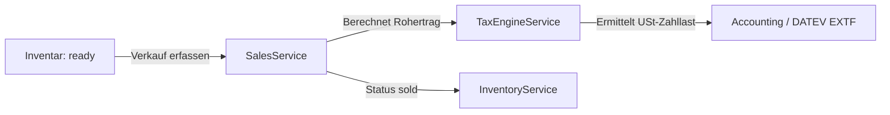
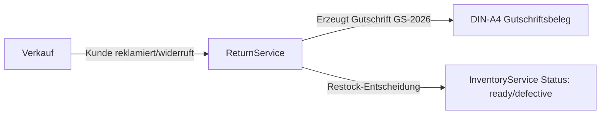
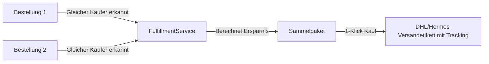

# 🏛️ ReFlip Reselling OS – System- & Code-Architektur

Dieses Dokument beschreibt die interne Architektur, Entwurfsmuster, Service-Schichten und Datenflüsse von **ReFlip Reselling OS**.

---

## 1. 📐 Grundlegende Entwurfsprinzipien

1. **Angular 21 Zoneless Signals Architecture**:
   - Die gesamte Anwendung nutzt `provideZonelessChangeDetection()`.
   - Zustandsverwaltung erfolgt 100% über reaktive Angular Signals (`signal()`, `computed()`, `effect()`).
   - Alle Komponenten sind Standalone und setzen `changeDetection: ChangeDetectionStrategy.OnPush`.

2. **100% Deterministische Finanz- & Steuerberechnungen**:
   - Keine Fließkomma-Rundungsfehler bei Währungs- und Steuerberechnungen.
   - Alle Margen, Vorsteuern und USt-Zahllasten werden zentimetergenau nach **§ 25a UStG (Differenzbesteuerung)** und **19% Regelbesteuerung** berechnet.

3. **Offline-First & Graceful Degradation**:
   - Die Anwendung funktioniert sowohl im reinen Demo-/Offline-Modus als auch mit angeschlossenem Supabase-Cloud-Backend.
   - Offline-Einkäufe (z. B. auf Flohmärkten) werden in einer lokalen Warteschlange gesichert und bei Netzverbindung automatisch synchronisiert.

4. **Pure Service Instantiation & Testbarkeit**:
   - Services nutzen `inject(..., { optional: true })` in `try / catch`-Blöcken, sodass sie in Vitest-Unit-Tests ohne aufwendiges `TestBed` instantiiert werden können.

---

## 2. 🗂️ Modul- & Komponentenstruktur

```text
src/app/
├── core/
│   ├── models/                  # TypeScript Interfaces & Types
│   │   ├── reflip.models.ts     # Workspace, Purchases, Inventory, Sales, Tax
│   │   ├── accounting.models.ts # DATEV EXTF, SKR Kontenspiegel, Monatsabschluss
│   │   ├── fulfillment.models.ts# Carrier Rates, Shipping Labels, Bundling
│   │   ├── invoice.models.ts    # DIN-A4 Rechnungen & E-Mail Bestätigung
│   │   ├── offline-sourcing.models.ts # Flohmarkt PWA & Cash Wallet
│   │   ├── price-tracker.models.ts # Konkurrenz-Radar & Preisalarme
│   │   └── return.models.ts     # Retouren, Restock & Gutschriften
│   │
│   ├── services/                # Business Logic & Data Providers
│   │   ├── auth.service.ts      # Supabase Auth & Session Handling
│   │   ├── workspace.service.ts # Multi-Workspace & Holding-Konsolidierung
│   │   ├── purchase.service.ts  # Einkauf & Kostenallokation
│   │   ├── inventory.service.ts # Bestandsverwaltung & Status-Workflow
│   │   ├── sales.service.ts     # Verkäufe & Margenberechnung
│   │   ├── profit-engine.service.ts # KPI & Profit-Formeln
│   │   ├── tax-engine.service.ts# § 25a UStG & EÜR Generator
│   │   ├── tax-advisor.service.ts # DATEV EXTF Export & Kanzlei-Paket
│   │   ├── fulfillment.service.ts # DHL/Hermes APIs & Paket-Bündelung
│   │   ├── return.service.ts    # Retouren & Gutschriften-Generator
│   │   ├── research.service.ts  # Multi-Plattform Marktpreis-Recherche
│   │   ├── price-tracker.service.ts # Konkurrenz-Radar & 1-Klick-Repricing
│   │   ├── offline-sync.service.ts # Flohmarkt PWA & Auto Cloud-Sync
│   │   ├── store.service.ts     # Reseller Webshop & Stripe/PayPal Checkout
│   │   ├── listing-studio.service.ts # Crosslisting & KI-SEO Score
│   │   ├── web-push.service.ts  # W3C Web Push Benachrichtigungen
│   │   └── webhook.service.ts   # Discord/Telegram Push & Audit Log
│   │
│   └── i18n/
│       └── translations.ts      # Synchrones deutsches Sprachpaket (ngx-translate)
│
├── features/                    # Feature Pages & Smart Views
│   ├── dashboard/               # Reseller KPI Dashboard
│   ├── purchases/               # Einkaufsverwaltung & Flohmarkt-Schnellerfassung
│   ├── inventory/               # Bestands-Matrix, QR-Codes & Filter
│   ├── research/                # Marktpreis-Recherche & Konkurrenz-Radar
│   ├── deal-calculator/         # Margen- & Ankaufskalkulator
│   ├── listings/                # Crosslisting Studio & KI-SEO-Tuning
│   ├── sales/                   # Verkäufe, Retouren & § 25a Gutschriften
│   ├── accounting/              # Steuern, § 25a Journal & DATEV Export
│   ├── fulfillment/             # Packtisch, Kombiversand & Labelkauf
│   ├── analytics/               # Umsatzkurven & Holding-Konsolidierung
│   ├── store/                   # Öffentlicher Webshop & Checkout
│   └── settings/                # Workspaces, DATEV & Web Push Konfiguration
│
└── shared/                      # Wiederverwendbare UI-Komponenten
    ├── components/
    │   ├── barcode-scanner/     # Live Kamera-Barcode & EAN Scanner
    │   ├── invoice-modal/       # DIN-A4 PDF-Rechnung / Gutschriften-Vorschau
    │   └── ai-photo-scanner-modal/ # KI-Bilderkennung & Zustandsanalyse
    └── pipes/
```

---

## 3. 🔄 Kern-Datenflüsse

### 1. Einkauf & Kostenallokation


### 2. Verkauf & § 25a Differenzbesteuerung


### 3. Retoure & Gutschriften-Abwicklung


### 4. Packtisch & Intelligente Paket-Bündelung


---

## 4. 🧪 Test- & Qualitätsstandards

* **Test-Suite**: Vitest mit **22/22 Test-Dateien und 86/86 Tests (100% Pass-Rate)**.
* **TypeScript Strict Mode**: 100% typsicher ohne implizite oder unbegründete `any`-Typen.
* **Build-Stabilität**: Saubere Kompilierung über `ng build` ohne Warnungen.
