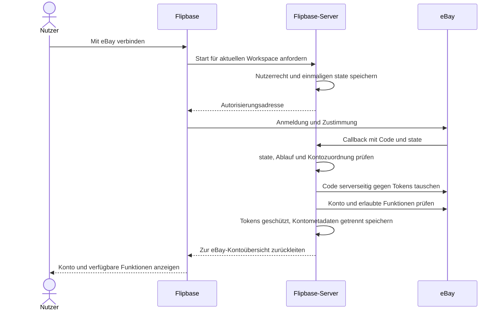

# eBay-API: Möglichkeiten und Einbindung in Flipbase

Stand: 1. Oktober 2026. Geprüfte Repository-Grundlage: `origin/master`,
Commit `08c94058`. Status: Analyse und erste implementierte Ausbaustufe;
Production-Konfiguration, Veröffentlichung und echter Kontotest stehen noch aus.
Die Implementierung ist zusätzlich mit `origin/master` (`c60f059e`) abgeglichen.

## Umgesetzter Einstieg und Einrichtung

Nach ausdrücklicher Freigabe der nötigen Supabase-Änderungen ist die persönliche
Verbindung unter `/settings/app` und `/marketplaces/ebay` umgesetzt. Jedes aktive
Workspace-Mitglied kann sein eigenes Konto verbinden und trennen. Die Verbindung
gilt pro Nutzer, Workspace und Umgebung. Der erste Umfang umfasst aktive
Angebote einschließlich Auktionen sowie eigene Bestellungen mit Zahlungs-,
Versand- und Stornierungsstatus. Es werden nur externe Daten angezeigt; daraus
entstehen keine Flipbase-Verkäufe oder Bestandsänderungen. Nachrichten, neue
Inserate, Versandaktionen, Gebühren und Auszahlungen bleiben spätere Ausbaustufen.

Angebote werden über `GetMyeBaySelling` mit 200 Einträgen pro Seite gelesen
(höchstens 125 Seiten). Bestellungen werden über Fulfillment mit 50 Einträgen
pro Seite gelesen (höchstens 200 Seiten); ohne Datumsfilter gilt eBays
Standardzeitraum von 90 Tagen. Die Ansicht speichert keine Käuferadressen oder
anderen Käuferdaten. Die abgeschaltete Finding-Suche ist entfernt; eine
persönliche Anmeldung schaltet keine marktweite Verkaufspreishistorie frei.

Tokens bleiben AES-GCM-verschlüsselt im Backend. OAuth-Zustände sind gehasht,
zehn Minuten gültig und einmalig verwendbar. Eine Datenbanksperre koordiniert
Token-Erneuerungen; Trennen, erneute Anmeldung und verlorene Mitgliedschaft
verhindern das spätere Übernehmen alter Ergebnisse. Die Löschfunktion beantwortet
eBays Challenge und prüft signierte Kontolöschmeldungen, bevor sie alle passenden
eBay-Verbindungen samt Zugangsdaten entfernt.

Für den Betreiber sind folgende Schritte erforderlich:

1. Im Production-Keyset App-ID/Client-ID und Cert-ID/Client-Secret hinterlegen.
   Unter User Tokens eine OAuth-RuName konfigurieren; für akzeptierte und
   abgelehnte Anmeldung dieselbe URL setzen:
   `https://api.flipbase.de/functions/v1/ebay-account/callback`. Den RuName-Wert,
   nicht diese URL, als `EBAY_REDIRECT_URI_NAME` setzen. Eine tatsächlich
   veröffentlichte Datenschutzerklärung im Entwicklerportal hinterlegen.
2. Die verfügbaren OAuth-Rechte des Keysets prüfen. Benötigt werden
   `api_scope`, `commerce.identity.readonly` und `sell.fulfillment.readonly`
   unter `https://api.ebay.com/oauth/api_scope`. eBays Basisscope gilt für
   Trading; Flipbase verwendet ihn hier ausschließlich für lesende Aufrufe.
   [eBay-Autorisierung](https://developer.ebay.com/develop/guides/sell/authorization)
3. Die Werte aus [ebay.env.example](../../deploy/ebay.env.example) ausschließlich
   in `/opt/supabase/.env` ergänzen. Für `EBAY_TOKEN_ENCRYPTION_KEY` einen
   zufälligen 32-Byte-Schlüssel als Base64 erzeugen und geschützt sichern.
   Ein Schlüsselwechsel erfordert eine geplante Neuverschlüsselung oder neue
   Nutzerfreigaben. Für Löschmeldungen einen zufälligen Verifikationstoken mit
   32–80 Zeichen aus Buchstaben, Zahlen, `_` und `-` verwenden.
4. Unter Marketplace Account Deletion die URL aus `EBAY_DELETION_ENDPOINT` und
   denselben Verifikationstoken eintragen. Die URL muss exakt übereinstimmen,
   öffentlich erreichbar sein und die Challenge bestehen. Das Production-Keyset
   muss anschließend aktiv sein.
   [eBay-Kontolöschmeldungen](https://developer.ebay.com/develop/guides/sell/marketplace-user-account-deletion)
5. Die geprüfte Migration mit dem vorhandenen Release-Ablauf veröffentlichen.
   `deploy/docker-compose.ebay.yml` nach `/opt/supabase/` übertragen und zur
   bestehenden `COMPOSE_FILE`-Liste hinzufügen. Die Funktionsordner `ebay-account`,
   `ebay-account-deletion`, `marketplace-search` und `_shared` gemeinsam nach dem
   [bestehenden Deployment-Verfahren](../../deploy/README.md) übertragen.
   Die Pipeline rollt Edge Functions derzeit nicht automatisch aus.
6. Beim selbst gehosteten Funktionsdispatcher prüfen, dass OAuth-Callback und
   Löschendpoint ohne Supabase-Bearer erreichbar sind. `config.toml` registriert
   dafür `verify_jwt = false`; die selbst gehostete `main`-Funktion übernimmt
   diese Einstellung nicht automatisch. Vorhandene Schutzregeln anderer
   Funktionen beibehalten. `ebay-account` prüft jeden POST selbst mit `getUser`
   und Workspace-Rechten; Lösch-POSTs benötigen eine gültige eBay-Signatur.
7. Nach dem Funktionsneustart mit zwei normalen Nutzern verbinden, eigene
   Angebote und Bestellungen abrufen, Workspacewechsel und Trennen prüfen.
   Ein anonymer POST muss 401 ergeben; ein Callback ohne gültigen Zustand
   darf keine Verbindung anlegen. Die Lösch-Challenge und eBays Testmeldung
   prüfen. Ohne vollständige Serverkonfiguration bleibt die Oberfläche gesperrt.

Die nachfolgende Bestandsaufnahme beschreibt den Ausgangsstand vor dieser
Implementierung. Weitere Pakete sind weiterhin Vorschläge.

## Ergebnis für Nutzer und Betreiber

Flipbase benötigt eine zentrale eBay-Entwickleranwendung. Jeder Nutzer verbindet
sein normales eBay-Konto und erteilt dieser Anwendung die benötigten Rechte.
Ein eigenes Entwickler-Keyset pro Nutzer ist dafür nicht vorgesehen.
Die Zustimmung erfolgt bei eBay; ein Nutzerpasswort wird Flipbase nicht übergeben.
[OAuth-Dokumentation][oauth]

Der Betreiber besitzt nach eigener Angabe bereits ein Production-Keyset.
Noch nicht geprüft sind dessen Aktivierung und zugewiesene Rechte. Für den
OAuth-Betrieb werden App-ID/Client-ID, Cert-ID/Client-Secret und für die
Kontofreigabe eine konfigurierte RuName benötigt. Sandbox und Produktion haben
getrennte Zugangsdaten. [Einrichtung][getting-started], [OAuth][oauth]

Ein verbundenes Konto schaltet nur Funktionen frei, für die sowohl eBay als
auch Flipbase Zugriff erlauben. Kontoverbindung, Verkäuferberechtigung,
Produktionsfreigabe und ein gebuchtes Flipbase-Paket sind getrennte Voraussetzungen.
Die folgenden Ausbaustufen sind Vorschläge, keine bereits implementierten Funktionen.

## 1. Was im Projekt bereits vorhanden ist

| Bereich                | Nachgewiesener Stand                                                                                                                       | Konsequenz für eBay                                                                                                                                                    |
| ---------------------- | ------------------------------------------------------------------------------------------------------------------------------------------ | ---------------------------------------------------------------------------------------------------------------------------------------------------------------------- |
| Einstellungen          | `/settings/app`, „App & Geräte“, enthält App-ID und Marktplatz; Speicherung unter `flipbase_ebay_config` in LocalStorage                   | Keine Kontoverbindung und keine dauerhafte Nutzerzuordnung. Durch einen Verbindungsstatus und den Zugang zum eBay-Verbindungsablauf ersetzen.                          |
| Marktplatzbereich      | `/marketplaces/vinted`; Konten, Übersicht, Inserate, Nachrichten, Verkäufe, Profil, Bewertungen und Aktivität                              | Einen eigenen eBay-Bereich in dieser Struktur planen. Vinted-Komponenten nicht durch bloße Umbenennung als eBay-Unterstützung ausgeben.                                |
| Kontoverträge          | Gemeinsamer `Marketplace`-Typ enthält `ebay`; `AccountScope` besteht aus Workspace und Verbindung; Fähigkeiten und Zustände sind vorhanden | Die Struktur ist wiederverwendbar, die laufenden RPCs, Parser und Rechte sind jedoch noch Vinted-spezifisch.                                                           |
| Zugriffsrechte         | `marketplace_can_manage` verlangt Betreiberrolle und Workspace-Adminrechte                                                                 | Normale Nutzer können die bestehende Kontoverwaltung noch nicht nutzen. Eigene eBay-Rechte müssen im Backend vorgesehen werden.                                        |
| Kontoisolierung        | `marketplace_connections` und `marketplace_account_entries`; eindeutige externe Datensätze pro Workspace, Verbindung und Art               | Gute Grundlage für Kontolesekopien. Der globale eindeutige externe Kontoindex verhindert derzeit, dass dasselbe Konto mehreren Workspaces zugeordnet wird.             |
| Inserate               | `/listings`, `/listings/new`, `/listings/:id`; `ListingPlatform = 'kleinanzeigen'`                                                         | eBay benötigt einen vollständigen Plattformvertrag mit Verbindung, externen IDs, Pflichtfeldern und Serveroperationen. Eine weitere Auswahloption allein genügt nicht. |
| Produkte und Bestand   | `/catalog`, `/catalog/new`, `/catalog/:id`, `/inventory/:id`                                                                               | Produktdaten und physischer Bestand sind die Ausgangsdaten für Zuordnung, SKU, Mengen und Inseratsvorbereitung.                                                        |
| Verkäufe               | `/sales` und `/sales/new`; Verkaufspositionen, Kosten, Retouren und Bestandsbewegungen; externe Bestellreferenz ist vorhanden              | eBay-Bestellungen zunächst als externe Daten lesen, anschließend bewusst mit dem vorhandenen Verkaufsablauf verknüpfen.                                                |
| Versand und Auswertung | `/fulfillment`, `/analytics`, `/accounting`, `/deal-calculator/ebay`                                                                       | Versandstatus, echte Gebühren und Auszahlungen fachlich getrennt integrieren. Die Existenz dieser Seiten belegt noch keine eBay-Datenanbindung.                        |
| Preisrecherche         | `/research` → `ResearchService` → `EbayApiService` → `marketplace-search` beziehungsweise direkter Finding-Aufruf                          | Verwendet eine abgeschaltete API. Aktuelle Angebotspreise dürfen nicht unter der bestehenden Quelle `ebay_sold` gespeichert werden.                                    |

Geprüfte Dateien:

- [Routen](../../src/app/app.routes.ts), [Einstellungen](../../src/app/features/settings/pages/app-settings/app-settings.component.ts)
- [eBay-Service](../../src/app/core/services/ebay-api.service.ts), [Recherche](../../src/app/core/services/research.service.ts)
- [Marktplatzrouten](../../src/app/features/marketplaces/marketplaces.routes.ts), [RPC-Service](../../src/app/features/marketplaces/services/marketplace-api.service.ts), [Antwortparser](../../src/app/features/marketplaces/models/marketplace-response.ts)
- [Gemeinsame Kontoverträge](../../supabase/functions/_shared/marketplace-contracts.ts), [Kontenschema](../../supabase/schemas/250_marketplace_accounts.sql)
- [Inseratsmodell](../../src/app/features/listings/models/listing.models.ts), [Inseratsservice](../../src/app/features/listings/services/listing.service.ts)
- [Verkaufsservice](../../src/app/core/services/sales.service.ts), [alte Suchfunktion](../../supabase/functions/marketplace-search/index.ts)

## 2. Welche Funktionen sich sinnvoll anbinden lassen

„Möglich“ bedeutet hier: durch offizielle Dokumentation beschrieben. Das konkrete
Flipbase-Keyset, der Verkäufer, das Land und die jeweiligen Methoden können
zusätzliche Einschränkungen haben. Die Freigabe muss vor Umsetzung des Pakets
mit dem echten Zugang nachgewiesen werden.

| Funktion                                   | API und Einstieg                                                                                | Platz in Flipbase                                                | Voraussetzungen und Priorität                                                                                                                                                     |
| ------------------------------------------ | ----------------------------------------------------------------------------------------------- | ---------------------------------------------------------------- | --------------------------------------------------------------------------------------------------------------------------------------------------------------------------------- |
| Konto erkennen                             | Identity `getUser`; alternativ eine ausdrücklich geplante Trading-Abfrage                       | Marktplätze → eBay → Konten                                      | Nur erforderliche Profildaten abrufen; zusätzliche personenbezogene Felder sind nicht pauschal freigegeben. Grundlage. [Identity-Referenz][identity-spec]                         |
| Verkäuferstatus prüfen                     | Account `getPrivileges`                                                                         | Kontoübersicht und Inseratsfreigabe                              | Verkäuferregistrierung und Limits prüfen. Ein normaler Login allein belegt keine Verkaufsmöglichkeit. Grundlage. [Verkäuferstatus][privileges]                                    |
| Bestehende Angebote lesen                  | Trading `GetSellerList`/`GetItem`; Inventory für dessen eigene Bestands- und Angebotsobjekte    | Marktplätze → eBay → Inserate                                    | Herkunft des Inserats unterscheiden; keine automatische Übernahme in ein anderes eBay-Verwaltungsmodell. Frühes Lesepaket. [Listing Management][listing-management]               |
| Bestellungen und Verkäufe lesen            | Sell Fulfillment `getOrders`/`getOrder`                                                         | Marktplätze → eBay → Verkäufe; Übernahme nach `/sales`           | Positionen, Zahlung, Storno, Versand und Steuerinformationen getrennt behandeln. Frühes Lesepaket. [Order Management][orders]                                                     |
| Versand und Tracking übertragen            | Fulfillment `createShippingFulfillment`                                                         | `/fulfillment`                                                   | Bestellpositionen dem Paket zuordnen; tatsächlichen Versand bestätigen. Schreibendes Folgepaket. [Order Management][orders]                                                       |
| Gebühren und Auszahlungen lesen            | Finances `getTransactions`/`getPayouts`                                                         | Verkaufsdetails, Gebührenrechner, Auswertung; später Buchhaltung | Für EU-/UK-Verkäufer digitale Signaturen erforderlich. Echte Gebühren von Schätzwerten trennen. [Finanzen][account-management], [Signaturen][signatures]                          |
| Kategorien und Pflichtmerkmale vorschlagen | Taxonomy `getCategorySuggestions`/`getItemAspectsForCategory`; Metadata für Zustände und Regeln | Katalog und eBay-Inseratseditor                                  | eBay-Kategorie und interne Flipbase-Kategorie getrennt speichern. Voraussetzung fürs Inserieren. [Listing Metadata][metadata]                                                     |
| eBay-Katalogprodukte finden                | Catalog-Suche nach passenden Produktdaten                                                       | `/catalog/new` und Produktzuordnung                              | ePID als externe Referenz; keine automatische Gleichsetzung mit eigener SKU. Verfügbarkeit und passende Suchfelder im Keyset prüfen. [Listing Metadata][metadata]                 |
| Inseratsbilder bereitstellen               | Media `createImageFromFile`/`createImageFromUrl`, `getImage`; Video getrennt                    | Bestehende Bildauswahl und Bildoptimierung                       | Reihenfolge und Titelbild erhalten; EPS-URL und Ablauf berücksichtigen. Voraussetzung fürs Inserieren. [Media][media]                                                             |
| Inserate veröffentlichen                   | Inventory: Artikelobjekt, Standort, Angebot, `publishOffer`; Trading als fachliche Alternative  | `/listings/new` und `/listings/:id`                              | Account-Policies, SKU, Kategorie, Zustand und Pflichtmerkmale nötig. Verwaltungsmodell zuerst entscheiden. [Inventory][inventory], [Listing Creation][listing-creation]           |
| Preis und verfügbare Menge aktualisieren   | Inventory-Angebot beziehungsweise Trading-Revision passend zur Herkunft                         | Inseratsdetails und Bestandsabgleich                             | Keine parallelen unkoordinierten Änderungen über beide Modelle. Erst nach bestätigter Zuordnung. [Listing Management][listing-management]                                         |
| Nachrichten lesen und beantworten          | Commerce Message `getConversations`, `getConversation`, `sendMessage`                           | Marktplätze → eBay → Nachrichten                                 | Eigene Kontofreigabe; Lesen und Senden in Flipbase getrennt berechtigen. Späteres Paket. [Message-Spezifikation][message-spec]                                                    |
| Ereignisse empfangen                       | Notification, unter anderem `ORDER_CONFIRMATION`, `NEW_MESSAGE` und Inseratsereignisse          | Automatischer Kontoabgleich und Benachrichtigungen               | Topic-Verfügbarkeit, Scope und Signaturprüfung nachweisen. Ergänzt regelmäßigen Abgleich. [Topics][notification-topics]                                                           |
| Anzeigenleistung auswerten                 | Sell Analytics `getTrafficReport`, Verkäufer- und Servicekennzahlen                             | `/analytics`, eBay-Inseratsdetails                               | Fehlende Kennzahlen als unbekannt darstellen. Nicht aus Impressionen eine Favoritenzahl ableiten. [Analytics][analytics]                                                          |
| Interessenten ein Angebot senden           | Negotiation `findEligibleItems`/`sendOfferToInterestedBuyers`                                   | eBay-Inseratsdetails                                             | Nur geeignete Angebote; Preisänderung beziehungsweise Angebot bewusst bestätigen. Optional. [Negotiation-Spezifikation][negotiation-spec]                                         |
| Preisvorschläge bearbeiten                 | Trading `GetBestOffers`/`RespondToBestOffer`                                                    | Nachrichten oder eigener Bereich „Preisvorschläge“               | Annahme kann eine Transaktion auslösen; Rechte und Status separat modellieren. Optional. [Weitere APIs][other-apis]                                                               |
| Werbung und Rabatte verwalten              | Sell Marketing, Recommendation                                                                  | eBay-Marktplatzbereich und Auswertung                            | Verkäuferberechtigung, Marktplatz und mögliche Werbekosten beachten. Spätere Erweiterung. [Marketing][marketing]                                                                  |
| Große Bestände und Berichte verarbeiten    | Sell Feed, etwa Active Inventory Report                                                         | Kontoabgleich im Hintergrund                                     | Berichtserstellung ist asynchron; der aktive Bestandsbericht ersetzt keine vollständigen Produktdetails. Erst bei nachgewiesenem Bedarf. [Listing Management][listing-management] |
| Feedback lesen oder abgeben                | Trading-Feedback und passende Notification-Topics                                               | Marktplätze → eBay → Bewertungen                                 | Anzeige und Schreiben getrennt freigeben. Optional. [Kommunikation][communications]                                                                                               |
| Texte übersetzen                           | Translation für unterstützte Sprachpaare                                                        | Inseratseditor                                                   | Vorschlag vor Veröffentlichung prüfen. Optional. [Weitere APIs][other-apis]                                                                                                       |

Diese Einbindung ist ein Produktvorschlag auf Basis der vorhandenen Flipbase-Seiten.
Neue Unterseiten wie `/marketplaces/ebay` existieren derzeit noch nicht.

## 3. Bereiche mit besonderen Zugangsgrenzen

| Wunsch                                                   | Ergebnis der Analyse                                                                                                                                                                                                                                     |
| -------------------------------------------------------- | -------------------------------------------------------------------------------------------------------------------------------------------------------------------------------------------------------------------------------------------------------- |
| Aktuelle öffentliche Angebote, EAN- und Bildsuche        | Browse passt zur Recherche und zum Sourcing. Anwendungstoken statt persönlicher Kontofreigabe; `EBAY_DE` als REST-Marktplatz. Produktionsberechtigung gesondert prüfen. [Browse][browse-spec], [Buy-Zugang][buy-requirements]                            |
| Marktweite tatsächlich erzielte Verkaufspreise           | Marketplace Insights ist aktuell eingeschränkt und für neue Nutzer geschlossen. Kontoverbindung oder eigener API-Key beseitigen diese Grenze nicht. Eigene Verkäufe sind eine andere Datenquelle. [Zugangsstatus][marketplace-support]                   |
| Direkt in Flipbase kaufen oder bieten                    | Buy Order beziehungsweise Offer sind gesonderte, eingeschränkte Integrationen. Kein Bestandteil der normalen Verkäufer-Kontoverbindung. [Buy-Zugang][buy-requirements], [Offer][buy-offer]                                                               |
| Vollständige eBay-Kaufhistorie importieren               | Sell Fulfillment liefert Verkäuferbestellungen. Daraus keinen vollständigen Käuferimport ableiten. Ein eigenes Einkaufspaket müsste die passenden Buyer-/Trading-Methoden und Historiengrenzen gesondert prüfen. [Fulfillment-Vertrag][fulfillment-spec] |
| Versandlabels für deutsche Nutzer                        | Tracking ist möglich. Die im Order-Guide beschriebene Logistics API ist auf zugelassene Partner und inländische USPS-Sendungen in den USA begrenzt. Sie ist keine allgemeine deutsche Label-Schnittstelle. [Order Management][orders]                    |
| KI-Inseratsvorschläge aus Produktdaten                   | Inventory Mapping ist ein eingeschränkter Zugang. Als Option prüfen; nicht als verfügbare Grundlage für alle Nutzer einplanen. [eBay-Mitteilung][inventory-mapping-update]                                                                               |
| Neue `order_earnings`-Finanzübersicht                    | Der aktuelle Finances-Vertrag nennt US-, China- und Hongkong-Verkäufer mit weiteren Zugangsvoraussetzungen. Für deutsche Verkäufer nicht als Grundlage einplanen. `getTransactions`/`getPayouts` getrennt prüfen. [Finances-Vertrag][finances-spec]      |
| eBay-Shops, spezielle Motors-/Charity-/Auslandsprogramme | Nur als eigenständige spätere Pakete nach Marktplatz-, Programm- und API-Prüfung. Kein nachgewiesener Bedarf im ersten Flipbase-Ausbau. [API-Einstieg][getting-started]                                                                                  |

### Angebotspreis ist kein Verkaufspreis

Empfohlene Produkttrennung:

- „Aktuelle eBay-Angebote“: Angebotspreise und Angebotsdatum, mit eBay-Link.
- „Deine eBay-Verkäufe“: tatsächlich importierte Bestellpositionen des verbundenen Kontos.
- „Marktweite Verkaufspreise“: nur mit nachgewiesenem, dafür freigegebenem Datenzugang.

Für Recherche, Preisvorschläge und Gebührenrechnung Quelle, Währung, Versand,
Steuerdarstellung und Abrufzeit mitführen. Ein Angebot kann erfolglos enden;
sein letzter Preis ist deshalb kein nachgewiesener Verkaufspreis.

## 4. Anmeldung und Funktionsfreigabe

### Offizieller Ablauf

eBay verwendet für Kontozugriff den Authorization-Code-Ablauf. Der Nutzer wird
zu eBay weitergeleitet; der Rückweg enthält einen kurzlebigen Code und den
übergebenen `state`. Der Server tauscht den Code gegen Tokens. `redirect_uri`
bezeichnet bei eBay die RuName, nicht einfach die Callback-URL. Tokens laufen
ab und können erneuert oder entzogen werden. [OAuth][oauth]

### Vorgeschlagener Flipbase-Ablauf

Empfohlene Regeln für diese Umsetzung:

1. OAuth-Start erfordert eine gültige Flipbase-Sitzung und Verwaltungsrecht für
   den gewählten Workspace. Die Nutzeridentität kommt aus der geprüften Sitzung.
2. `state` ist zufällig, kurz gültig und einmalig verwendbar. Er verweist
   serverseitig auf Workspace, initiierenden Nutzer, Verbindungsversuch,
   angeforderte Rechte und einen erlaubten Rückweg.
3. Der Callback muss auch ohne mitgesendeten Supabase-Bearer-Header funktionieren.
   Die Zuordnung erfolgt über den geprüften Verbindungsversuch; kein allgemeines
   Abschalten der Rechteprüfung aller Edge Functions.
4. Client Secret, Refresh Token und Signaturschlüssel bleiben auf dem Server.
   Tokenwerte erscheinen nicht in LocalStorage, normalen Kontoantworten,
   Protokollen oder Nutzerexporten. Callback-Codes ebenfalls nicht protokollieren.
5. Metadaten und Zugangsdaten getrennt speichern. Verschlüsselung muss einen
   ausschließlich serverseitigen Schlüssel verwenden; RLS allein ersetzt sie nicht.
6. Kontokennung aus eBay-Daten bestimmen und Benutzernamen nur als Anzeige behandeln.
   Bereits vorhandene Konten und der aktuelle globale Kontoindex müssen mit
   einem verständlichen Konflikt behandelt werden.
7. Erneuerung je Verbindung koordinieren. Nach einem entzogenen Zugriff die
   betroffenen Fähigkeiten sperren und „Erneut verbinden“ anbieten.
8. Beim Trennen künftige Aufträge stoppen, Zugangsdaten entfernen und den
   eBay-Widerruf entsprechend dem tatsächlich gewählten Tokenablauf umsetzen.
   Historische Kontodaten und bestätigte Flipbase-Verkäufe brauchen getrennte
   Aufbewahrungsentscheidungen.

### Rechte nach Funktion anfordern

Die Tabelle ist anhand der öffentlich heruntergeladenen OpenAPI-Verträge geprüft.
Der Präfix für alle Kurzformen ist `https://api.ebay.com/oauth/api_scope/`;
`api_scope` ohne nachgestellten Pfad ist der Basisscope.

| Funktion                                  | Vorgesehener eBay-Scope                                                                            | Quelle                                                                               |
| ----------------------------------------- | -------------------------------------------------------------------------------------------------- | ------------------------------------------------------------------------------------ |
| Öffentlich suchen                         | Basisscope, Anwendungstoken                                                                        | [Browse-Vertrag][browse-spec]                                                        |
| Konto erkennen                            | `commerce.identity.readonly`                                                                       | [Identity-Vertrag][identity-spec]                                                    |
| Verkäuferstatus und Policies lesen        | `sell.account.readonly`                                                                            | [Account-Vertrag][account-spec]                                                      |
| Inventory-Objekte lesen                   | `sell.inventory.readonly`                                                                          | [Inventory-Vertrag][inventory-spec]                                                  |
| Bestellungen lesen                        | `sell.fulfillment.readonly`                                                                        | [Fulfillment-Vertrag][fulfillment-spec]                                              |
| Versandstatus schreiben                   | `sell.fulfillment`                                                                                 | [Fulfillment-Vertrag][fulfillment-spec]                                              |
| Inventory-Inserate veröffentlichen/ändern | `sell.inventory`; Policies zunächst lesend, Änderungen nur mit `sell.account`                      | [Inventory][inventory-spec], [Account][account-spec]                                 |
| Gebühren, Auszahlungen, Erstattung        | `sell.finances`; digitale Signaturen zusätzlich berücksichtigen                                    | [Finances][finances-spec], [Fulfillment][fulfillment-spec], [Signaturen][signatures] |
| Nachrichten                               | `commerce.message`; im geprüften Vertrag kein getrennter Lesescope aufgeführt                      | [Message-Vertrag][message-spec]                                                      |
| Analytics                                 | `sell.analytics.readonly`                                                                          | [Analytics-Vertrag][analytics-spec]                                                  |
| Interessenten-Angebote lesen/senden       | Lesen: `sell.inventory.readonly`; Senden: `sell.inventory`                                         | [Negotiation-Vertrag][negotiation-spec]                                              |
| Notifications                             | Typ des Abonnements und Topic entscheiden; nicht pauschal einen Scope für alle Ereignisse annehmen | [Notification-Vertrag][notification-spec], [Topics][notification-topics]             |

Trading verwendet einen gesonderten XML-Vertrag. Dessen Token- und Methodenrechte
vor dem Importpaket anhand der konkret benötigten Calls prüfen. Keine nur scheinbar
lesende Freigabe versprechen, wenn eBay für die verwendete Methode weitergehenden
Zugriff verlangt. Im eigenen Server können wir Schreibfunktionen trotzdem sperren.

Die verfügbaren Scopes müssen im echten Production-Keyset geprüft werden. Neue
Funktionen können eine erneute Zustimmung benötigen. Der erste Verbindungsdialog
soll nur die Rechte des tatsächlich angebotenen Pakets verlangen.

## 5. Angebotsverwaltung: vor dem Inserieren entscheiden

### Vorschlag: bestehende Angebote zuerst lesen

Für vorhandene Angebote zunächst Trading-Lesezugriff nutzen und externe IDs,
SKU, Menge, Status und Herkunft festhalten. Inventory-Datensätze zusätzlich
lesen, falls das Konto dieses Modell bereits verwendet. `getInventoryItems`
ist keine Garantie, alle über die eBay-Oberfläche erstellten Inserate zu erhalten.
Der Inventory-Vertrag beschreibt Inventory-Artikelobjekte; für vorhandene
Inserate nennt der Guide eigene Trading-Abfragen. [Inventory][inventory-spec],
[Listing Management][listing-management]

In Flipbase muss das externe Inserat mit einem Lagerartikel, Produkt oder einer
Variante verbunden werden. Mehrere ähnliche Titel reichen nicht als sichere
Zuordnung. Unklare Treffer bleiben zur manuellen Prüfung offen.

### Inventory oder Trading für neue Inserate

| Weg       | Vorteil für Flipbase                                                                        | Abwägung                                                                                                                                             |
| --------- | ------------------------------------------------------------------------------------------- | ---------------------------------------------------------------------------------------------------------------------------------------------------- |
| Inventory | Getrennte Artikel-, Angebots-, Standort- und Variantenobjekte passen zu Katalog und Bestand | SKU und Policies erforderlich. Laut eBay müssen Änderungen an Inventory-Inseraten über diese API erfolgen; Seller-Hub-Bearbeitung ist eingeschränkt. |
| Trading   | Bestehende Inserate und deren Verwaltungsweg lassen sich mit passenden Calls weiterführen   | XML-Vertrag und mehr methodenspezifische Regeln. Veraltete Calls dürfen nicht übernommen werden.                                                     |

Empfehlung: Lesepaket unabhängig vom späteren Veröffentlichungsweg umsetzen.
Vor einem schreibenden Paket mit einem echten Verkäuferkonto entscheiden, ob
Flipbase die vollständige Angebotsverwaltung übernehmen soll oder eine weitere
Bearbeitung im Seller Hub erhalten bleiben muss. [Inventory-Einschränkungen][inventory]

Die aktuellen Inventory-Objektbeschreibungen erlauben `FIXED_PRICE` und `AUCTION`.
Die Migration bestehender Angebote ist enger: der geprüfte `bulkMigrateListing`-
Vertrag erlaubt hierfür nur geeignete Festpreisangebote, unter anderem mit SKU,
Business Policies und Sofortzahlung. Auktionen nicht automatisch migrieren.
[Inventory-Vertrag][inventory-spec]

Eine Migration ist eine gesonderte bewusste Aktion, kein Nebeneffekt des Imports.
Teilresultate pro Inserat prüfen; erfolgreiche und abgelehnte Übernahmen getrennt
darstellen. Die historische Migrationsanleitung enthält noch Aussagen über eine
ausschließlich auf Festpreis beschränkte Inventory API; diese nicht auf die
aktuelle Neuanlage übertragen. [Ältere Migrationsanleitung][migration-guide]

## 6. Datenfluss und fachliche Zuordnung

Empfohlen ist ein eBay-API-Zugang auf dem Server. Der Vinted-Browserworker wird
dafür nicht gebraucht. Wiederverwendbar sind Kontoisolierung, Auftragsstatus und
Importregeln; Browsersitzungen und Cookies sind kein eBay-OAuth-Vertrag.

### Externe Daten und interne Buchungen

| eBay-Datum                    | Speicherung/Zuordnung in Flipbase                                | Verbindliche Regel für das geplante Paket                                                         |
| ----------------------------- | ---------------------------------------------------------------- | ------------------------------------------------------------------------------------------------- |
| Konto-ID, Anzeige, Rechte     | `marketplace_connections` plus geschützte Zugangsdaten           | Workspace, Verbindung und freigebender Nutzer bleiben nachvollziehbar.                            |
| Inserat-ID, SKU, Offer-ID     | Kontolesekopie plus Zuordnung zum Bestand                        | Offer-ID, klassische Listing-ID und Browse-Item-ID sind unterschiedliche Kennungen.               |
| Bestell-ID und Position-ID    | Externe Bestelllesekopie; danach Zuordnung zu Verkaufspositionen | Wiederholter Import darf weder Verkauf noch Bestandsabbuchung verdoppeln.                         |
| Menge und Preis               | Bestellposition beziehungsweise Inserat                          | Reservierung, bestellte Menge und verfügbarer Lagerbestand sind unterschiedliche Zustände.        |
| Zahlung, Storno, Erstattung   | Externer Status und bestätigter Verkaufs-/Retourenablauf         | Eine stornierte oder nur angelegte Bestellung ist nicht automatisch ein abgeschlossener Verkauf.  |
| Versandumsatz                 | Verkaufsdaten                                                    | Vom tatsächlich gezahlten Versandlabel und anderen Versandkosten trennen.                         |
| Gebühren, Credits, Auszahlung | Kosteneinträge und Abgleich                                      | Auszahlung nicht als zweiten Umsatz buchen. Fehlende Gebühren bleiben unbekannt, nicht null Euro. |
| Währung und Steuerwerte       | Originaldaten und fachlich zugeordnete Werte                     | Keine stillschweigende EUR-Annahme oder automatische Ableitung eines Steuerverfahrens.            |
| Änderungs-/Abrufzeit          | Synchronisationsstand und Quellnachweis                          | Wiederanlauf mit überlappenden Zeitfenstern, Deduplizierung und bestätigtem Fortschritt.          |

Diese Regeln sind Designvorgaben für Flipbase, keine bereits vorhandenen
eBay-Tabellen oder RPCs. Neue öffentliche Verträge müssen vom Backend kommen;
keine temporären DTOs in Angular und keine manuell bearbeiteten generierten Typen.

### Abgleich im Hintergrund

Vorschlag: initialer paginierter Import, danach geänderte Bestellungen und
Inserate nachführen. Notifications stoßen einen gezielten erneuten Leseabruf an.
Regelmäßiger Abgleich fängt ausgefallene Ereignisse auf. Keine festen Fünf-Minuten-
Intervalle versprechen, bevor Kontenzahl und tatsächliches App-Kontingent bekannt sind.

eBay-Notifications brauchen einen erreichbaren HTTPS-Endpunkt, eine Challenge-
Antwort und eine Prüfung der eingehenden Nachricht. Die verfügbaren Topics und
Zusatzrechte unterscheiden sich. [Kommunikation][communications], [Topics][notification-topics]

Serverseitig Verbindungsrechte vor jedem Auftrag erneut prüfen. Schreibaufträge
benötigen eine eindeutige Anfragekennung. Nach einem unklaren Publish-Timeout
zuerst den externen Stand abgleichen, statt blind erneut zu veröffentlichen.
Mengenänderungen nur mit bestätigter Zuordnung und einer festgelegten Reihenfolge
zwischen Import, Verkauf, Retoure und konkurrierenden Bestandsänderungen ausführen.

## 7. Grenzen, Betrieb und aktuelle Dokumentationsänderungen

### Vor dem ersten produktiven Konto

- Production-Keyset und seine tatsächlich vorhandenen Scopes überprüfen.
- Anzeigename der Anwendung, RuName sowie akzeptierter und abgelehnter Rückweg
  konfigurieren. Datenschutzadresse in der eBay-Anwendung hinterlegen.
  [OAuth-Einrichtung][oauth]
- Account-Deletion-Notifications einrichten. Eine Ausnahme ist nur nach dem
  vorgesehenen eBay-Verfahren möglich, wenn keine entsprechenden eBay-Daten
  gespeichert werden. Für geplante Kontolesekopien keinen solchen Verzicht
  voraussetzen. Die Aktivierung des Keysets hängt hiervon ab. [Account Deletion][deletion]
- Besondere Buy- und andere eingeschränkte Zugänge separat beantragen beziehungsweise
  prüfen. Verkäufer-OAuth und Buy-Produktionsfreigabe nicht gleichsetzen.
  [Buy-Zugang][buy-requirements]
- Für deutsche Finanzkonten Signaturschlüssel und deren Lebenszyklus bereitstellen;
  die Signaturpflicht betrifft alle Finances-Methoden und bestimmte Erstattungs-
  beziehungsweise weitere Finanzcalls. [Digitale Signaturen][signatures]

### Kontingente, Historie und fehlende Werte

Das Kontingent eines zentralen Keysets muss für alle Nutzer geplant werden.
Eigene Nutzertokens erzeugen keine garantierten getrennten API-Budgets.
Die veröffentlichte Standardgrenze für Browse nennt 5.000 Aufrufe pro Tag für
die üblichen Methoden; konkrete App-Limits und zusätzliche Kurzzeitgrenzen
müssen live geprüft werden. Caching, Tokenwiederverwendung und kontrollierte
Wiederholungen sind Teil der geplanten Serveranbindung. [API-Limits][limits]

Fulfillment liefert ohne Filter standardmäßig die letzten 90 Tage. Die
Release-Dokumentation beschreibt Abrufe bis zwei Jahre zurück und Maskierung
bestimmter personenbezogener Informationen älterer Bestellungen. Details von
Stornoanfragen können einen Einzelabruf über `getOrder` erfordern.
[Fulfillment-Vertrag][fulfillment-spec], [Fulfillment-Release-Notes][fulfillment-releases]

Finances hat eigene Historien- und Fenstergrenzen; nicht als unbegrenztes Archiv
planen. Die veröffentlichten Regeln nennen fünf Jahre für relevante Transaktionen
und Auszahlungen sowie höchstens 36 Monate pro Datumsbereich für bestimmte Abfragen.
[Finances-Release-Notes][finances-releases]

Fehlende oder ausgeblendete Kundeninformationen dürfen Versand oder Abgleich
nicht mit erfundenen Werten fortsetzen lassen. Nicht jede Datenhandling-
Einschränkung gilt weltweit: die aktuelle eBay-Mitteilung benennt bestimmte
Entwicklerjurisdiktionen und US-Nutzerdaten. [Data Handling][data-handling]

### Ausrangierte APIs und widersprüchliche Leitfäden

- Finding und Shopping sind seit Februar 2025 abgeschaltet. Die bestehende
  Flipbase-Implementierung darf keine Grundlage der neuen Integration sein.
- Compliance API, Product API und bestimmte alte Kategorie-/Metadatencalls
  stehen ebenfalls im Abschaltungsverzeichnis. Ein Guide, der diese noch nennt,
  ist keine Freigabe, sie neu einzubauen.
- Bildübertragung für neue Entwicklung mit der aktuellen Media API planen;
  die 2026-Mitteilung nennt diese als Ersatz für `UploadSiteHostedPictures`.

[Abschaltungsverzeichnis][deprecations], [eBay Q2 2026][q2-2026]

Die aktuelle Inventory-Veröffentlichung nennt zusätzliche Größenprüfungen für
Bekleidung und Schuhe seit August 2026. Der Editor muss erforderliche Kategorie-
und Zustandsmerkmale aus aktuellen Metadaten übernehmen; freie Größenangaben
allein reichen nicht als Vertrag. [Inventory-Release-Stand][inventory-releases]

Bei Widersprüchen gelten für die Planung: Abschaltungsstatus, konkreter
Methodenvertrag, aktuelle Release-Notes, dann allgemeiner Guide. Vor schreibender
Umsetzung einen Sandbox-Test und einen ausdrücklich begrenzten Production-Pilot
mit dem echten Kontovertrag durchführen.

## 8. Empfohlene Umsetzungspakete

| Paket                              | Konkretes Ergebnis                                                                                                         | Voraussetzung zum Start                                                                   |
| ---------------------------------- | -------------------------------------------------------------------------------------------------------------------------- | ----------------------------------------------------------------------------------------- |
| 1 – Kontoverbindung                | eBay-OAuth, Kontoübersicht, Rechteanzeige, erneutes Verbinden und Trennen; Zugang für normale berechtigte Workspace-Nutzer | Keyset, RuName, Löschbenachrichtigung, Backend- und Rollenvertrag                         |
| 2 – Lesen und zuordnen             | Bestehende Inserate und Bestellungen abrufen, extern anzeigen, Bestand manuell/sicher zuordnen, Dubletten verhindern       | Nachgewiesene Listing- und Fulfillment-Lesezugriffe                                       |
| 3 – Verkauf und Versand            | Bestellpositionen bewusst nach Flipbase übernehmen, Versandstatus übertragen, Stornos und Retouren abgleichen              | Bestands-/Buchungsregeln und Schreibrechte; Gebühren können getrennt nachgeliefert werden |
| 4 – Gebühren und Auszahlungen      | Echte Kosten und Zahlungsausgänge dem Verkauf zuordnen; Schätzrechner und tatsächliche Werte trennen                       | Finances-Freigabe und digitale Signaturen für EU/UK                                       |
| 5 – Inserieren                     | eBay-Editor mit Kategorien, Pflichtmerkmalen, Bildern, Policies, SKU und bestätigter Veröffentlichung                      | Entscheidung Inventory/Trading sowie vollständiger Backend- und Datenvertrag              |
| 6 – Ausbau                         | Nachrichten, Notifications, Analytics, Angebote an Interessenten; Werbung erst als eigenes Paket                           | Methodenspezifische Rechte, nachgewiesener Bedarf und Betriebskapazität                   |
| Unabhängig – öffentliche Recherche | Aktuelle Angebote per Browse anzeigen und fachlich korrekt speichern                                                       | Buy-Produktionszugang; echte marktweite Verkaufsdaten separat klären                      |

Für jedes Paket zuerst die Backend-Unterstützung bereitstellen, danach die
Oberfläche. Bis dahin nur dokumentieren; keine Scheinfreischaltung anhand
einer lokal gespeicherten App-ID. Die bestehenden Vinted-Pilotregeln werden
nicht nebenbei erweitert.

### Abnahme des ersten nutzbaren Pakets

- Zwei normale berechtigte Nutzer können unterschiedliche eBay-Konten verbinden.
- Fremde Workspaces, fremde Verbindungen und doppelte externe Kontozuordnung
  werden kontrolliert behandelt.
- Ablehnung, abgelaufener oder erneut verwendeter Callback sowie Kontowechsel
  während der Anmeldung sind getestet.
- Ablauf und Widerruf sperren den betroffenen Zugriff verständlich.
- Nach dem Trennen laufen keine neuen Kontoaufträge weiter.
- Wiederholte Seitenabrufe und Ereignisse erzeugen keine Doppelimporte.
- Unbezahlte, stornierte, teilweise erstattete und mehrpositionige Bestellungen
  werden fachlich richtig zugeordnet.
- Vorschau, Entwurf und bestätigte eBay-Veröffentlichung sind getrennte Zustände.
- Ein Test belegt, dass Geheimnisse weder im Browser noch in normalen Logs landen.
- Frontend: betroffene Tests, Format/Lint, Angular-Bau und AXE für die neuen Abläufe.
- Backend: Kontoisolierung, OAuth, Signaturen, Importwiederanlauf, Rollen und
  Schema-/Migrationsvertrag durch die Backend-Entwicklung prüfen lassen.

## 9. Erfasste Quellen und Prüfgrenze

Geprüft wurden die offiziellen Einstiegsguides, zentrale Sell-/Buy-Anwendungsfälle,
Zugangs- und Abschaltungsseiten sowie elf öffentliche OpenAPI-Verträge. Die
Erfassung besteht aus dieser Auswertung, Quellverweisen und Vertragsständen;
sie ist keine Kopie sämtlicher eBay-Dokumentationsseiten.

### Öffentlich heruntergeladene OpenAPI-Verträge

| API                               | Gemeldeter Vertragsstand | Geprüfter Schwerpunkt                                       |
| --------------------------------- | ------------------------ | ----------------------------------------------------------- |
| [Fulfillment][fulfillment-spec]   | `v1.20.7`                | Bestellungen, Versand, Erstattung, Scopes                   |
| [Inventory][inventory-spec]       | `1.18.5`                 | Lesen, Angebot, Publish, Formate, Migration, Scopes         |
| [Account v1][account-spec]        | `v1.9.3`                 | Verkäuferstatus, drei Policies, Scopes                      |
| [Finances][finances-spec]         | `v1.19.0`                | Transaktionen, Auszahlungen, `order_earnings`, Ländergrenze |
| [Identity][identity-spec]         | `v2.0.0`                 | Kontoerkennung, Scope und Host                              |
| [Message][message-spec]           | `1.0.0`                  | Konversationen und Senden                                   |
| [Browse][browse-spec]             | `v1.20.4`                | Stichwort-, GTIN- und Bildsuche, Headers, Scopes            |
| [Sell Analytics][analytics-spec]  | `1.3.2`                  | Traffic-Report und Scope                                    |
| [Negotiation][negotiation-spec]   | `v1.1.0`                 | Eignung und Angebot an Interessenten                        |
| [Taxonomy][taxonomy-spec]         | `v1.1.1`                 | Kategorie- und Merkmalsvorschläge                           |
| [Notification][notification-spec] | `v1.6.7`                 | Destination und Abonnement                                  |

Die Versionsbezeichnung einer Download-Datei kann hinter aktuellen Release-Notes
liegen; etwa nennt die Inventory-Release-Seite bereits `1.18.8`. Die Identity-
Datei heißt `commerce_identity_v1_oas3.json`, meldet aber `v2.0.0`; ihr Server ist
`https://apiz.ebay.com/commerce/identity/v1`. Hosts und Pfade pro API übernehmen,
nicht für alle APIs pauschal `api.ebay.com` voraussetzen.

Einige neue Referenzseiten überschreiten die Abrufgrenze des Recherchewerkzeugs.
Für die Kernverträge wurden deshalb die offiziellen JSON-Spezifikationen direkt
abgerufen und die Methodennamen, Scopes und ausgewählte Einschränkungen geprüft.
Nicht jede Option in dieser Übersicht wurde bis zu allen Request- und Response-
Feldern geprüft; diese Detailprüfung gehört zum jeweiligen Umsetzungspaket.

Die Umgebung Production wurde vom Betreiber bestätigt; das Keyset selbst wurde
nicht eingesehen.

Nicht geprüft: Entwicklerkonto des Betreibers, Secret-Konfiguration, tatsächlich
erteilte Production-Rechte, konkrete Verkäuferkonten, produktiver Supabase-Stand,
Live-Importe, veröffentlichte Inserate oder echte Zahlungen. Keine Zugangsdaten
abgerufen, keine Migration und keine Backend-/Frontend-Implementierung ausgeführt.

[oauth]: https://developer.ebay.com/develop/guides/sell/authorization
[getting-started]: https://developer.ebay.com/develop/guides/sell/get-started-with-ebay-apis
[privileges]: https://developer.ebay.com/api-docs/sell/static/seller-accounts/ht_get-selling-limits.html
[listing-management]: https://developer.ebay.com/develop/guides/sell/listing-management
[orders]: https://developer.ebay.com/develop/guides/sell/order-management-guide
[account-management]: https://developer.ebay.com/develop/guides/sell/account-management-guide
[signatures]: https://developer.ebay.com/develop/guides/sell/digital-signatures-for-apis
[metadata]: https://developer.ebay.com/develop/guides/sell/listing-metadata-guide
[media]: https://developer.ebay.com/api-docs/commerce/media/static/overview.html
[inventory]: https://developer.ebay.com/api-docs/sell/inventory/overview.html
[listing-creation]: https://developer.ebay.com/develop/guides/sell/listing-creation
[notification-topics]: https://developer.ebay.com/develop/api/sell/notification_events
[analytics]: https://developer.ebay.com/develop/guides/sell/analytics-and-reporting-guide
[other-apis]: https://developer.ebay.com/develop/guides/sell/other-apis-guide
[marketing]: https://developer.ebay.com/develop/guides/sell/marketing-and-promotions-guide
[communications]: https://developer.ebay.com/develop/guides/sell/sell-communications-guide
[buy-requirements]: https://developer.ebay.com/api-docs/buy/static/buy-requirements.html
[marketplace-support]: https://developer.ebay.com/api-docs/buy/ref-marketplace-supported.html
[buy-offer]: https://developer.ebay.com/api-docs/buy/offer/static/overview.html
[inventory-mapping-update]: https://developer.ebay.com/updates/newsletter/q3_2025
[migration-guide]: https://developer.ebay.com/api-docs/sell/static/inventory/migrating-listings.html
[deletion]: https://developer.ebay.com/develop/guides/sell/marketplace-user-account-deletion
[limits]: https://developer.ebay.com/develop/get-started/api-call-limits?campid=5336728181&mkcid=1&mkrid=711-53200-19255-0&toolid=10001
[fulfillment-releases]: https://developer.ebay.com/api-docs/sell/fulfillment/static/release-notes.html
[finances-releases]: https://developer.ebay.com/api-docs/sell/finances/static/release-notes.html
[data-handling]: https://developer.ebay.com/api-docs/static/data-handling-update.html
[deprecations]: https://developer.ebay.com/develop/get-started/api-deprecation-status
[q2-2026]: https://developer.ebay.com/updates/newsletter/q2_2026
[inventory-releases]: https://developer.ebay.com/develop/api/sell/release_notes
[fulfillment-spec]: https://developer.ebay.com/api-docs/master/sell/fulfillment/openapi/3/sell_fulfillment_v1_oas3.json
[inventory-spec]: https://developer.ebay.com/api-docs/master/sell/inventory/openapi/3/sell_inventory_v1_oas3.json
[account-spec]: https://developer.ebay.com/api-docs/master/sell/account/openapi/3/sell_account_v1_oas3.json
[finances-spec]: https://developer.ebay.com/api-docs/master/sell/finances/openapi/3/sell_finances_v1_oas3.json
[identity-spec]: https://developer.ebay.com/api-docs/master/commerce/identity/openapi/3/commerce_identity_v1_oas3.json
[message-spec]: https://developer.ebay.com/api-docs/master/commerce/message/openapi/3/commerce_message_v1_oas3.json
[browse-spec]: https://developer.ebay.com/api-docs/master/buy/browse/openapi/3/buy_browse_v1_oas3.json
[analytics-spec]: https://developer.ebay.com/api-docs/master/sell/analytics/openapi/3/sell_analytics_v1_oas3.json
[negotiation-spec]: https://developer.ebay.com/api-docs/master/sell/negotiation/openapi/3/sell_negotiation_v1_oas3.json
[taxonomy-spec]: https://developer.ebay.com/api-docs/master/commerce/taxonomy/openapi/3/commerce_taxonomy_v1_oas3.json
[notification-spec]: https://developer.ebay.com/api-docs/master/commerce/notification/openapi/3/commerce_notification_v1_oas3.json
