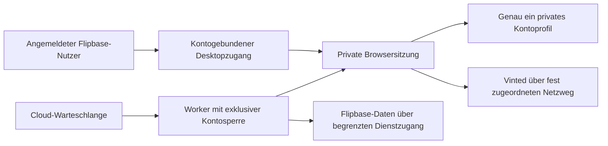

# Bleam und Vinted: Recherche- und Beobachtungsprotokoll

Stand der Recherche: 03.–04.10.2026. Dieses Protokoll bewahrt die Quellen,
beobachteten Funktionen und Codebefunde des gemeinsamen Bleam-Rundgangs.
Anbieterangaben, eigene Beobachtungen, Codebefunde und offene Fragen bleiben
getrennt. Die historischen Betriebsangaben sind kein aktueller Produktionsnachweis.
Interne Serverimplementierung und Cloud-Netzwerkweg von Bleam sind unbekannt.

Daraus entstanden der [Produktentwurf](../implementation/vinted-local-and-cloud-design.md)
und der [lokale Pilotplan](../implementation/vinted-local-extension-pilot.md).
Das Protokoll enthält eigene Notizen; Zugangsdaten, Kontodumps und kopierte
Anwendungspakete werden nicht mit veröffentlicht.

## Cloudbetrieb und Bleam-Abgleich vom 03.10.2026

Ziel bleibt ein eigener, rund um die Uhr erreichbarer Cloudbetrieb für überwiegend
normale Vinted-Konten. GoLogin, ein Proxyvertrag und eine gekaufte IP je Konto sind
keine beschlossenen Voraussetzungen. Technischer Schutz der Kundensitzungen,
Vinted-Zugänglichkeit und Zulässigkeit der angebundenen Funktionen sind getrennte
Anforderungen. Ein erfolgreicher Login bestätigt nur den konkreten Versuch.

### Quellenabgleich

| Aussage                                      | Nachweis und Bedeutung für Flipbase                                                                                                                                                                                                                                                                                                                                                                                                                                                                                               |
| -------------------------------------------- | --------------------------------------------------------------------------------------------------------------------------------------------------------------------------------------------------------------------------------------------------------------------------------------------------------------------------------------------------------------------------------------------------------------------------------------------------------------------------------------------------------------------------------- |
| Ein Browserprofil je Konto                   | [Bleams Mehrkonten-Hilfe](https://bleam.app/en/help/connecter-plusieurs-comptes) beschreibt getrennte Chrome-/Brave-Profile mit eigener Erweiterung. Das ist ein belegtes Desktopmodell, keine Offenlegung der Cloudimplementierung.                                                                                                                                                                                                                                                                                              |
| Bleam betreibt eigene Cloudbrowser           | Die [Cloud-Hilfe](https://bleam.app/en/help/bleam-cloud) beschreibt die gehostete Erweiterung, isolierte Sitzungen und eine gemeinsame französische Standard-IP. Zusätzliche eigene IPs sind optional. Herkunft des Netzwegs, Browserstart und Automatisierungsprotokoll bleiben unbekannt.                                                                                                                                                                                                                                       |
| Die IP sei unwichtig                         | Der [Blog](https://bleam.app/en/blog/vinted/eviter-bannissement-multi-comptes) widerspricht der Cloud-Hilfe: Dort wird eine gemeinsame IP ausdrücklich als Verbindung zwischen Konten beschrieben. Keine Grundlage für eine allgemeine Aussage, Vinted berücksichtige IPs nicht.                                                                                                                                                                                                                                                  |
| Vinted lese im Browser die MAC-Adresse       | IP und MAC sind verschiedene Adressen. Normale Webseiten bekommen über die üblichen Browser-APIs keine rohe Netzwerkkarten-MAC. Die [Network-Information-API](https://developer.mozilla.org/en-US/docs/Web/API/NetworkInformation) stellt Verbindungstyp und Schätzwerte bereit; [ARP](https://www.rfc-editor.org/info/rfc826/) löst Hardwareadressen im lokalen Netz auf. Daraus folgt keine Aussage über native Vinted-Apps oder andere Gerätekennungen. Bleams Erklärung ist für unseren Webbrowser technisch nicht tragfähig. |
| Neues Telefon und neue Nummer seien zwingend | Keine offizielle Vinted-Quelle gefunden, die daraus eine allgemeine Voraussetzung für den Login bestehender Konten im Cloudbrowser macht. Kontenerstellung ist außerdem eine andere Frage als die Verbindung vorhandener Konten.                                                                                                                                                                                                                                                                                                  |
| Bleam verursache keine Sperren               | Anbieterbehauptung ohne überprüfbare Garantie. Bleams [CAPTCHA-Hilfe](https://bleam.app/en/help/debloquer-captcha) beschreibt ausdrücklich pausierte Automatik und manuelle Prüfungen. CAPTCHA, blockierte Browsersitzung und gesperrtes Vinted-Konto sind unterschiedliche Zustände.                                                                                                                                                                                                                                             |

Browserprofile trennen gespeicherte Sitzungsdaten, erzeugen aber keine neuen
physischen Geräte, öffentlichen IPs oder garantierten getrennten Fingerabdrücke.
Sie sind auch keine Zugriffssperre zwischen Kunden: Die [Chrome-Hilfe](https://support.google.com/chrome/answer/2364824?hl=de)
warnt ausdrücklich vor dem Zugriff anderer Gerätenutzer auf andere Profile.
Deshalb genügt in Flipbase ein gemeinsamer Desktop mit umschaltbaren Profilen nicht.

[DataDomes Dokumentation](https://docs.datadome.co/docs/threat-detection) nennt
Browser-/TLS-Signaturen, Verhalten und IP-Reputation als verschiedene Signale.
Das beschreibt technische Möglichkeiten des Schutzsystems, nicht die genaue
Ursache unserer Sperre oder die bei Vinted aktivierten Regeln. Auch eine
Residential-IP ist damit keine nachgewiesene Lösung.

Vinteds [deutsche Mehrkonten-Hilfe](https://www.vinted.de/help/1436) nennt einen
regulären Account und einen Pro-Account je Mitglied. Die am 03.10.2026 noch
[bisherigen AGB](https://www.vinted.de/old-terms-and-conditions) erlauben externe
Automatisierungswerkzeuge nur bei entsprechender Erlaubnis durch Vinted. Die
bereits veröffentlichte [Folgeversion](https://www.vinted.de/terms-and-conditions)
gilt laut Seite ab 05.10.2026 und enthält dieselben relevanten Einschränkungen.
Unterschiedliche Kontoinhaber gemeinsam zu verwalten ist eine andere Frage als
mehrere reguläre Konten derselben Person; Profiltrennung ändert diese Regeln nicht.
Für Flipbase ist keine entsprechende Vinted-Freigabe nachgewiesen. Ein technisch
funktionierender Pilot kann diese offene Produktvoraussetzung nicht ersetzen.

Die [offizielle Pro-Integrations-API](https://pro-docs.svc.vinted.com/) ist auf
freigeschaltete Pro-Unternehmen beschränkt und dokumentiert Artikel, Bestellungen
und Webhooks. Sie ersetzt den Zugang für unsere überwiegend normalen Konten nicht.

### Beobachtungsprotokoll: Bleam-Testzugang vom 03.10.2026

Auf ausdrücklichen Nutzerwunsch werden die gemeinsam geprüften Seiten und
Schritte fortlaufend hier notiert. Quelle ist der sichtbare Seitenzustand des
angemeldeten Testzugangs. Werbeaussagen werden als solche behandelt; unbekannte
Interna bleiben offen. Keine Passwörter, Codes, Sitzungstoken oder persönlichen
Kontaktdaten in dieses Protokoll übernehmen.

| Schritt                              | Tatsächlich beobachtet                                                                                                                                                                                                                                       | Bedeutung / noch offen                                                                                                                |
| ------------------------------------ | ------------------------------------------------------------------------------------------------------------------------------------------------------------------------------------------------------------------------------------------------------------ | ------------------------------------------------------------------------------------------------------------------------------------- |
| 1: Erste Willkommensansicht          | Überschrift beschreibt Bleam als Arbeit auf Vinted wie durch den Nutzer. Erläuterung: lokale Browsererweiterung, aktiv bei geöffnetem Browser. Button „Gute Neuigkeiten, ich habe einen Computer“; zusätzlich Verweis auf Bleam Cloud und Cloud-Menüeintrag. | Die Seite bewirbt lokale Ausführung. Ihre Aussage fehlenden Entdeckungsrisikos ist kein technischer Nachweis.                         |
| 2: Nutzer klickt auf Computer-Button | Anschließend sichtbare Überschrift „Welcome to Bleam“, darunter „2 steps to get started“.                                                                                                                                                                    | Einrichtungsschritt; keine Kontenübersicht. Frühere mündliche Fehlbezeichnung wurde korrigiert.                                       |
| 3: Installation angeboten            | „Install the extension“, Hinweis auf Chrome-Erweiterung zur Kontoverbindung. Buttons „Install the extension“ und „Already installed“, Link zur Anleitung sowie zweiminütiges Installations-Tutorial.                                                         | Installation und tatsächliche Erweiterungsberechtigungen noch nicht geprüft; keine Installation durch Juna.                           |
| 4: Kontoverbindung beschrieben       | Zweiter Schritt „Connect your Vinted account“: Vinted öffnen und Bleam-Sprechblase anklicken.                                                                                                                                                                | Der beschriebene Weg verwendet die Erweiterung im Nutzerbrowser. Eine erfolgreiche Kontoverbindung ist noch nicht beobachtet.         |
| 5: Testphase angezeigt               | Die Oberfläche nennt Ende der Testphase am 17. Oktober und keine Belastung davor. Sie sagt außerdem, ohne verknüpftes Konto werde Bleam nicht aktiv.                                                                                                         | Beobachtete Anzeige; Cloud-Zusatzkosten, Vertragsbedingungen und tatsächliche Abrechnung sind hier noch nicht geprüft.                |
| 6: Cloudzugang sichtbar              | Link „Bleam Cloud“ im linken Menü.                                                                                                                                                                                                                           | Cloudbereich bisher nicht geöffnet; kein gehosteter Browser, Login, CAPTCHA, Netzweg oder Wiederöffnen einer Cloudsession beobachtet. |

**7: Anleitung nach dem Installationsweg.** Der Nutzer berichtet, die
Erweiterung zu installieren. Anschließend ist „First steps with Bleam“ im
Browser geöffnet; der Seitenverweis trägt Installationsparameter der Erweiterung.
Das erklärt den geöffneten Hilfeschritt, bestätigt allein aber noch nicht die
konkreten Erweiterungsrechte oder eine funktionierende Vinted-Verbindung.
Quelle: [First steps with Bleam](https://bleam.app/en/help/premiers-pas).

Die sichtbare Anleitung beschreibt drei Schritte:

1. Erweiterung aus dem Chrome Web Store installieren. Als kompatible Browser
   nennt sie Chrome, Brave, Edge und Opera.
2. Vinted öffnen und die Bleam-Sprechblase unten rechts anklicken. Ihre Anzeige
   sei zunächst rot. In der sich öffnenden Anmeldung sollen die Bleam-Zugangsdaten
   verwendet werden. Die Anleitung sagt ausdrücklich, die lokale Erweiterung
   verwende die bereits offene Vinted-Sitzung und benötige dafür kein
   Vinted-Passwort. Anschließend werde das erkannte Vinted-Konto zur Verknüpfung
   angeboten; danach sei die Anzeige grün.
3. Nach Verknüpfung seien die gebuchten Aktionen verfügbar. Für mehrere Konten
   nennt die Anleitung erneut ein Browserprofil je Konto und entsprechende Tarife.

**Einordnung:** Dies belegt die Dokumentation eines lokalen Ablaufs mit
vorhandener Vinted-Sitzung und eigener Bleam-Anmeldung. Keine Anmeldung,
Kontoverknüpfung, Statusumschaltung oder Automatik selbst beobachtet.
Die Hilfe verlinkt zusätzlich Bleam Cloud; der gehostete Anmeldeablauf ist damit
noch nicht geprüft. Die lokale Aussage zum Vinted-Passwort nicht auf die Cloud
übertragen. Das eingebettete Tutorial wurde nicht abgespielt; geschlossene
FAQ-Antworten wurden nicht als gelesene Inhalte gewertet.

**8: Dashboard nach Erweiterungsinstallation.** Der Nutzer meldet die
Installation als abgeschlossen. Im erneut geprüften Dashboard ist der erste
Schritt sichtbar mit „Done“ markiert. Schritt zwei zeigt „Connect your Vinted
account“, den Button „Open Vinted“ und „Waiting for your account…“. Die Seite
fordert die Rückkehr nach Verknüpfung an und kündigt an, anschließend selbst den
nächsten Schritt anzuzeigen. Zusätzlich sichtbar: „Is Vinted open in another
browser?“, Anleitung, Videotutorial und Rückweg zum vorherigen Schritt.
Damit ist die Installationsbestätigung der Oberfläche beobachtet. Die
Verknüpfung ist weiterhin ausstehend; Rechte der Erweiterung, Datenübertragung
und Cloudverhalten bleiben ungeprüft.

**9: Erweiterungsanmeldung über die Website.** Der Nutzer berichtet: Nach
„Open Vinted“ erscheint die Bleam-Sprechblase. Sie verlangt Bleam-Zugangsdaten
und bietet eine Anmeldung über die Website an. Dort erscheint eine Bestätigung
zur Verbindung der Erweiterung mit dem angezeigten Bleam-Konto. Dieser kurzlebige
Bestätigungsdialog wurde vom Nutzer beschrieben, nicht unabhängig als eigener
Seitenzustand erfasst. Keine Kontaktdaten oder Authentifizierungsparameter notiert.

**10: Sichtbarer Erweiterungsdialog nach der Anmeldung.** Im Browserbild auf
Vinted ist anschließend das Bleam-Fenster mit angemeldetem Bleam-Konto und
Testphasenhinweis sichtbar. Es zeigt das erkannte lokale Vinted-Konto. Trotz
der Überschrift „Verbundenes Vinted-Konto“ steht darunter, dieses Konto müsse
noch mit dem Bleam-Konto verknüpft sein; angeboten wird „Dieses Vinted-Konto
verknüpfen“. Außerdem sichtbar: Abmelden und eine Ladeanzeige. Das Bleam-Dashboard
meldete beim kurz vorherigen Abruf weiterhin „Waiting for your account…“.

**Einordnung:** Die Oberfläche trennt die Anmeldung der Erweiterung beim
Bleam-Dienst und die ausdrückliche Zuordnung der erkannten Vinted-Identität.
Die Vinted-Sitzung besteht bereits im lokalen Nutzerbrowser. Noch kein
beobachteter erfolgreicher Abschluss der Kontoverknüpfung oder Datenimport.
Das Erweiterungsfenster erschien im Browserbild, aber nicht im normalen
Zugänglichkeitsbaum der Seite; deshalb wurde die visuelle Ansicht herangezogen.
Private Nachrichten und E-Mail-Adresse werden nicht ins Protokoll übernommen.

**11: Verknüpfung und Einstellungsfenster.** Der Nutzer berichtet, den Button
zur Verknüpfung des erkannten Vinted-Kontos betätigt zu haben. Danach meldet der
Titel des bisherigen Bleam-Dashboards „Account linked“. Im aktuellen Browserbild
auf Vinted zeigt das Bleam-Modal einen grünen Haken am Kontonamen sowie die
Tarifanzeige „enterprise“. Das ist eine beobachtete Bestätigung der Oberfläche,
kein Nachweis einer bereits erfolgreichen Datenübernahme oder Aktion auf Vinted.

Im Einstellungsfenster sichtbar:

| Bereich                           | Einstellungen / Beschreibung                                                                              | Sichtbarer Zustand                                                   |
| --------------------------------- | --------------------------------------------------------------------------------------------------------- | -------------------------------------------------------------------- |
| Nachrichten an Favoriten          | Automatische Nachrichten und Antworten-Analyse; Zugang „Konfigurieren“                                    | Beide Schalter aus; Favoriten-Nachrichten als deaktiviert bezeichnet |
| Automatische Assistenten          | Automatische Verhandlung und automatische Antworten; Zugang „Konfigurieren“                               | Beide Schalter aus; Assistenten als deaktiviert bezeichnet           |
| Automatisches Backup der Anzeigen | Auto-Backup; Beschreibung kündigt stündliche Sicherung an; Link zur manuellen Sicherung im Kleiderschrank | Schalter aus; stündliche Sicherung nicht als ausgeführt beobachtet   |
| Sprache der Oberfläche            | Sprachauswahl                                                                                             | Deutsch                                                              |
| Weitere Aktionen                  | Kontakt und Abmelden                                                                                      | Nicht betätigt                                                       |

**12: Zusätzlicher reservierter Vinted-Tab.** Nach der Verknüpfung ist ein
weiterer Vinted-Tab vorhanden. Sein Browserbild zeigt „Für Bleam reservierter
Tab“ und erläutert, dieser Tab verwalte automatisierte Aktionen und solle offen
bleiben. Für normale Vinted-Nutzung wird ein weiterer Tab angeboten. Sichtbare
Funktionshinweise: KI-Assistent, Auto-Favoriten und Nachrichten-Tracking.
Die Bleam-Sprechblase trägt eine grüne Statusmarkierung. Der zuletzt geprüfte
erste Vinted-Tab zeigt dagegen das Einstellungsmodal; gleichlautende Tabtitel
waren zur Unterscheidung unzureichend. Beide Browserbilder wurden geprüft,
ohne neue Tabs selbst zu öffnen oder Einstellungen zu ändern.

**Einordnung:** Jetzt beobachtet sind die Trennung zwischen Erweiterungsanmeldung
und Kontoverknüpfung sowie ein gesonderter Arbeits-Tab. Das ist eine konkrete
Referenz für exklusive Browserarbeit neben der normalen Bedienung. Zwei Tabs
desselben Profils sind jedoch keine zwei isolierten Kontoprofile. Die sichtbaren
Hinweise belegen weder Interna der Ausführung noch erfolgreiches Tracking,
Cloudbetrieb oder Sperrfreiheit. Juna hat keine Automatik eingeschaltet,
Nachrichten gesendet oder Angebote bearbeitet.

**13: Prüfintervalle nach Aktivierung durch den Nutzer.** Der Nutzer schaltet
im Erweiterungsmodal automatische Favoriten-Nachrichten, automatische
Verhandlung und Auto-Backup ein. Die anschließende Browseransicht bestätigt:

| Funktion                              | Angezeigter Status / Prüfintervall                                    |
| ------------------------------------- | --------------------------------------------------------------------- |
| Automatische Nachrichten an Favoriten | Aktiv; Prüfung alle 5 Minuten                                         |
| Automatische Verhandlung              | Aktiv; Prüfung alle 4 Minuten                                         |
| Auto-Backup der Anzeigen              | Aktiv; stündliche Überprüfung; Beschreibung nennt stündliches Sichern |

Antworten-Analyse und automatische Antworten sind in diesem Bild weiter aus.
Die Nachrichten- und Assistentenbereiche zeigen zudem einen Hilfelink für
ausbleibende Nachrichten sowie ein Aktualisierungssymbol. Diese wurden nicht
betätigt. Die frühere Beobachtung aller ausgeschalteten Schalter gehört zum
vorherigen Zeitpunkt und ist kein aktueller Gesamtzustand mehr.

Für die spätere Planung sind dies belegte Oberflächenangaben je Funktion.
Keine tatsächlichen Vinted-Anfragen, übertragene Datenmengen, gesendeten
Nachrichten, angenommenen Angebote oder abgeschlossenen Backups erfasst.
Die drei Intervalle sind deshalb nicht als globale Kontosynchronisierung oder
als Anzahl einzelner API-Anfragen zu behandeln. Juna hat die Schalter nicht
bedient; die Aktivierung erfolgte durch den Nutzer.

**14: Nutzerbericht über sofortige Nachrichten auf Französisch.** Der Nutzer
berichtet, nach Aktivierung der Nachrichtenfunktion seien bereits an zwei
Personen, die Artikel favorisiert hatten, automatisch Nachrichten versendet
worden. Die Nachrichten seien auf Französisch gewesen. Diese konkreten
Nachrichten und ihre Versandzeit wurden nicht unabhängig geöffnet oder
vermessen; keine Empfängerdaten oder Nachrichtentexte ins Protokoll übernommen.
Die mündliche Bezeichnung „automatische Antworten“ klärt allein nicht die genaue
interne Funktion; der beschriebene Auslöser sind favorisierte Artikel.

Im zuvor geprüften Modal stand die Oberflächensprache auf Deutsch. Eine deutsche
Oberfläche bestätigt damit noch keine deutschen ausgehenden Nachrichten.
Vorlagensprache, Nachrichtenvorlage oder Spracherkennung sind als Ursache
ungeprüft; die Herkunft des Anbieters erklärt das Verhalten nicht nachweislich.
Der Nutzerbericht legt nahe, dass eine Aktivierung nicht zwangsläufig bis zum
angezeigten nächsten Prüfintervall auf erste Aktionen wartet. Kein allgemeines
Startverhalten daraus ableiten.

**Folgerung für Flipbase:** Bei Funktionen mit ausgehenden Nachrichten müssen
Auslöser, Text, Sprache, Umgang mit vorhandenen Favoriten und Beginn der ersten
Aktion vor Aktivierung klar sein. Kontoverknüpfung allein aktiviert keine
Nachrichtenfunktion. Eine Vorschau und bewusste Freigabe des gewählten Textes
gehören zur Einrichtung; Prüfintervall und erste Ausführung sind getrennt zu
erklären. Für den weiteren Rundgang empfiehlt sich eine Pause der ausgehenden
Nachrichten bis zur Prüfung der Konfiguration. Juna hat keine Nachrichten
gesendet, Einstellungen geändert oder Empfänger kontaktiert.

**15: Detailprüfung der Favoriten-Nachrichten im Dashboard.** Auf Nutzerauftrag
die aktuelle Seite `/en/dashboard/favorites` im Browser über Seitenstruktur und
Browserbild gelesen. Die Konfiguration zeigt ausdrücklich das ausgewählte
Vinted-Konto; der Hauptschalter ist eingeschaltet. Die deutsch dargestellte
Oberfläche enthält teilweise missverständliche Übersetzungen. Keine Texte,
Schalter, Rabattwerte oder Reihenfolgen geändert.

| Bereich                                     | Beobachtete Konfiguration / Möglichkeit                                                                                                                                                       | Grenze der Aussage                                                                                                                                                                                                       |
| ------------------------------------------- | --------------------------------------------------------------------------------------------------------------------------------------------------------------------------------------------- | ------------------------------------------------------------------------------------------------------------------------------------------------------------------------------------------------------------------------ |
| Standardnachricht für einen Artikel         | Ein Textfeld mit französischer Nachricht: Dank für das Favorisieren und Einladung, ein Angebot zu machen. Zeichenanzeige 72/2000. „Vorname einfügen“ und „Nachricht hinzufügen“.              | Weitere Texte können laut Oberfläche hinzugefügt werden; ihre Auswahl wurde nicht durch zusätzliche Sendungen getestet. „1 Element“ bezeichnet im Kontext den einzelnen Artikel und ist kein eindeutiger Vorlagenzähler. |
| Automatisches Angebot zum einzelnen Artikel | Schalter aus; deaktivierte Eingabefelder zeigen 2 und Euro, daneben Minus/Plus sowie Einheitenauswahl.                                                                                        | Wert ist eine sichtbare aktuelle Konfiguration, kein bestätigter allgemeiner Standard. Kein Angebot abgegeben.                                                                                                           |
| Bundles / mehrere Artikel                   | Laut Oberfläche ab zwei Artikeln angewendet. Eigenes französisches Textfeld zur Einladung, mehrere Artikel zusammen zu nehmen; Zeichenanzeige 93/2000. Vorname und weiterer Text hinzufügbar. | Beobachtet ist eine Nachricht für Mehrartikel-Interesse. Eine tatsächliche automatische Zusammenstellung oder Buchung eines Bundles ist nicht belegt.                                                                    |
| Automatisches Angebot zu mehreren Artikeln  | Schalter aus; deaktivierter Wert 5 Prozent, Minus/Plus und Einheitenauswahl.                                                                                                                  | Kein Rabatt versendet oder akzeptiert.                                                                                                                                                                                   |
| Bedingte Nachrichten                        | Kategorien Uhrzeit, Wochentag und Artikelpreis; alle drei sichtbaren Schalter aus. Erläuterung: erste passende Nachricht von oben nach unten; Reihenfolge durch Ziehen änderbar.              | Zeitfenster, konkrete Tage, Preisgrenzen und Wechselwirkung mit Bundle-/Standardtext bei ausgeschalteten Regeln noch nicht geprüft.                                                                                      |
| Zusätzliche Sendeverzögerung                | Schalter aus. Erklärung: Ohne zusätzliche Verzögerung normalerweise Versand innerhalb weniger Minuten nach dem Favorisieren, abhängig von der Erkennung.                                      | Erkennungsintervall, Wartedauer und tatsächliche Zustellzeit sind unterschiedliche Größen. Verborgene Eingabefelder nicht durch Aktivierung geöffnet.                                                                    |

Die aktuell französischen Nachrichtenvorlagen erklären plausibel den vom Nutzer
berichteten französischen Versand trotz deutscher Oberfläche. Die versendeten
Nachrichten wurden nicht mit diesen Vorlagen abgeglichen; automatische
Übersetzung oder Sprache aus Anbieterherkunft wird daraus nicht behauptet.

**Zusätzlicher Abgleich mit der verlinkten Anbieterhilfe:**
[Automatic favourite messages](https://bleam.app/en/help/messages-favoris)
beschreibt Kontowahl, Vorname, optionale Rabatte in Euro oder Prozent und eine
eigene Nachricht bei Interesse an mehreren Artikeln. Mehrere Vorlagen werden
laut Hilfe im Enterprise-Tarif zufällig ausgewählt; nicht alle nacheinander an
denselben Empfänger geschickt. Context-Regeln betreffen Uhrzeit, Wochentag und
Artikelpreis. Die Hilfe nennt variierende Erkennung ungefähr alle vier bis sechs
Minuten sowie zusätzliche Verzögerung bis sieben Tage. Diese Herstellerangaben
sind nicht als gemessene Implementierung behandelt. Insbesondere die bisher
sichtbaren fünf Minuten sind keine belegte feste Taktung. Antworten zu
Mehrfachversand, Versandfenstern, Ausschlüssen und Angebotsgrenzen stehen in
geschlossenen FAQ und wurden nicht gelesen.

**Folgerung für Flipbase:** Kontobezogene Regeln, getrennte Einzelartikel- und
Mehrartikelvorlagen, explizite Auswahl-/Prioritätsregeln und sichtbare Sprache
sind brauchbare Produktreferenzen. Automatische Rabatte benötigen eigene
Freigabe und klare Grenzen. Erkennung und verzögerte Ausführung getrennt planen,
mit überprüfbarem Zustand einer wartenden Aktion. Duplikatvermeidung und
Abbruch bei geänderter Konto-/Artikel-/Empfängersituation sind Anforderungen an
unseren Entwurf, hier keine bestätigten Eigenschaften von Bleam. Aktive
Nachrichten wurden in dieser Untersuchung nicht geändert oder testweise gesendet.

**Weitere Nutzerbeobachtung vor dieser Seite:** Der Nutzer berichtet zusätzlich
von Bleams Nachrichtenübersicht mit Gesprächsliste links, Verlauf rechts und
Anzeige eines aktiven Bots sowie einer Angebotsaktion. Diese Zwischenansicht
wurde nicht eigenständig geprüft; keine privaten Verläufe übernommen.

**16: Statische Prüfung der installierten Erweiterung.** Auf ausdrücklichen
Nutzerauftrag den ausgelieferten Code von Bleam 6.0.14 aus dem installierten
Chrome-Web-Store-Paket gelesen. Nur statische Programmdateien untersucht;
keine Cookies, gespeicherten Kontodaten oder Zugangsdaten gelesen, keinen
Erweiterungscode ausgeführt und keine Anbieter- oder Vinted-API aufgerufen.
Minifizierte Dateien wurden ausschließlich für die Analyse vorübergehend
formatiert. Kein Anbieterprogramm in Flipbase übernommen.

Referenzen beziehen sich auf Dateiname und Symbol im Paket, nicht auf
Serverquellcode oder tatsächlich gemessene Ausführung:

| Befund                             | Statischer Nachweis / Grenze                                                                                                                                                                                                                                                                                                                              |
| ---------------------------------- | --------------------------------------------------------------------------------------------------------------------------------------------------------------------------------------------------------------------------------------------------------------------------------------------------------------------------------------------------------- |
| Reservierter Arbeits-Tab           | `background.js`, `ensureDedicatedTab`: angehefteter Vinted-Tab, normalerweise `/inbox`, mit deaktiviertem automatischem Verwerfen. `TRIGGER_FAVORITES_PROCESSING` sendet `FORCE_FAVORITES_PROCESSING` an diesen Tab. Der zusätzliche Tab trennt Arbeitsansicht und normale Bedienung innerhalb desselben Profils; er ist keine weitere Kontositzung.      |
| Tab-Pflege                         | Hintergrundalarm kontrolliert Heartbeats und kann einen nicht mehr antwortenden Tab neu laden. Dies ist von der eigentlichen Favoritenprüfung zu unterscheiden.                                                                                                                                                                                           |
| Dashboard und Erweiterung          | `background.js`, `TOGGLE_CHANGED`, und `js/background/account-owner.js`, `refreshAllKnownVids`, aktualisieren Kontokonfiguration und Berechtigungen über Bleams Server. Realtime beobachtet unter anderem `favorite_auto_dm_config`. Ein Nachrichten-Socket transportiert zusätzlich Hinweise an Vinted-Tabs; die Serverimplementierung bleibt unbekannt. |
| Voraussetzungen vor Verarbeitung   | `base.js`, `FavoritesManager.performPeriodicCheck`: Automatik und Konfiguration aktiv, dedizierter Tab, Konto nicht gesperrt, Sitzung nicht abgelaufen, Identität nicht verdächtig; Pausen bei Abruffehlern und ausgesetzter Nachrichtenverarbeitung. Vor dem regulären Zyklus wird eine serverseitige Verarbeitungssperre angefordert.                   |
| Verschiedene Prüfintervalle        | Derselbe Manager überprüft Voraussetzungen per lokalem Timer ungefähr alle 45 Sekunden. Ein eigener Zyklusabstand und der gespeicherte Verarbeitungsstand begrenzen die eigentliche Favoritenverarbeitung. Die Anzeige fünf Minuten bezeichnet daher weder jeden Timer noch jeden Netzaufruf. Ohne Laufzeitmessung kein Datenverbrauch ableitbar.         |
| Verarbeitung in begrenzten Gruppen | `FavoritesManager.processFavorites` prüft zuerst Versandberechtigung/Kontingent, gleicht offene Angebotsabsichten ab und verarbeitet höchstens zehn Empfängergruppen pro Zyklus nacheinander. Das ist eine Bleam-Codegrenze, keine offizielle Vinted-Freigabe oder garantierte sichere Versandmenge.                                                      |
| Geeignete Favoriten auswählen      | `FavoritesManager.getFavorites`: letzter Verarbeitungsstand, Benachrichtigungen, zusätzliche Wartezeit, aktive Artikel; Gruppierung nach Empfänger; Herausfiltern bereits vorhandener Gespräche. Bei unbekanntem oder fehlgeschlagenem Artikelabruf wird die Verarbeitung zurückgehalten.                                                                 |
| Text und Regeln                    | `processFavoriteNotification` übermittelt Kontext wie Empfängername, Artikelpreis und Zahl der Favoriten an `FavoritesAPIClient.buildMessage`. Die Antwort kann Text, Angebotskonfiguration und Reihenfolge liefern. Die eigentliche serverseitige Bedingungs- und Variantenauswahl ist nicht sichtbar.                                                   |
| Lokaler Ersatztext                 | `FavoritesManager.buildMessage` verwendet bei fehlendem Servertext die Einzelartikel- oder Mehrartikelvorlage aus der Konfiguration; optional Namensauflösung. Ob sämtliche Bedingungen dabei gleichwertig berücksichtigt werden, ist nicht belegt. Für Flipbase keine unbemerkte Abschwächung von Regeln vorsehen.                                       |
| Nachricht und optionales Angebot   | `processFavoriteNotification`: Gesprächsstatus vor Versand prüfen; vorhandenes begonnenes Gespräch überspringen. Angebot nur mit passender Konfiguration, Preis und Transaktionsbezug. Reihenfolge kann Angebot vor oder nach Nachricht sein. Offene Angebotsabsichten werden zum späteren Abgleich erfasst.                                              |
| Bestätigte und wartende Aktionen   | Versand kann als wartend oder ausgesetzt zurückkommen. Erfolgreiche Verarbeitung wird erfasst und der Verarbeitungsstand aktualisiert. Clients verwenden Idempotenzschlüssel. Das belegt vorgesehenes Wiederholungs-/Duplikathandling, keine überprüfte Genau-einmal-Garantie des gesamten Systems.                                                       |
| Unterschiedliche Scheduler         | `js/background/scheduled-dispatcher.js` verarbeitet Veröffentlichungen, Preisänderungen, Löschungen und Backups über wartende Serveraufträge. Der Favoritenmanager ist ein eigener Ablauf; beide nicht zu einem allgemeinen Fünf-Minuten-Scheduler zusammenfassen.                                                                                        |

**Ableitung für Flipbase:** Eigene kontobezogene Einstellungen und freigegebene
Nachrichtenvorschau; Erkennung neuer Favoriten getrennt von Regelentscheidung
und Versand. Wartende Aktionen dauerhaft mit Empfänger, Artikel, gewähltem
Text, Ausführungszeit und Wiederholungsschutz speichern. Vor Versand Konto,
Sitzung, Artikel, aktiven Schalter und Empfänger erneut prüfen. Bei unklarem
Versandergebnis zuerst abgleichen statt erneut senden. Ein sichtbarer Verlauf
muss wartende, gesendete, übersprungene und angehaltene Aktionen erklären.
Cloud-Zugänglichkeit und Sitzungserhalt bleiben gesonderte Pilotvoraussetzungen.
Dies ist ein eigenständiger Entwurf, noch keine umgesetzte Favoritenfunktion.

**17: MCP-Zugang des Anbieters.** Die im Browser geöffnete
[MCP-Seite](https://bleam.app/en/mcp) beschreibt über 60 Werkzeuge für Kontodaten,
Nachrichten und Automatisierungen. Laut Seite standardmäßig lesend; schreibende
Aktionen benötigen zusätzliche Freigabe in Bleam. Werkzeugkatalog und
wirksame Rechte sind dadurch noch nicht unabhängig geprüft.

Auf ausdrücklichen Nutzerauftrag den Server `https://api.bleam.app/mcp` in
der lokalen Konfiguration eingetragen und OAuth-Anmeldung gestartet. Der
Nutzer hat den geöffneten Freigabedialog selbst bestätigt. Die CLI bestätigt
erfolgreiche Anmeldung. Keine Nachricht versendet oder Automatik geändert.
In diesem laufenden Chat ist der neue Server noch nicht registriert; ein
Leseversuch meldet unbekannten MCP-Server. Daher noch kein Zugriff auf seine
Werkzeuge behauptet. Keine OAuth-Parameter oder Token dokumentiert.
**Nach dem App-Neustart:** Auf Nutzerauftrag den Anschluss tatsächlich getestet.
`get_capabilities` antwortet erfolgreich und erkennt einen verknüpften
Vinted-Verkaufsaccount im Enterprise-Testtarif. `write_enabled: true` belegt,
dass die wirksame Freigabe auch Schreibaktionen umfasst; Juna führt für diese
Analyse ausschließlich lesende Aufrufe aus. Keine Einstellungen geändert und
keine Nachrichten, Angebote oder Aufgaben ausgelöst.

`get_settings` für `favorites` bestätigt die französischen Einzelartikel- und
Mehrartikelvorlagen, keine zusätzlichen Varianten, deaktivierte automatische
Angebote mit gespeicherten Werten 2 Euro bzw. 5 Prozent, deaktiviertes Targeting
und keine zusätzliche Wartezeit. **Aktueller Serverzustand: Favoritenautomatik
ausgeschaltet.** Das unterscheidet sich von der zuvor beobachteten Aktivierung;
Zeitpunkt und Verursacher dieser Änderung nicht aus dem Leseabruf ableiten.
Der Anschluss stellt aktuell 71 Werkzeuge bereit; das ist die Zahl der
API-Werkzeuge, nicht 71 voneinander unabhängige Produktfunktionen. Der Katalog
umfasst Kontostatus und Diagnose, Favoriten-/Bot-/Wiederveröffentlichungsregeln,
Nachrichten und Angebote, geplante Aufgaben und Verlauf, Anzeigen und Backups,
Verkäufe/Einkäufe/Bestand, Vorlagen und Wissenseinträge. Die vorhandenen
Schreibwerkzeuge wurden nur über ihre Beschreibung erfasst, nicht ausgeführt.
Insbesondere sind Aufgabenanlage und tatsächliche Ausführung getrennte Zustände.
MCP-Zugriff liefert keinen vollständigen Serverquellcode oder Beweis über
Netzweg, Browserbetrieb und jedes Dashboarddetail.

Die MCP-Antwort enthält nicht jede sichtbare Dashboard-Regel. Funktionierende
Konfigurationsabfrage belegt weder laufenden Cloudbrowser noch Versand.

Die ältere installierte CLI akzeptiert den bestehenden Wert `service_tier`
nicht; ausschließlich für die beiden Einrichtungsaufrufe einen gültigen Wert
überschrieben, die bestehende Modell-/Tarifeinstellung nicht geändert.

**18: Vollständiger Scan des verfügbaren MCP-Katalogs.** Auf Nutzerauftrag alle
71 Werkzeugbeschreibungen und Parameterschemata nach Bereichen geprüft;
Anzeigen, Vorlagen, Aufgaben, Postfach, Wissen und CRM mit einem Recherche-Agenten
abgeglichen. Zusätzlich Kontofreigaben, Bot- und Wiederveröffentlichungseinstellungen
sowie die Kontoübersicht tatsächlich lesend abgerufen. Die bereits gelesene
Favoritenkonfiguration ergänzt den Einstellungsabgleich. Keine Setter,
Planungs-, Versand-, Archivierungs- oder Löschaktionen ausgeführt.

Die folgenden Möglichkeiten sind **im MCP-Vertrag beschrieben**, sofern kein
Leseergebnis angegeben ist. Eine Werkzeugbeschreibung ist kein erfolgreich
ausgeführter Funktionstest. Tarife, Freischaltung, Kontositzung und vorhandene
Daten können die Nutzung zusätzlich begrenzen.

| Bereich                         | Erfasste Möglichkeiten                                                                                                                                                                                                                                                | Grenzen / Bedeutung                                                                                                                                                                                                                                   |
| ------------------------------- | --------------------------------------------------------------------------------------------------------------------------------------------------------------------------------------------------------------------------------------------------------------------- | ----------------------------------------------------------------------------------------------------------------------------------------------------------------------------------------------------------------------------------------------------- |
| Konto und Betrieb               | Verknüpfte Konten, Berechtigungen, Kontingente, letzte Aktivität, aktive Funktionen, Diagnose, Nutzungsstatistik; E-Mail-Präferenzen für Warnungen, Automatisierung, Lebenszyklus und Newsletter.                                                                     | Abonnementänderungen gehören nicht zum MCP. Transaktions-/Sicherheitsmails bleiben aktiv. Diagnose startet keine Synchronisierung. Nutzungsstatistik ist keine Verkaufsstatistik.                                                                     |
| Favoriten-Nachrichten           | Einzelartikel-/Mehrartikeltext, zusätzliche zufällig ausgewählte Varianten, Name, getrennte optionale Angebote in Euro/Prozent, Bedingungen und zusätzliche Wartezeit bis sieben Tage. Aktivierung getrennt von Inhalt.                                               | Variantenlisten werden vollständig ersetzt. Das Bedingungsobjekt ist im Setter nicht vollständig typisiert; nicht jede Dashboardregel über die Konfigurationsantwort nachvollziehbar.                                                                 |
| Verhandlung                     | Preisabhängige Nachlassgrenzen, mehrere Verhandlungsstufen, Texte für Annahme, Gegenangebot, letztes Angebot und Rückfragen; Nachrichten-/Angebotsreihenfolge und Wartezeit.                                                                                          | Angebot und Freigabe einer Preisentscheidung sind eigene Aktionen. Kein Preisalgorithmus aus den Konfigurationswerten rekonstruiert oder ausgeführt.                                                                                                  |
| Antworten und Nachfassen        | Sprache, Ton, Du-/Sie-Ansprache, Antwortverhalten, Versandtage, Angaben zu Maßen/Tragefotos, situations- und zustandsbezogene Texte, eigener Kontext, Hinweis bei nötigem Eingriff. Nachfassen mit festen oder KI-Texten, Filter für Angebote und optionalem Angebot. | Antwort- und Verhandlungsautomatik haben getrennte Schalter. Listen werden teilweise vollständig ersetzt. Tatsachen über Zustand, Echtheit und Versand müssen vom Verkäufer bestätigt sein. Vorbelegte Texte nicht als geprüfte Tatsachen übernehmen. |
| Erweiterte KI und Artikelpakete | Modellwahl Classic/Nexus, besondere Paket-Verhandlungen/-Antworten, Preisregeln nach Paketgröße, eigene Paketsituationen; KI-Tragefotos als angebotene Option.                                                                                                        | Mehrere Möglichkeiten verlangen laut Vertrag Nexus; kein Nachweis, dass sie im aktuellen Testtarif tatsächlich nutzbar sind. KI-Bilder dürfen für Flipbase nicht als echte Trageaufnahmen ausgegeben werden.                                          |
| Wissen für Antworten            | Wissenseinträge und offene Fragen verwalten; Wissen nach Kategorie, Marke, Größe, Zustand, Preis und teilweise aktiven Stunden eingrenzen; Frage in Wissen für künftige Gespräche umwandeln.                                                                          | Das Beantworten einer Wissensfrage sendet keine Nachricht an den bisherigen Käufer. „Alle Konten“ kann die gesamte Wissensbasis kopieren und gleichnamige Einträge überschreiben. Kein solcher Vorgang durchgeführt.                                  |
| Postfach                        | Gesprächsindex, Einzelgespräch, ungelesen/Botstatus/Kategorien, Nachrichten und Angebote beauftragen, Angebote annehmen, Befehlsstatus, als gelesen markieren, Ordner und Archiv.                                                                                     | Archiv/Ordner sind Bleam-Sortierung; Archivierung stoppt den Bot nicht. Lesen-Markierung ist dagegen ein Vinted-Auftrag. Keine privaten Gespräche für diesen Scan gelesen.                                                                            |
| Anzeigen vorbereiten            | Entwurf mit Titel, Beschreibung, Kategorie, Marke, Größe, Zustand, Preis, Farbe, Material, Paketgröße, Maßen, ISBN und Einkauf-SKU; Fotos hinzufügen, sortieren und entfernen; als Anzeige oder Vinted-Entwurf planen.                                                | Nur bearbeitbare Entwürfe/Fehlerzustände ändern. Referenzdaten über Suchwerkzeug, nicht geraten. Vertrag liefert fehlende Pflichtfelder und Veröffentlichungsbereitschaft. Bis 20 Fotos; Hinzufügen in Gruppen bis zehn.                              |
| Veröffentlichungsvorlagen       | Kontoweite Vorlagen anlegen, bearbeiten, sortieren, löschen und vorhandenen Ordnern zuweisen.                                                                                                                                                                         | Vorlagen sind nicht je Vinted-Konto getrennt. Änderungen werden feldweise zusammengeführt, explizites `null` entfernt einen Wert. Vorlagenordner-Erstellung/-Löschung bleibt laut Vertrag im Dashboard.                                               |
| Anzeigenarchiv und Sicherung    | Gesicherte Anzeigen filtern, Details/Bilder lesen, manuelle Sicherung planen, automatische Sicherung schalten, zwischen Konten übertragen, neu veröffentlichen oder löschen.                                                                                          | Übertragen verschiebt nur die Bleam-Sicherung. Es ändert keine Vinted-Anzeige. Eine Veröffentlichung ohne Entfernung des Originals kann ein Duplikat erzeugen. Sicherungskontingent nicht vollständig über MCP dargestellt.                           |
| Wiederveröffentlichung          | Konto- und artikelbezogen aktivieren, Anzahl begrenzen, Zeitabstände und bis 20 Bearbeitungszyklen festlegen; Preis, Text, Bilder oder Entwurfsmodus bearbeiten.                                                                                                      | Aktivierung pro Artikel kann Zykluszähler zurücksetzen. Kontoschalter und Artikelregel sind getrennte Ebenen. Kein solcher Zyklus ausgelöst; nicht als Lösung für Zugangssperren behandeln.                                                           |
| Nachverkauf                     | Nachrichten rund um Versandunterlagen, Abschluss, Abholung, Dank und Bewertung; Colissimo-Abgabeoption; verkaufte Artikel aus dem Sicherungsarchiv entfernen.                                                                                                         | Im Setter beschrieben, aber vom gelesenen `auto_repost`-Objekt nicht vollständig zurückgegeben. Aktueller Status dieser Optionen bleibt daher unbekannt.                                                                                              |
| Planung und Verlauf             | Veröffentlichung, Wiederveröffentlichung, Preisänderung, Löschung und Sicherung planen; Termine verschieben, wartende Aufträge abbrechen, Artikel entfernen, Ergebnisse und Fehler je Artikel lesen.                                                                  | Auftragseingang bestätigt keine Ausführung. Laufende Aufgaben nur begrenzt bearbeitbar. Konto-/Artikelbezug, Zeitzone und Wartegrund sind relevant. Termine laut Vertrag bis 30 Tage voraus.                                                          |
| Einkäufe, Bestand und Kosten    | Einkäufe/Verkäufe analysieren, manuelle Einkäufe mit Stückzahl, Kosten, SKU, Lagerort und Notiz; Stück-/Einkaufskosten; einmalige/monatliche Gebühren.                                                                                                                | Bestandskosten, Inseratspreise und Verkaufserlös unterscheiden. Bereits verbuchte Verkaufsmargen werden laut Vertrag durch spätere Kostenkorrektur nicht rückwirkend geändert. Keine Kosten oder Geschäftsdaten für den Scan verändert.               |
| Auswertung und Datenexport      | Verkäufe, Lagerbestand, SKU, Verkaufsdauer, Inseratsalter, Aufrufe/Favoriten, fehlende Sicherungen; inkrementeller Verkaufsexport nach Änderungszeit.                                                                                                                 | Synchronisierte Spiegel können veraltet oder nicht freigeschaltet sein. Nullwerte nicht als leeren Bestand interpretieren. Verkaufsexport benötigt Zuordnung/Upsert; Bundle-Transaktionen und verkaufte Stückzahlen unterscheiden.                    |

**Aktuelle Konfiguration aus den erfolgreichen Leseaufrufen:**

| Einstellung                       | Tatsächlich zurückgegeben                                                                                                                                            |
| --------------------------------- | -------------------------------------------------------------------------------------------------------------------------------------------------------------------- |
| Favoritenautomatik                | Aus; französische Einzelartikel-/Mehrartikelvorlagen, keine weiteren Varianten, keine Angebote, keine zusätzliche Wartezeit, Targeting aus.                          |
| Verhandlungsautomatik             | An; Modell Classic, Französisch, höfliche Sie-Ansprache, ausgewogenes Verhalten, gespeicherte Wartezeit drei Sekunden, mehrere Verhandlungsstufen und Textvarianten. |
| Allgemeine automatische Antworten | Aus. Separates Feld für frei generierte KI-Antworten steht auf an; das belegt keine aktive Ausführung bei ausgeschaltetem Hauptschalter.                             |
| Versand-/Artikelantworten         | Versandtage Mittwoch/Samstag und Regeln für Maße/Tragefotos gespeichert. Das sind Konfigurationswerte, keine unabhängig bestätigten Verkäuferangaben.                |
| Nachfassen                        | Hauptschalter aus; untergeordnete Optionen für Favoriten/KI gespeichert. Kein Nachfassen daraus als aktiv behauptet.                                                 |
| Artikelpakete                     | Automatische Paketverhandlung und Paketantworten aus; Preisstaffeln und Text vorhanden. KI-Tragefoto-Funktion aus.                                                   |
| Wiederveröffentlichung            | Aus; gespeicherter Abstand sechs bis 18 Stunden; keine Bearbeitungszyklen.                                                                                           |
| Automatische Sicherung            | An laut Kontoübersicht. Kein Sicherungslauf selbst beobachtet.                                                                                                       |
| MCP-Schreibrechte                 | Freigegeben; für diese Analyse ausschließlich lesende Nutzung.                                                                                                       |

**Wichtiger Architekturbeleg aus dem Werkzeugvertrag:** Der Server nimmt
Nachrichten- und Anzeigenaufträge entgegen. Die Vinted-Sitzung des Kontos
(lokale Erweiterung oder Cloud) führt sie aus. Das ergänzt den zuvor geprüften
Erweiterungscode, offenbart jedoch keine Cloudbereitstellung oder Netzwerkdetails.

- Nachrichtenbefehle unterscheiden wartend, laufend, abgeschlossen, fehlgeschlagen
  und abgelaufen. Laut `list_messaging_commands` verfallen nicht ausgeführte
  Befehle nach zwei Stunden. Eine erfolgreiche Annahme eines Auftrags ist daher
  ausdrücklich kein Versandnachweis.
- `get_scheduled_task` beschreibt Ergebnisse je Artikel: veröffentlicht,
  fehlgeschlagen, übersprungen, als Entwurf verblieben oder nicht versucht.
  Wartegründe unterscheiden fehlende aktive Sitzung und erforderliches
  Erweiterungsupdate. Ein kompletter Stapel darf nach Teilfehlern nicht blind
  wiederholt werden.
- Konfiguration, Auslöser, Auftrag, Browserausführung und Ergebnis bilden
  getrennte Zustände. Fehlende Sitzung muss sichtbar zu einer Pause führen.
  Für Flipbase diese Verantwortungsteilung eigenständig in die vorhandenen
  kontogebundenen Worker und Warteschlangen übersetzen.

**Prioritäten für unseren Produktentwurf:** Zuerst freigegebene Sprache und
Textvorschau, kontobezogene Favoritenregeln und nachvollziehbare wartende Aktionen.
Danach Verhandlungsgrenzen sowie Verkäuferwissen mit Übergabe an den Menschen
bei fehlenden Angaben. Anzeigenplanung und Nachverkauf als weitere getrennte
Funktionsbereiche bewerten. Sichtbare Ergebnisprüfung, dauerhafte Duplikatkontrolle
und Pausen bei Sitzungsproblemen bleiben gemeinsame Anforderungen. Keine
Konkurrentenimplementierung übernommen und keine neue Anwendungscodeänderung.

**Verbleibende Lücken:** `get_settings` unterstützt nur Favoriten, Bot und
Wiederveröffentlichung; manche Zusatzfelder erscheinen nicht in der Antwort.
Das Vorwort erwähnt kontoweite Patterns, ohne entsprechendes Werkzeug im Katalog.
Serverquellcode, Cloudbrowserstart, IP/Proxy, Datenverbrauch und echte Laufzeiten
sind über diesen Scan nicht geklärt. Eine vollständige Produktprüfung benötigt
für diese Punkte weiterhin die passende Oberfläche oder einen gesonderten Pilot.

**19: Cloudbetrieb und Zehn-Konten-Grenze nochmals abgeglichen.** Auf Rückfrage
die [Cloud-Hilfe](https://bleam.app/en/help/bleam-cloud) erneut gelesen: Bleam
beschreibt eine dauerhaft laufende gehostete Erweiterung, eine isolierte Sitzung
je Vinted-Konto und bis zehn Sitzungen je Cloudserver; gebuchte Zusatzkonten
erhöhen laut Hilfe auch diese Sitzungsgrenze. Das ist eine Produkt-/Tarifgrenze,
kein allgemeiner technischer Nachweis, dass ein Server maximal zehn Konten
bewältigt. Der MCP-Testzugang meldet ebenfalls ein Kontolimit von zehn.
Physischer Server, virtuelle Maschine, Container und genaue Workerstruktur
lassen sich daraus nicht unterscheiden; keine Übereinstimmung mit unserer
Implementierung behaupten. Für Flipbase Kapazität über Last- und Sitzungstests
bestimmen, nicht die Zahl zehn als feste Architekturgrenze übernehmen.

**20: Kauf- und Verkaufskonten als unterschiedliche Bleam-Rollen.** Der Nutzer
berichtet auf der Kontenseite von neun freien Verkaufsplätzen und unbegrenzten
Kaufplätzen. Nach dem App-Neustart ist Chrome nicht mehr am Browserwerkzeug
angeschlossen; diese konkrete Anzeige wurde daher nicht erneut unabhängig
gelesen. Der erfolgreiche MCP-Aufruf beschreibt das verknüpfte Konto als
Verkaufsaccount. Keine Kontorolle geändert oder Konto angelegt.

Der geprüfte Erweiterungscode schließt Kaufkonten aus Verkaufsautomatisierung
aus. `query_stock` bezieht sie dagegen ausdrücklich in die Beschaffung und
Bestandsbetrachtung ein; `query_listings` schließt sie aus der Verkaufsanzeigensicht
aus. Die [Postfach-Hilfe](https://bleam.app/en/help/messagerie-centralisee)
bestätigt Lesen/Antworten auch bei Kaufgesprächen; Verkaufsangebote gehören zum
Verkaufsbereich. Das ist eine Funktionsrolle im Anbieterprodukt, keine
nachgewiesene technische Pflicht zu getrennten Vinted-Konten. Ein Konto kann
auf Vinted grundsätzlich Käufer und Verkäufer sein; Bleam legt fest, welche
Funktionen es für die verknüpfte Rolle bereitstellt.

Der unterschiedliche Funktionsumfang ist eine plausible Erklärung für getrennte
Tarifplätze. Interne Preisberechnung und Ressourcenverbrauch sind unbekannt.
„Unbegrenzte Kaufplätze“ nicht als Nachweis unbegrenzter gleichzeitig laufender
Cloudbrowser auslegen; Kontoverknüpfung, Rollenberechtigung und Cloud-Sitzungszahl
bleiben unterschiedliche Größen. Für Flipbase Einkauf-/Verkaufsfunktionen je
Konto konfigurierbar erwägen; keine separate Kontoanlage allein für diese Trennung
als Voraussetzung einführen.

**21: Auswirkungen der Kontorollen auf das Postfach.** Nach Nutzerzustimmung
die bereits gelesene Postfach-Hilfe für die Erklärung eingeordnet: gemeinsames
Postfach mit Konto-/Rollenfiltern; Kaufgespräche erlauben Lesen und Antworten,
Verkaufsangebote und Verkäuferautomatik gehören zum Verkaufsbereich. Aktualität
und Versand hängen von der aktiven Erweiterung oder Cloud-Sitzung ab. Eine im
Dashboard angelegte Antwort wartet zunächst auf Browserausführung; deshalb
Warteschlange und Zustellergebnis sichtbar trennen. Archivieren sortiert den
Chat nur innerhalb Bleams und stoppt den Bot nicht. Die Hilfe beschreibt eine
gesprächsweise Bot-Pause, ohne andere Chats anzuhalten. Kein Gespräch gelesen,
archiviert, stummgeschaltet oder beantwortet; kein entsprechender Live-Test.

**22: Hinweis beim Hinzufügen weiterer Konten.** Der Nutzer berichtet von einem
Modal: Im aktuellen Browserfenster sei bereits ein Vinted-Konto geöffnet; eine
Anmeldung mit einem anderen Konto würde dieses ersetzen. Für weitere Konten
werde ein neues Browserprofil verlangt. Als Nutzerbeobachtung erfasst, ohne
erneut angeschlossene Chrome-Ansicht unabhängig zu bestätigen. Kein Profil
erstellt, keine Anmeldung geändert und kein weiteres Konto verbunden.

**Einordnung:** Browserprofile trennen Cookies, lokale Speicherung, Erweiterungen
und Anmeldesitzungen. Ein zusätzlicher Tab im selben Profil bietet diese
Kontotrennung nicht. Der Hinweis passt dazu, dass das Ab-/Anmelden im selben
Profil die bisherige Vinted-Sitzung ersetzt. Ein Profilwechsel allein ändert
keine öffentliche IP und garantiert keine verschiedenen Browser-/Gerätesignale.
Getrennte Sitzungsdaten sind deshalb kein Nachweis, dass Vinted gemeinsame
Herkunft oder Kontobeziehungen nicht erkennen kann. Anbieterangaben zur
Zuverlässigkeit nicht als zugesicherte Sperrfreiheit oder Verschleierung behandeln.
Für Flipbase bleibt der belegte Nutzen ein privates Kontoprofil mit klarer
Identitätszuordnung und Schutz vor Sitzungsaustausch; Zulässigkeit und stabiler
Cloudzugang sind weiterhin gesondert zu prüfen.

**23: Gezielte Prüfung auf veränderte Geräte-/Browserangaben.** Auf Rückfrage
das installierte Bleam-Paket 6.0.14 erneut statisch geprüft: Manifest sowie
14 eigene JavaScript-Dateien, ohne Vendorbibliotheken, Nutzerspeicher oder
Ausführung. Nach Zugriffen/Überschreibungen von Browserkennung, Geräteeigenschaften,
Grafik-/Canvas-APIs, Netzwerk-/Debuggersteuerung und Seitenskript-Injektion gesucht.
Keine belegte Gerätekennungsverschleierung in den geprüften Stellen gefunden.
Die gezielte Suche ist kein vollständiger Beweis über jeden dynamischen Pfad,
andere Paketversionen oder Bleams Cloudumgebung.

- Das Manifest erlaubt Storage, WebRequest, Tabs, Alarms und Scripting; keine
  Proxy- oder Debuggerberechtigung. Deklarierte Inhaltsskripte laufen standardmäßig
  im isolierten Erweiterungskontext. Das allein beweist keine Abwesenheit von
  Seiteneingriffen: Der Hintergrund nutzt für bestimmte Aktionen auch den
  Seitenkontext.
- Gefundene Zugriffe auf Browserkennung/Mobilgeräteangaben dienen in den gelesenen
  Kontexten Erkennung, Kompatibilität und Diagnose. Keine entsprechenden
  Gerätewerte-Überschreibungen nachgewiesen.
- `listingFingerprint` und `FINGERPRINT_GENERATION` betreffen den Vergleich von
  Artikeldaten für Sicherungen; nicht Browser- oder Gerätefingerabdrücke.
- Die geprüfte `reactBridgeMain` bedient das Anzeigenformular und verfolgt
  Entwurfs-/Veröffentlichungsergebnisse. Ihre Seiteneingriffe belegen in diesem
  Code keine Veränderung von Gerätekennungen.

Technisch können Erweiterungen bestimmte sichtbare Browserangaben beeinflussen;
das ist nicht gleichbedeutend mit Änderung der physischen Geräteadresse oder
des öffentlichen Netzwegs. [Chromes Dokumentation](https://developer.chrome.com/docs/extensions/develop/concepts/content-scripts)
erklärt die getrennten Skriptkontexte; [MDN](https://developer.mozilla.org/en-US/docs/Glossary/Fingerprinting)
beschreibt Fingerprinting als Kombination verschiedener Merkmale. Eine gemeinsame
IP ist zudem kein eindeutiger Personen-/Gerätenachweis. Daher benötigt ein
funktionierender Mehrkontenversuch nicht zwangsläufig eine versteckte
Geräteverschleierung. Vinteds genaue Bewertung und der Grund für unseren
Cloud-Block bleiben damit unbestimmt. Keine Umgehungsschritte getestet oder
aus der Untersuchung als Produktlösung abgeleitet.

**24: Zuverlässigkeit des Profilansatzes anhand weiterer Quellen prüfen.**
Auf Nutzerauftrag öffentliche Anbieterquellen und unabhängige Erfahrungsberichte
mit zwei Recherche-Agenten geprüft; Stand 3. Oktober 2026. Der lokale Funktionstest
und die statische Bleam-Analyse stützen die technische Nutzbarkeit, liefern aber
keinen Nachweis für dauerhaft störungsfreien Cloudbetrieb oder Sperrfreiheit.

| Quelle                                                                                                                                | Beleg und Grenze                                                                                                                                                                                                                                                                                                                    |
| ------------------------------------------------------------------------------------------------------------------------------------- | ----------------------------------------------------------------------------------------------------------------------------------------------------------------------------------------------------------------------------------------------------------------------------------------------------------------------------------- |
| [Revendor: Mehrkontenbetrieb](https://revendor.app/guide/how-multi-account-works)                                                     | Normale Chrome-/Edge-/Brave-Profile mit eigener Vinted-Sitzung sind ausdrücklich vorgesehen. Spezialbrowser sind optional. Ohne aktive Sitzung warten Aufträge; Kontozuordnung wird vor Ausführung geprüft. Anbieterbeschreibung, kein unabhängiger Dauerpilot.                                                                     |
| [Bleam: Einschränkungen und abgebrochene Durchläufe](https://bleam.app/en/help/combien-republier-par-jour)                            | Eigene Hilfe beschreibt Einschränkungen wegen automatisierter Aktivität sowie verweigerte Seiten, Prüfungen und gestoppte Stapel. Genannte Erfahrungswerte enthalten keine veröffentlichte Stichprobe oder unabhängige Prüfung; daraus keinen sicheren Grenzwert ableiten.                                                          |
| [Bleam: Cloud](https://bleam.app/en/help/bleam-cloud)                                                                                 | Anbieter betreibt die Erweiterung in dauerhaft laufenden, getrennten Serversitzungen. Das belegt das angebotene Produktmodell, nicht dessen Ausfallquote oder unseren Cloudzugang.                                                                                                                                                  |
| [Cavri: Ausführungsweg und Plattformregeln](https://cavri.app/vinted-bot)                                                             | Lokale Erweiterung, zentrale Aufträge und Ausführung im angemeldeten Vinted-Tab; bei fehlender Sitzung oder Fehler Stopp. Anbieter nennt ausdrücklich fehlende Vinted-Vereinbarung und keine Nullrisiko-Garantie. In dieser Quelle kein Mehrkontenangebot belegt.                                                                   |
| [Bleam-Bewertungen](https://fr.trustpilot.com/review/bleam.app)                                                                       | Positive Nutzerberichte zu Nachrichten und Mehrkontenverwaltung, ohne nachvollziehbare Laufzeit, Netzwerk- oder Cloudkonfiguration. Aus ihnen keine Sperrwahrscheinlichkeit berechnen.                                                                                                                                              |
| [Reddit: SellerAider-Erfahrung](https://www.reddit.com/r/vinted/comments/1llzzay/comment/n58t4cc/)                                    | Kommentar vom 26. Juli 2025 berichtet über eine Botwarnung trotz ausschließlicher Wiederveröffentlichung. Ungeprüfte Selbstauskunft; der Hauptbeitrag enthält Affiliatewerbung und ist kein unabhängiger Erfolgsnachweis.                                                                                                           |
| [Vinted: Kontoregel](https://www.vinted.de/help/1436), [aktuelle Nutzungsbedingungen](https://www.vinted.de/old-terms-and-conditions) | Ein normales Konto und gegebenenfalls ein Pro-Konto je Mitglied. Externe Automatisierung ist grundsätzlich eingeschränkt, mit ausdrücklich zugelassenen Ausnahmen. Mehrere rechtmäßige Kundenkonten und mehrere normale Konten derselben Person getrennt beurteilen. Keine Anbieterfreigabe für Flipbase aus diesen Quellen belegt. |

**Folgerung für Flipbase:** Der Profilansatz ist eine begründete Architektur,
weil er Sitzungen und Ausführungsaufträge kontogebunden hält. Verbreitung und
positive Berichte beweisen weder Unsichtbarkeit noch Sperrfreiheit. Für den
Cloudbetrieb bleiben der manuelle Basistest, Sitzungserhalt und ein begrenzter
lesender Dauerpilot erforderlich. Unterbrechungen müssen sichtbar pausieren;
angelegte Aufträge dürfen nicht als erfolgreich ausgeführt gelten. Für verschiedene
Kunden sind zusätzlich Zugriffsrechte und Laufzeitisolation zu prüfen: gewöhnliche
Browserprofile allein bilden keine Sicherheitsgrenze zwischen Kunden. Kein
pauschaler GoLogin-/Proxykauf und kein kompletter Erweiterungsumbau aus diesen
Quellen abgeleitet. Keine Kontoeinstellungen, Nachrichten oder Cloudbuchungen
verändert; keine Umgehung ausprobiert.

**25: Garderobe und manuelle Synchronisierung.** Nutzer beschreibt die
Garderobenseite mit Anzeigenkarten, Aufrufen, Favoriten, Preis und Anzeigenalter;
Archiv in seiner Ansicht leer. Er hat selbst synchronisiert und schätzt den
Vorgang auf etwa anderthalb Minuten. Keine Zeitmessung oder Browseraufzeichnung
dieses Vorgangs vorhanden. Chrome ist aktuell nicht mit dem Browserzugang
verbunden; Bildschirmzugriff außerhalb von Codex wird auf diesem Gerät nicht
unterstützt. Daher Aufbau und Filter der aktuellen Ansicht nicht selbst bestätigt.

Anschließend `query_listings` und `query_backups` ausschließlich lesend für das
verknüpfte Konto ausgeführt: elf aktive Anzeigen, Garderoben-Synchronisierung
wenige Minuten vor dem Abruf, zehn davon gesichert und eine ungesichert.
Sicherungskatalog meldet zehn Artikel, 52 Fotos und 19,3 MB. Diese gespeicherten
Sicherungen widersprechen nicht zwangsläufig einem leeren gefilterten Archiv;
die genaue Ursache der abweichenden Oberfläche ist ohne Tabzugriff unbekannt.
Zeitliche Nähe zum Nutzerklick ist kein Nachweis aller dabei ausgeführten Schritte.

Im bestehenden statischen Erweiterungscode einen Garderobenabgleich gelesen:
Kontoprüfung, Zustandszähler, seitenweise Anzeigenabrufe und Übertragung des
Anzeigenspiegels an Bleam. Vollständigkeit wird geprüft, unvollständige Läufe
nicht als kompletter Satz gemeldet. Backup-Verarbeitung ist separat vorhanden
und unterscheidet neue Sicherungen von Aktualisierungen bestehender Metadaten.
Diese Codepfade erklären mögliche Vorgänge; der konkrete Synchronisieren-Button
ist damit noch nicht vollständig zugeordnet und seine Laufzeit nicht erklärt.

Nutzer autorisiert anschließend ausdrücklich einen erneuten Klick mit
Netzwerkbeobachtung. Ausführung bleibt mangels verbundenem Chrome-Tab offen;
keinen Klick, Konsolenzugriff oder Netzwerkverlauf behauptet. Nächster Nachweis:
im tatsächlich verbundenen Tab den Vorgang einmal beobachten und Anfragearten,
Dauer, Datenmengen sowie Abschlusszustand auswerten, ohne Sitzungsgeheimnisse
in Protokoll oder Ausgaben zu übernehmen.

**26: Browserzugriff wiederhergestellt und Garderobe direkt geprüft.** Nach
Nutzeraktivierung des vollständigen CDP-Zugriffs ist Chrome im Browserwerkzeug
wieder verfügbar. Die richtige Dashboard-Garderobe direkt geöffnet und ihre
aktuelle Oberfläche bestätigt: elf Anzeigen, Karten mit Bild, Aufrufen,
Favoriten, Preis und Alter; Konto-/Statusfilter, Sortierung, Sicherungsfilter,
Suche, Auswahl und Verweis auf den Verlauf. Der Altershinweis nennt ausdrücklich
das Foto-Upload-Datum; nicht als unabhängig bestätigtes ursprüngliches
Veröffentlichungsdatum ausgeben.

Den zuvor ausdrücklich freigegebenen Synchronisieren-Button genau einmal
betätigt. Sofortiger Hinweis: zuletzt vor sieben Minuten synchronisiert,
Liste vom Bleam-Server aktualisiert; neuer Vinted-Durchlauf erst nach 15 Minuten
möglich. Daher kein neuer vollständiger Vinted-Abgleich und keine Reproduktion
der vom Nutzer geschätzten anderthalb Minuten. Die 15 Minuten sind die angezeigte
Garderobenregel, kein allgemeiner Takt sämtlicher Automatikfunktionen.

Archiv anschließend direkt geprüft: null archivierte Sicherungen, zehn von
10.000 Sicherungsplätzen belegt, automatische Sicherung aktiv. Die Oberfläche
erklärt den Übergang ins Archiv bei verkauftem/gelöschtem Eintrag oder nicht
mehr erreichbarem Konto. Damit ist die Abweichung aus Schritt 25 aufgelöst:
zehn Sicherungen aktiver Anzeigen und leeres Archiv können gleichzeitig stimmen.

Eine vollständige Netzwerkaufzeichnung liegt noch nicht vor. Der hier geladene
Browservertrag bietet Konsolenlogs und Oberflächenbedienung, aber keinen
dokumentierten CDP-Netzwerkzugriff; die aktivierte Produkteinstellung allein ist
kein Nachweis einer solchen Werkzeugfunktion. Lesender Zugriff auf die
Performance-Zeitwerte war in diesem Auswertungskontext nicht verfügbar.
Konsolenlogs enthalten frühere Darstellungsfehler; keine Ursache für die
Synchronisierungsdauer daraus abgeleitet. Keine Header, Cookies oder privaten
Nachrichten ausgelesen. Keine Sicherungen angelegt, gelöscht oder veröffentlicht.

Für Flipbase als Produktidee festgehalten: Anzeigenspiegel, gespeicherte
Sicherungen und archivierte Sicherungen getrennt anzeigen; letztes erfolgreiches
Aktualisieren und den Umfang des aktuellen Vorgangs benennen. Eine reine
Serveraktualisierung darf nicht den Eindruck eines neuen Vinted-Abrufs erwecken.

**27: Synchronisieren-Button technisch zugeordnet und neuen Abgleich bestätigt.**
Den tatsächlich ausgelieferten JavaScript-Code der Garderobe nach einem
Seitenneuladen gelesen. Der Klickhandler fordert über `sendCrmSyncNow` einen
Abgleich mit `only: "listings"` an. Die Brücke sendet `SYNC_CRM_NOW` an die lokale
Chrome-Erweiterung; sie ruft nicht selbst Vinted aus dem Dashboard ab.
Bei einem zuletzt vor weniger als 15 gerundeten Minuten gespeicherten Abgleich
wird lediglich der Cache verworfen und die Liste vom Bleam-Server neu geladen.

Die installierte Erweiterung bearbeitet den Auftrag mit einem erzwungenen
Anzeigenabgleich. Kontoprüfung, laufender Vorgang und serverseitige Freigabe
bleiben relevant; der Auftragseingang allein beweist daher keinen Abschluss.
Der gelesene Anzeigenpfad erfasst Statusgruppen und Seiten mit jeweils 20
Artikeln, normalisiert die Einträge und überträgt sie gesammelt über
`/api/crm/listings/sync-batch` an Bleam. Der vollständige Abschluss enthält die
gesehenen Artikelkennungen. Bestandszählungen vor und nach dem Lesen verhindern,
dass ein unvollständiger Durchlauf als vollständiger Bestand behandelt wird.
Verkäufe, Einkäufe und vollständige Fotosicherungen sind separate Vorgänge.

Die Garderobe liest ihren gespeicherten Spiegel über `/api/crm/listings`.
Nach einer Anfrage lädt der Klickhandler die Liste nach 15 und 45 Sekunden
erneut; nach 45 Sekunden wird der Button wieder freigegeben. Diese festen
Zeitgeber sind keine Bestätigung, dass der Erweiterungsauftrag abgeschlossen
ist. Die Brücke bestätigt die Benachrichtigung der Erweiterung, nicht das
erfolgreiche Ende des Vinted-Abgleichs.

Nach Ablauf der angezeigten Frist den freigegebenen Button einmal betätigt:
Oberfläche meldet einen angeforderten Abgleich. Anschließend bestätigt MCP einen
neuen `last_synced_at` von `2026-10-03T20:19:00.398166+00:00`, gegenüber zuvor
`2026-10-03T20:03:22.542038+00:00`; weiterhin elf aktive Anzeigen. Damit ist eine
neue Aktualisierung des gespeicherten Anzeigenspiegels belegt. Kein vollständiger
Netzwerkmitschnitt, keine gemessene Datenmenge und keine genaue Gesamtlaufzeit.
Die gefilterten CRM-Konsolenlogs beider verbundenen Vinted-Tabs blieben leer.
Der Nutzer öffnete inzwischen ein Wiederveröffentlichungsmodal; darin keine
Einstellungen geändert und keine Veröffentlichung oder Planung ausgelöst.

Quellnachweise: ausgelieferte Garderobenroute `0eod0x010siov.js`, Brücke
`0to4np42kcosw.js`, Listenabfrage `3s2qd3mv7wju2.js` sowie lokale Erweiterung
6.0.14 mit `base.js` und `bleam-core.js`. Nur statischen Programmcode gelesen;
keine Authentifizierungsdaten oder privaten Gespräche übernommen.

Für Flipbase: Anzeigenabgleich gezielt statt kompletter Seitennavigation
planen, gespeicherten Spiegel verwenden und Auftrag, laufenden Abgleich sowie
bestätigten Abschluss getrennt anzeigen. Aus diesem Ablauf folgt noch kein
Nachweis zur Cloud-Netzwerkverträglichkeit oder zum tatsächlichen Datenverbrauch.

**28: Artikeldrawer und Modal zum erneuten Einstellen analysiert.** Nutzer
beschreibt den geöffneten Artikeldrawer mit Beschreibung und Aktionen zum
Löschen beziehungsweise erneuten Einstellen. Das anschließend geöffnete Modal
direkt per Browseransicht und Screenshot geprüft, ohne es zu schließen oder
eine Aktion auszulösen. Im ausgelieferten Garderoben-Code zusätzlich den
Drawer geprüft: Er lädt Fotogalerie und ausführliche Beschreibung bei
vorhandener Sicherung aus deren Details nach. Sichtbare Kennzahlen und
Artikelmerkmale kommen ergänzend aus dem Anzeigenspiegel. Fehlende Sicherungen
haben einen eigenen Hinweis. Vorheriger/nächster Artikel, Sicherungsverwaltung,
Preisaktion, erneutes Einstellen, Vinted-Link und Löschen sind eigene Aktionen;
ihre Verfügbarkeit hängt teilweise von Status und Freigaben ab. Der Drawer war
während dieser Prüfung durch das Modal verdeckt, sein vollständiges Layout
daher aus Code und Nutzerbeobachtung, nicht durch eine neue direkte Ansicht
bestätigt.

Das Modal trennt die Bereiche Fotobearbeitung, Änderungen an der Anzeige und
Ausführungseinstellungen. Vorher-Nachher-Vorschau mit Herkunftsdatum der
Sicherung; optionale KI-Fotobearbeitung und manuelle Bildbearbeitung als
alternative Wege. Der Code verhindert die Kombination der KI-Fotobearbeitung
mit den manuellen Bildoptionen. Keine Aussage, dass Bildänderungen für einen
zulässigen neuen Eintrag zwingend nötig seien oder Plattformprüfungen vermeiden.
Keine Umgehungswirkung getestet oder für Flipbase zugesagt.

Preisänderung erlaubt Rabatt oder Festpreis; Rabatt wahlweise als Betrag oder
Prozent. KI-Textbearbeitung kann Titel, Beschreibung oder beides bearbeiten und
bietet mehrere Bearbeitungsstärken. Ausführungseinstellungen umfassen Entwurf,
Originalfotos aus der Sicherung, Abstand zwischen Artikeln und eine optionale
spätere Wiederaufnahme bei vorübergehenden Fehlern. Sofortausführung und Planung
sind getrennte Schaltflächen. Der Dialog hat einen scrollbaren Inhalt und eine
ständig sichtbare Aktionsleiste. Die sichtbaren Optionen wurden vom Nutzer
geändert; keine Änderungen durch den Assistenten, keine Veröffentlichung,
Löschung, Planung oder KI-Bearbeitung ausgelöst.

Für Flipbase als konkrete Produktideen festgehalten: Artikeldetails als
seitlicher Drawer über der weiter sichtbaren Liste; Bilder, Beschreibung und
Kennzahlen zusammenführen; Datenherkunft und Sicherungsstand zeigen; Änderungen
vor der Ausführung separat vorbereiten, optional als Entwurf speichern und
sofortige beziehungsweise geplante Ausführung unterscheiden. Die beobachteten
Bildoptionen allein sind kein Implementierungsauftrag und kein Nachweis einer
sicheren Wiederveröffentlichung.

**29: Nutzer startet einen echten Wiederveröffentlichungstest.** Nutzer
betätigt selbst die Sofortaktion für die Chelsea Boots. Das Modal schließt;
die ursprüngliche Karte zeigt einen Auftrag samt Möglichkeit zum Abbrechen.
MCP bestätigt einen Auftrag für genau einen Artikel, zunächst `pending`,
angelegt um 22:27 Uhr und vorgesehen für 22:29 Uhr Ortszeit. Der ausgelieferte
Code erklärt den Abstand: `republishNowIso` liefert ausdrücklich den Zeitpunkt
zwei Minuten nach dem Klick. Die Sofortaktion verwendet dieselbe
`createScheduledTasks`-Übergabe wie eine geplante Ausführung; sie veröffentlicht
nicht unmittelbar aus dem Dashboard. Auf Nutzerauftrag den Status lesend
weiterverfolgt. Keine weitere Veröffentlichung, Änderung oder Löschung durch
den Assistenten angestoßen.

Serverstatus wechselte anschließend zu `processing`. Danach verlangte der
MCP-Anschluss erneut eine Anmeldung; Abschluss deshalb über Browserseiten
geprüft. Ein zusätzlicher Vinted-Arbeitstab mit Verkaufsformular war direkt
lesbar: vier hochgeladene Bilder, geänderter Titel und Beschreibung,
Kategorie/Marke/Größe, anschließend Zustand und Preis ausgefüllt. Sichtbarer
Preiswechsel von 60 auf 58 Euro passt zur vom Nutzer gewählten Preisänderung.
Der Nutzer sah zusätzlich einen Hinweis auf einen von Bleam gesteuerten Tab;
dessen Wortlaut war nicht im hier gelesenen DOM enthalten und bleibt eine
Nutzerbeobachtung. Keine Tastatur- oder Mauseingabe im Arbeitstab durch den
Assistenten.

Zwischenzeitlich navigierte der Arbeitstab zur ursprünglichen Artikelansicht
und anschließend zur Bearbeitung einer neuen Artikelnummer; daraus allein
noch keinen Erfolg abgeleitet. Neue Anzeige schließlich in einem separaten
Lesetab direkt bestätigt: Artikel `10232730673`, geänderter Titel und
Beschreibung, vier Fotos, 58 Euro, Upload laut Vinted vor wenigen Sekunden.
Die zuvor erreichbare Originaladresse mit Artikel `9837227451` zeigte bei einer
anschließenden Kontrolle „Page not found“. Damit sind neue veröffentlichte
Anzeige und nicht mehr erreichbare Originalanzeige unabhängig von einem
Bleam-Erfolgslabel nachgewiesen. Nutzer meldet anschließend das Schließen des
Arbeitstabs. Bleams Journal zeigte zunächst noch keinen abgeschlossenen Vorgang,
anschließend um 22:32 Uhr aber „Completed“ für die Wiederveröffentlichung eines
Artikels; aufgeklappte Details bestätigen einen von einem Artikel erfolgreich
bearbeitet. Die Ursache des zusätzlichen Bearbeitungsschritts bleibt unbekannt. Keine
gemessenen Netzwerkdaten und kein Cloudtest: dieser Durchlauf erfolgte in der
lokalen Chrome-Erweiterung.

**30: Wartezeiten von behaupteter Erkennungsvermeidung getrennt.** Nutzer fragt,
ob die sichtbaren Pausen absichtlich menschliches Verhalten nachbilden.
Statischer Erweiterungscode verwendet an mehreren Stellen `BleamHumanPacing`
und variierende Wartezeiten. Bewusst eingebaute Pausen sind daher belegt; die
vollständige Laufzeit dieses Tests lässt sich damit nicht allein erklären.
Der zweiminütige Vorlauf kommt separat aus dem Dashboard-Auftragszeitpunkt.
Weitere Zeit entfällt auf beobachtete Formularschritte, Uploads und Antworten;
deren jeweilige Dauer wurde nicht gemessen. Keine Wirkung gegen Vinteds
Automatisierungserkennung nachgewiesen und aus dem lokalen Einzeltest keine
Aussage über zuverlässigen Cloudbetrieb abgeleitet. Reihenfolge des Löschens
und Veröffentlichens nicht lückenlos erfasst; belegt sind neue Anzeige und
anschließend nicht mehr erreichbare alte Adresse.

Nutzer möchte bewusste zeitliche Abstände ausdrücklich im Vergleich und im
späteren Flipbase-Konzept berücksichtigen. Seine Vermutung: Der anfängliche
Vorlauf könnte ein Puffer nach dem Löschen sein; Pausen während der Eingaben
könnten einen menschlich wirkenden Ablauf bezwecken. Als Nutzerinterpretation
festgehalten, nicht als nachgewiesene Ursache. Der Dashboard-Code legt den
Vorlauf bereits bei der Auftragsanlage fest; eine Kopplung an einen erfolgreichen
Löschzeitpunkt wurde nicht beobachtet. Für das spätere Konzept Auftragsvorlauf,
Warten auf fertige Uploads/Formulare und bewusste Abstände getrennt betrachten;
keine pauschale Übernahme einer festen Dauer und keine zugesagte Sperrvermeidung.

**31: Erweiterungsbedienung direkt in der Vinted-Garderobe.** Aktuellen
Vinted-Profiltab anhand des Browsers identifiziert und Screenshot geprüft.
Rechts am Seitenrand schwebt der Bleam-Kreis als Einstieg in die bereits
besprochenen Einstellungen. Unten links stehen „Backups“, „Planungen“ und
„Auto-Bestand“. Unten rechts stehen „Planen“, „Bearbeitung“, „Neu veröffentlichen“
und „Löschung“; darüber „Erweiterter Kleiderschrank“. Diese Beschriftungen und
Positionen sind direkt sichtbar. Die Zugangspunkte sind in dieser Ansicht
nicht vollständig im Accessibility-Baum enthalten, daher Screenshot als
Beleg verwendet. Keine Aktionsausführung oder Einstellungsänderung ausgelöst.

Die Texte und der zuständige Erweiterungscode erklären „Auto-Bestand“ als
erneutes Anbieten dafür ausgewählter Artikel nach einem Verkauf. Das ist ein
eigener Wiederveröffentlichungsablauf, keine bloße Übersicht verfügbarer
Mengen. Aktivierung, Kontofreigabe und Sicherungen spielen dabei eine Rolle;
in diesem Schritt weder geöffnet noch ausprobiert. Die übrigen Buttons sind
als beobachtete Zugangspunkte erfasst; ihre vollständigen Dialoge wurden hier
noch nicht einzeln getestet.

Nutzer möchte diese Funktionen ausdrücklich für das spätere Flipbase-Konzept
berücksichtigen. Als Produktideen aufgenommen: zentrale Zugänge zu Sicherungen
und Aufgaben, artikelspezifische beziehungsweise gemeinsame Bearbeitungsaktionen,
klare Trennung von Planung und Ausführung sowie leicht erreichbare
Kontoeinstellungen. Die heutige Bedienung direkt auf Vinted beruht auf einer
lokalen Erweiterung; für Flipbase zusätzlich eine eigene zentrale Oberfläche
bewerten. Daraus folgt noch kein Auftrag, eine Erweiterung oder sämtliche
sichtbaren Aktionen unverändert nachzubauen.

**32: Zweck der Anzeigenbackups direkt eingeordnet.** Nutzer beschreibt den
Backup-Einstieg mit Kontoname, elf Artikeln und letztem Backup vor zwölf Minuten.
Anschließend geöffneten Sicherungskatalog direkt per Screenshot geprüft:
elf Sicherungen, Kontingent elf von 10.000, Artikelauswahl, Filter zum Ausblenden
verkaufter Artikel und „Auf aktuelles Konto veröffentlichen“. Keine Auswahl
oder Veröffentlichung durch den Assistenten ausgelöst.

Sicherungen enthalten gespeicherte Artikeldaten und Fotos; der zuvor geprüfte
Drawer lädt daraus unter anderem Beschreibung und Fotogalerie. Sie bewahren
Anzeigeninhalte unabhängig von der aktuellen Vinted-Anzeige und ermöglichen
die erneute Erstellung aus dem gespeicherten Stand. Kein vollständiges Backup
der Vinted-Kontodaten, Anmeldung oder Nachrichten daraus abgeleitet. Bei den
Boots zeigt die Sicherung noch 60 Euro, die gerade veröffentlichte Anzeige
58 Euro: Sicherungsstand und aktuelle Anzeige sind getrennte Datenstände.
Der frühere Anzeigenabgleich und die Sicherung sind unterschiedliche Vorgänge;
ein aktualisierter Anzeigenspiegel beweist keine aktualisierte Fotosicherung.

Für Flipbase gespeicherte Artikelinhalte samt Bildern, Sicherungszeitpunkt und
Quelle als konkrete Produktidee festgehalten. Wiederherstellung muss als neue
Veröffentlichung erkennbar sein; sie stellt frühere Favoriten oder Aufrufe nicht
automatisch wieder her. Die Anzeige der Sicherungen ist außerdem von dem zuvor
geprüften Archivfilter für nicht mehr aktive Anzeigen zu unterscheiden.

**33: Gemeinsamen Einstieg zur Aktionsplanung direkt geprüft.** Nutzer wählt
einen Artikel per Checkbox und bestätigt die Auswahl. Geöffnetes Modal
„Aktion planen“ per Screenshot bestätigt: eine ausgewählte Anzeige und drei
Aktionen. „Neuveröffentlichung planen“ nennt erneutes Veröffentlichen mit
Änderungen; „Veröffentlichung planen“ ist ausdrücklich für Entwürfe;
„Preisänderung planen“ erlaubt Reduktion oder Erhöhung. Der Hinweis
„Unbegrenzte Planungen“ ist eine sichtbare Anbieterangabe, kein Nachweis
unbegrenzter gleichzeitiger Ausführung. Keine Aktion durch den Assistenten
ausgewählt oder angelegt; Datumsauswahl und weiterer Bestätigungsdialog in
diesem Schritt noch nicht geprüft.

Für Flipbase als Produktidee aufgenommen: ein gemeinsamer Ablauf für
Artikelwahl, Aktionsart, Einstellungen und Termin. Neue Veröffentlichung eines
Entwurfs und erneutes Einstellen einer bestehenden Anzeige verständlich
unterscheiden; Preisänderungen als separate Aufgabe anbieten. Anzahl der
ausgewählten Artikel durchgängig anzeigen und geplante Aufträge im zentralen
Verlauf mit ihrem Ausführungsergebnis zusammenführen.

**34: Gemeinsame Preisbearbeitung aufgenommen.** Nutzer beschreibt mehrere
per Checkbox ausgewählte Anzeigen und anschließende Preiserhöhung oder
Preissenkung über „Bearbeitung“. Der sichtbare Einstieg öffnet einen
Auswahlmodus; diesen ohne Artikelauswahl wieder abgebrochen. Keine Preise
geändert und keinen Auftrag angelegt. Die Texte des installierten Codes
bestätigen drei Preisarten: aktuelle Preise senken, erhöhen oder auf einen
gemeinsamen Festpreis setzen. Der vollständige Preisdialog und eine echte
Ausführung wurden in diesem Schritt nicht direkt geprüft.

Für Flipbase als Produktidee festgehalten: mehrere Anzeigen gemeinsam
bearbeiten, eine klare Preisregel wählen und vor der Bestätigung die
betroffenen Artikel sowie alte und neue Preise zeigen. Diese Vorschau ist
eine eigene Ableitung für Flipbase, keine hier beobachtete Bleam-Funktion.

**35: Abschlussbenachrichtigung per E-Mail.** Nutzer berichtet nach dem
erfolgreichen Wiederveröffentlichen über eine Bleam-E-Mail mit grünem
Erfolgsbalken und Haken. Inhalt laut Nutzer: ein Artikel erfolgreich bearbeitet,
Aktion Wiederveröffentlichung, zugehöriges Konto, Anzahl eins, Dauer drei Minuten
und zwei Sekunden, geplanter Termin sowie der betroffene Artikeltitel. Die Mail
nicht selbst geöffnet oder unabhängig gelesen; Angaben als Nutzerbeobachtung
festgehalten. Dauer ist ein Anbieterwert, keine eigene Messung; ob der vorherige
Auftragsvorlauf enthalten ist, bleibt offen.

Nutzer bestätigt anschließend ausdrücklich eine optionale Ergebnis-E-Mail für
ausgeführte zeitgesteuerte Aktionen als gewünschte Flipbase-Funktion. Noch kein
Implementierungs- oder Versandtest durchgeführt.
Die E-Mail-Benachrichtigung muss vom Nutzer deaktiviert werden können.

Für Flipbase als Produktidee aufgenommen: nach bestätigtem Abschluss eine
optionale Ergebnisbenachrichtigung mit verständlichem Status, Aktion, Konto, Anzahl,
Ausführungsdauer, geplantem und tatsächlichem Zeitpunkt sowie Ergebnissen pro
Artikel. Bei Teilfehlern erfolgreiche und fehlgeschlagene Artikel getrennt
benennen und zum Aufgabenverlauf verweisen. Eine Bestätigung der Auftragsanlage
darf nicht als Erfolgsmeldung erscheinen. Keine E-Mail durch den Assistenten
versendet und keine Benachrichtigungseinstellung geändert.

**36: Zweck von Journal und anstehenden Aufgaben erklärt.** Aktuelle Journal-
Ansicht direkt gelesen: „Upcoming“ zeigt noch geplante Aufgaben, derzeit leer.
Der sichtbare Hinweis nennt geplantes erneutes Einstellen, Preisändern, Löschen
und Sichern mit Tageszuordnung. „Past“ enthält den bereits bestätigten
abgeschlossenen Wiederveröffentlichungsauftrag samt aufgeklapptem Ergebnis
eines erfolgreich bearbeiteten Artikels. Dort wurden zuvor auch Filter für
erfolgreiche, auffällige und abgebrochene Aufgaben direkt gesehen.

Als Produktidee für Flipbase aufgenommen: zentrale Übersicht für zukünftige
Aufgaben und einen getrennten Ausführungsverlauf. Der Nutzer kann erkennen,
was für wann geplant ist und was tatsächlich erfolgreich, teilweise oder
fehlerhaft ausgeführt wurde. Die leere Zukunftsansicht ist in diesem Test
konsistent mit dem bereits abgeschlossenen einzigen beobachteten Auftrag.
Das Journal nicht ohne weiteren Nachweis als vollständige Chronik sämtlicher
Hintergrundautomatik beschreiben. Keine neue Aufgabe angelegt oder geändert.

**37: Nachrichtenansicht und Synchronisierungswege technisch geprüft.** Auf
Nutzerauftrag den sichtbaren "Refresh"-Button einmal betätigt. Die Ansicht blieb
auf "Synced"; der sichtbare Kontosynchronisierungszeitpunkt rückte während der
Untersuchung von 22:53 auf 22:58 Uhr vor. Das belegt einen neueren gespeicherten
Stand, aber weder die Verursachung durch den Klick noch eine gemessene
Reaktionszeit auf eine neu eingegangene Nachricht. Keine Nachricht, kein Angebot
und keine Änderung an Automatisierungseinstellungen durch den Assistenten.

Ausgelieferten Nachrichten-Seitencode und das installierte Erweiterungspaket
6.0.14 getrennt analysiert. Vier Wege unterscheiden:

- **Dashboard:** liest Kontostand und Synchronisierungszeitpunkte alle 60 Sekunden
  vom Bleam-Backend. Bei verändertem Zeitpunkt werden Gesprächsliste,
  Ordnerzahlen und ausgewähltes Gespräch neu gelesen. Ausstehende Aufträge
  aktivieren zusätzliche 20-Sekunden-Abfragen; ein fehlendes oder nicht frisches
  ausgewähltes Gespräch wird alle acht Sekunden für höchstens fünf Minuten
  nachgeprüft. Diese Dashboard-Timer pausieren bei verborgenem Dokument und
  lesen beim erneuten Sichtbarwerden sofort. "Refresh" ruft die vorhandenen
  Ladefunktionen auf; im Klickhandler kein direkter Vinted-Aufruf. Ob ein
  lesender Backend-Aufruf zusätzlich einen Gesprächsabgleich anfordert, ist
  ohne Servercode nicht abschließend geklärt.
- **Vinted-Abgleich:** Erweiterungs-Heartbeat alle 30 Sekunden prüft eigene
  Fristen. Nachrichten-Mirror normalerweise alle fünf Minuten, beim Aufholen
  jede Minute; Servervorgaben können davon abweichen. Er liest die Vinted-Inbox
  seitenweise, vergleicht Änderungszeitpunkte und überträgt Änderungen gesammelt
  an Bleam. Angeforderte oder geänderte Gesprächsdetails werden gesondert
  nachgeladen. Ein DOM-Beobachter im reservierten Tab kann zusätzliche
  Abgleiche anstoßen; dessen Prüftimer sind keine Vinted-API-Abfrageintervalle.
- **Ausgehende Aufträge:** Dashboard legt Nachrichten als Aufträge ab, statt
  bereits Erfolg zu behaupten. Erweiterung übernimmt sie normalerweise nach
  eigener 90-Sekunden-Frist; bei vorhandenen Aufträgen verkürzt sie die Frist.
  Zusätzlich empfängt ihr Background-Prozess Bleam-Signale über WebSocket und
  weckt Vinted-Tabs für Aufträge oder Abgleich. Diese Verbindung ist kein
  direkter Vinted-Stream für eingehende Nachrichten. Der 30-Sekunden-Heartbeat
  und Signale bestimmen die tatsächlichen Aufrufgelegenheiten; eine gesetzte
  kürzere Frist garantiert keinen exakt so getakteten Abruf.
- **Antworten/Verhandlungen:** eigener Bot-Zyklus mit nominell fünf Minuten,
  zusätzlichen Fristen und Verarbeitungssperre. Er prüft ungelesene, seit dem
  letzten Cursor geänderte Gespräche, deren Details und letzte fremde ungelesene
  Nachricht. Stummgeschaltete Gespräche und eigene letzte Nachrichten werden
  übersprungen. Automatische Verarbeitung benötigt den reservierten Vinted-Tab,
  gültige Sitzungen, ein autorisiertes Verkaufskonto und einen aktivierten
  passenden Antwort- oder Verhandlungsmodus. Ein schnellerer Mirror-Abgleich
  startet nicht automatisch einen Bot-Antwortlauf.

Technische Belege: aktueller öffentlicher Dashboard-Chunk
`36bc9v0edh5yg.js`, formatierte Zeilen 5388–5449 und 5804–5806;
Polling-Hook `1375rgc0cm8ch.js`, Zeilen 861–890; Messaging-Client
`3426w66kn91iv.js`, Zeilen 2083–2110 und 2182–2224. Erweiterung:
formatierte `base.js`, Zeilen 81929–81969 (Heartbeat), 49755–50047
(Mirror), 50547–50573/50808–50834 (Aufträge), 51562–51815 und
53134–53361 (Bot); `bleam-core.js`, Zeilen 20503–20625 (Mirror-Fristen);
originale `js/background/messaging-socket.js` (Steuersignale). Öffentliche
Skripte und statische Erweiterungsdateien gelesen, keine Zugangsdaten oder
privaten Gesprächsinhalte in das Protokoll übernommen.

Konsequenz für Flipbase: getrennte Zeiten und Status für Datenabgleich,
Dashboardanzeige und tatsächliche Antwortausführung vorsehen. Neue und geänderte
Gespräche anhand eines Cursors erkennen, Änderungen gezielt synchronisieren,
Aufträge mit bestätigtem Ergebnis führen und eine fehlende ausführende Sitzung
sichtbar machen. Die Codewerte sind Standardwerte, keine gemessene Zusage über
aktuelle Servervorgaben oder Ende-zu-Ende-Latenz. Kein kontrollierter
Eingangsnachrichtentest und keine vollständige HTTP-Netzwerkaufzeichnung erfolgt.

**38: Veröffentlichungsseite, Entwürfe und Vorlagen aufgenommen.** Aktuelle
"Publish"-Seite direkt gelesen, zusätzliche Aktionen sowie Vorlagenverwaltung
und Bleam-Entwürfe geöffnet. Beide Listen im Test leer. Keine Formulareingabe,
Dateiübertragung, Vorlage, neuer Entwurf oder Veröffentlichungsauftrag durch
den Assistenten. Nutzer wechselte anschließend selbst zu "Stock"; dort keine
Aktion ausgelöst und für diese Untersuchung nicht zurücknavigiert.

Sichtbare Funktionen:

- Zielkonto oben und nochmals im Veröffentlichungsbutton sichtbar; eigener
  Zugang zu Entwürfen und zum Journal.
- Fotos per Dateiauswahl, Ziehen oder Einfügen; JPG, PNG und HEIC genannt.
  Erstes Bild ist das Hauptbild. Seitencode ergänzt Sortieren, Drehen,
  Entfernen und Vorschau; ohne Fotos nicht praktisch getestet.
- Titel mit 100 und Beschreibung mit 2000 Zeichen, Kategorie sowie zugehörige
  Artikelangaben. In der gezeigten Kleidungskategorie: Marke, Größe, Zustand,
  bis zu zwei Farben, bis zu drei Materialien sowie Länge und Breite.
  Außerdem Preis und Paketgröße mit Versandhinweis. Code enthält weitere
  kategorienabhängige Merkmale; nicht alle Varianten live geöffnet.
- Optionale Einkaufsverknüpfung, Einkaufspreis und SKU. Die Oberfläche erklärt,
  dass zugeordnete Einkaufskosten beim Verkauf zur Gewinnberechnung dienen.
  Diese Berechnung nicht durch einen Verkauf geprüft.
- Bleam-Entwurf speichern, Vorlage speichern und auf das ausgewählte Konto
  veröffentlichen. Zusatzmenü bietet Terminplanung und einen Vinted-Entwurf,
  ausdrücklich ohne sofortige öffentliche Veröffentlichung.

**Drei getrennte Speicherzwecke:** Bleam-Entwurf ist eine im eigenen Backend
gespeicherte, fortsetzbare Anzeigenvorbereitung; der Entwurfsdialog ordnet sie
dem ausgewählten Konto zu und nennt auch in der Bleam-App begonnene Anzeigen.
Vinted-Entwurf wird als eigener Ausführungsauftrag mit `leave_as_draft: true`
an die Browser-Ausführung übergeben. Eine Vorlage speichert dagegen ausgewählte
wiederverwendbare Formulardaten. Die Vorlage soll laut Oberfläche auch in der
Erweiterung erscheinen; ihr Erstellen und Anwenden wurden hier nicht getestet.

Statischer Vorlagencode belegt auswählbare Felder wie Titel, Beschreibung,
Preis, Kategorie, Marke, Zustand, Größe, Farben, Materialien und Paketgröße,
Ordnerverwaltung sowie Bearbeiten und Ersetzen bestehender Vorlagen. Platzhalter
für Marke, Größe, Farbe, Zustand, Kategorie, Material und Preis werden aus
aktuellen Artikelangaben eingesetzt. Die geprüfte Feldvorlage nicht mit einem
vollständigen Foto-Backup gleichsetzen.

**Technischer Weg:** Bearbeitbare Anzeigen werden nach 800 Millisekunden
Eingabepause automatisch gespeichert; zusätzlich gibt es explizites Speichern.
Fotos werden einem gespeicherten Anzeigenentwurf separat zugeordnet. Die
Veröffentlichung wartet auf abgeschlossene Bildarbeit, speichert noch offene
Änderungen und ruft die Veröffentlichungsplanung auf. Derselbe Planungsendpoint
trägt eine sofortige Veröffentlichung ohne Termin, einen Termin oder die
Vinted-Entwurfsoption. Feldfehler, abgelaufene Termine, Tageslimits und eine
veraltete Erweiterung haben eigene Fehlerbehandlung. Kein eigener Test dieser
Fehlerfälle durchgeführt.

Wichtige Grenze: Der Seitencode setzt bereits nach Annahme des Planungsaufrufs
die Rückmeldung "published" beziehungsweise "draft". Das allein ist kein
unabhängiger Nachweis einer tatsächlich veröffentlichten Vinted-Anzeige oder
eines dort angelegten Entwurfs. Für Flipbase Auftragsannahme, laufende Ausführung
und bestätigtes Vinted-Ergebnis ausdrücklich trennen.

Belege: aktueller öffentlicher Chunk `36ns9hrlqnn2m.js`, formatierte Zeilen
5140–5271 (Vorlagenfelder), 8701–8738 (Speichern), 9158–9269
(Veröffentlichungsübergabe/Fehler), 10058–10218 (Aktionen/Termin),
10540–10583 (Bleam-Entwürfe), 11282–11310 (Rückmeldung).
`446nhc-xn2ah3.js`, Zeilen 1492–1532 (Anzeigenentwürfe) und
1593–1606 (Planungsaufruf). Statische Quellenanalyse ist kein Live-
Veröffentlichungstest und liefert keinen Serverquellcode.

Erweiterungsprüfung ergänzt: ein Auftrag der Art `publication` wird in den
vorhandenen Batch-Ausführungsweg übernommen. Dieser öffnet das Vinted-
Verkaufsformular, lädt die vorbereiteten Bilder, setzt Artikelangaben und prüft
die übernommenen Werte vor dem Absenden. Die Entwurfsoption wählt das Speichern
statt des öffentlichen Veröffentlichens. Abschlussauswertung beobachtet
Upload-/Entwurfsergebnis und erfasste Artikel- beziehungsweise Entwurf-ID;
ein Entwurf ohne bestätigte ID wird als unbestätigt behandelt. Ergebnisse pro
Artikel und Fehlerphase werden gespeichert und an Bleam gemeldet. Vorgelagerte
Checks betreffen Kontoautorisation, passende Sitzung, Sperren und bereits aktive
Ausführungen; daraus keine lückenlose serverseitige Kontoprüfung behaupten.
Belege in formatierter Erweiterungs-`base.js`: Zeilen 59550–59774
(Auftrag/Freigabe), 75636–75639 und 75993–76018 (Formularweg),
73542–73620/76150–76217 (Ergebnisbestätigung), 79873–79949
(Auftragsabschluss). Dieser neue Veröffentlichungs-/Entwurfsweg wurde hier
statisch geprüft; der frühere erfolgreiche Wiederveröffentlichungstest ist
ein separater praktischer Nachweis.

Für Flipbase aufgenommen: ein gemeinsamer Anzeigeneditor mit klar sichtbarem
Zielkonto, automatischem Speichern, kategorienabhängigen Feldern, Fotoreihenfolge,
wiederverwendbaren Feldvorlagen und Einkaufs-/Bestandszuordnung. Bleam-Entwurf,
Vinted-Entwurf und öffentliche Anzeige verständlich unterscheiden; sofortige
und geplante Aktionen in demselben nachvollziehbaren Aufgabenverlauf führen.
Aus den vorhandenen Flipbase-Katalog-/Bestandsdaten vorbelegen, statt einen
zweiten unabhängigen Artikelstamm einzuführen. Noch keine Produktänderung.

**39: Vier Automatisierungsseiten im Detail abgeglichen.** Favoriten,
automatische Antworten samt "Memory", Verhandlungen und Nachverkauf direkt
gelesen. Zusätzlich öffentliche Dashboard-Module, aktuelle MCP-Parameterschemata
und statisches Erweiterungspaket 6.0.14 mit zwei Recherche-Agenten ausgewertet.
Keine Schalter aktiviert, Texte bearbeitet, Angebote oder Nachrichten versendet,
Bewertungen abgegeben oder Etiketten bestellt. Die unmittelbar gesehenen
Einstellungen: Favoriten aus, Antworten aus, Verhandlungen an; alle sichtbaren
Nachverkaufsschalter aus. Nachrichtenvorlagen weiterhin französisch, unabhängig
von einer zwischenzeitlichen deutschen Browserübersetzung. Konfigurationsseiten
speichern Änderungen teilweise automatisch; deshalb keine Aktivierung zum
Aufklappen verborgener Optionen vorgenommen.

**Favoritennachrichten – sichtbare und im Seitencode belegte Optionen:**

- Eigener Aktivierungsschalter pro konfiguriertem Konto; Konfigurieren und
  Aktivieren sind getrennt.
- Standardtext für einen Artikel und eigener Text für mehrere Artikel desselben
  Interessenten. Jeweils zusätzliche, zufällig ausgewählte Textvarianten und
  Einfügen einer persönlichen Anrede; Texte bis 2000 Zeichen. Varianten sind
  als Enterprise-Funktion ausgewiesen.
- Einzel- und Mehrartikeltexte haben unabhängige Angebotsoptionen, jeweils
  Eurobetrag oder Prozentrabatt. Im geprüften Dashboard-Eingabefeld Prozent
  1–20 und Betrag 1–100; der MCP-Vertrag erlaubt für Prozent 1–100.
  Diese Schnittstellenbereiche nicht als identische UI- oder Vinted-Grenzen
  behandeln. Die Erweiterung begrenzt ihren errechneten Angebotspreis zusätzlich
  auf mindestens ungefähr die Hälfte des Ausgangspreises.
- Bedingte Texte nach Uhrzeit mit Beginn/Ende, ausgewählten Wochentagen oder
  Artikelpreis von/bis; obere Preisgrenze kann offen bleiben. Bedingter Text
  kann ein eigenes Angebot erhalten. Reihenfolge ist per Ziehen änderbar;
  laut UI gilt die erste passende Regel, keine Kombination aller passenden
  Regeln. Zeitregeln beziehen sich laut Oberfläche auf den Sendezeitpunkt.
  Genaues Zeitzonen-/Grenzverhalten bleibt ohne Serverlogik offen.
- Zusätzliche Sendeverzögerung in Minuten oder Tagen, maximal sieben Tage.
  Aus bedeutet keine zusätzliche Wartezeit, nicht sofortige Zustellung.
- Statistik je Text/Variante: Sendungen, gemessene Antwort- und Verkaufsanteile;
  bei fehlender Messung entsprechender Hinweis statt Erfolgsquote. Die
  Zuordnungslogik einer späteren Antwort/eines Verkaufs ist nicht geprüft;
  keine Kausalitäts- oder Umsatzgarantie daraus ableiten.

Ausführung: Favoritenbenachrichtigungen werden seit dem letzten verarbeiteten
Stand gelesen, nach Empfänger zusammengefasst und gegen aktive Artikel und
bestehende Gespräche geprüft. Zu junge Ereignisse warten bei konfigurierter
Verzögerung; bis zu zehn Empfängergruppen pro Durchlauf. Das Backend wählt den
Text und Angebotskontext; diese Regelauswertung ist keine offengelegte
Serverimplementierung. Mehrere Favoriten belegen nicht die Erstellung eines
echten Vinted-Kaufbundles: im untersuchten Ersatzpfad startet das Gespräch am
ersten Artikel. Cursor, Gesprächsfilter, Angebotsabsicht und Sendeschlüssel
begrenzen Wiederholungen; keine live nachgewiesene Genau-einmal-Garantie.

**Automatische Antworten – sichtbare Optionen und ergänzender Vertrag:**

- Versandtage frei wählbar; eigene Antworttexte für Maße, Echtheit, Tragefotos
  und unentschlossene Käufer. Antworten nach Artikelzustand getrennt:
  neu mit Etikett, neu ohne Etikett, sehr gut, gut, zufriedenstellend.
  Die direkt gezeigten Standardantwort-Felder begrenzen Texte auf 300 Zeichen.
- Antwortsprache, formelle/informelle/automatische Anrede, Persönlichkeit und
  Entgegenkommen bei fehlenden Informationen. Exponierte Sprachwerte umfassen
  Französisch, Englisch, Deutsch, Spanisch, Italienisch, Portugiesisch,
  Niederländisch, Polnisch sowie die Werte `se` und `dk`. Persönlichkeit:
  jung, mütterlich, professionell oder adaptiv. Verhalten: streng, vorsichtig,
  ausgewogen, hilfsbereit oder sehr entgegenkommend.
- Vordefinierte Antworten versus intelligenter Modus mit zusätzlich generierten
  Antworten. Sichtbare Gesprächsvorschau zeigt Auswirkungen der Konfiguration,
  keinen tatsächlich versandten Testchat.
- Discord-Hinweis bei notwendiger eigener Intervention. Option, nach manueller
  Antwort **im Bleam-Postfach** den Bot dauerhaft für dieses Gespräch zu
  pausieren; wieder aktivierbar über den Bot-Schalter des Gesprächs. Daraus
  keine automatische Pause bei jeder manuell direkt auf Vinted gesendeten
  Nachricht ableiten.
- Nexus/Advanced AI: Modellwahl `classic`/`nexus`, eigene Situationen mit Name,
  Schlüsselwörtern und Antwort, separate Bundle-Antworten/Situationen,
  zusätzliche Verkäuferregeln und KI-Tragefotos einschließlich Freigabe
  kostenpflichtiger Erzeugung und Limit. Einheit/Abrechnung dieses Limits
  im MCP-Vertrag nicht näher erklärt; nichts erzeugt oder bezahlt.
- Nachfassen laut UI nach 24 Stunden ohne Käuferantwort, sofern nicht verkauft.
  Ergänzende Einstellungen betreffen Favoriten-Nachfassen, KI-Nachfassen für
  alle Gespräche oder nur Angebote sowie ein Angebot beim Nachfassen.
  Nexus-/Tarifabhängigkeit sichtbar; verborgene Unteroptionen statisch geprüft,
  nicht durch Aktivierung getestet.
- Erweiterte Maß-/Tragefotopolitiken im MCP bieten nie, mehrere Teil-Modi oder
  vollständig/immer; bei Maßen zusätzlich Bilder, Beschreibung oder beides als
  Quelle. Exakte Bedeutung der Teil-Modi nicht vollständig dokumentiert und
  deshalb nicht als beliebige menschliche Rückfrage-/Fotoaktion angenommen.

"Memory" direkt gesehen: null von 100 Fakten für dieses Konto, Fakten hinzufügen
und kontextbezogenes Verkäuferwissen. Ergänzender Knowledge-Center-Vertrag:
Titel bis 120, Inhalt bis 800 Zeichen; Eingrenzung nach Kategorie, Marke,
Größe, Zustand, Preis und aktiven Stunden, Aktivierung sowie Lernliste für offene
oder schlecht beantwortete Fragen. Das Beantworten einer Lernfrage pflegt
zukünftiges Wissen und sendet keine Nachricht an den bisherigen Käufer.
"Auf alle Konten anwenden" kopiert laut Vertrag die ganze Wissensbasis und
überschreibt gleichnamige Fakten, nicht nur eine einzelne neue Antwort.

**Automatische Verhandlungen – detaillierter Regelaufbau:**

- Eigener Aktivierungsschalter, unabhängig vom allgemeinen Antwortassistenten.
- Preisbereiche mit oberer Schwelle und maximalem Euro-Rabatt; Bereiche
  ergänzen/entfernen und Regeln zurücksetzen. UI erklärt ausdrücklich den
  Mindestpreis als Artikelpreis abzüglich erlaubter Marge. MCP nennt maximal
  50 Prozent des Preises als Margengrenze; vollständige Backend-
  Schwellenberechnung nicht aus der Vorschau ableiten.
- Progressive Stufen nutzen Anteile der erlaubten Marge, keine erneuten
  Prozente vom ganzen Artikelpreis. Gesehenes Beispiel: 50 Euro Artikel,
  10 Euro Spielraum, 50-/80-/100-Prozent-Stufen ergeben 45/42/40 Euro.
  Dashboard-Zwischenstufen 10–95 Prozent in Fünferschritten, letzte Stufe fest
  100 Prozent. MCP speichert die Anteile als Werte von null bis eins.
- Sechs Textfamilien, jeweils mit Varianten: Annahme, Gegenangebot, letztes
  Angebot, weiteres Verhandeln nach letztem Angebot, erneutes Verhandeln nach
  Annahme und unverstandene Anfrage. Preisplatzhalter, Textvarianten zufällig;
  Textfelder im Seitencode maximal 1000 Zeichen.
- Zusätzliche Nachrichtenwartezeit bis fünf Minuten; Presets sofort, 30 Sekunden,
  eine, zwei oder fünf Minuten. Verarbeitung und nächster Bot-Durchlauf kommen
  hinzu; Wartezeit ist keine Ende-zu-Ende-Antwortzeit. Versandfolge Nachricht
  zuerst oder Angebot zuerst.
- Bundleverhandlungen mit zusätzlichem Spielraum als Nexus-Funktion. Vertrag
  gruppiert nach zwei, drei, vier bis fünf und mindestens sechs Artikeln,
  jeweils Wert 0–100; nicht mit der Einzelartikel-Margengrenze gleichsetzen.

**Nachverkauf – getrennte Aktionen statt eines einzigen Gesamtbots:**

| Aktion                       | Sichtbarer Zweck und zusätzlich statisch geprüfte Bedingung                                                                                                                                                                                                 |
| ---------------------------- | ----------------------------------------------------------------------------------------------------------------------------------------------------------------------------------------------------------------------------------------------------------- |
| Versandetikett bestellen     | Nach erkanntem Verkauf; verlangt aktivierte Etikettenfunktion und passenden bezahlten, noch nicht versandten Auftrag. Bereits erfasste Etiketten werden ausgespart. Colissimo bietet Aus, Briefkasten oder Abgabestelle und benötigt eine Verkäuferadresse. |
| Nachricht nach Verkauf       | Nach bestätigter Zahlung vor Versand; keine Streitsituation. Bereits vorhandene Verkäuferantwort nach Verkaufsereignis verhindert weiteren Dank. Nach eigener Etikettenbestellung kann zusätzlich eine Wartefrist bestehen.                                 |
| Nachricht bei Abschluss      | Nach bestätigtem Verkaufsabschluss, kein Streitfall; im Code höchstens sieben Tage alter Abschluss. Bereits spätere Verkäufernachricht verhindert Wiederholung.                                                                                             |
| Abholerinnerung              | Laut UI nach 24 Stunden im Abholpunkt; Code misst ab erster lokaler Erkennung des passenden Abholstatus, nicht zwingend ab tatsächlicher Paketankunft.                                                                                                      |
| Bewertungsaufforderung       | Frühestens 24 Stunden nach Abschlussanker, kein Streitfall und noch kein Käuferfeedback.                                                                                                                                                                    |
| Automatische Käuferbewertung | Fest fünf Sterne; abgeschlossener Verkauf, kein Streitfall, verfügbare Bewertungsaktion; im Code Abschluss höchstens 72 Stunden alt. Kein konfigurierbarer Sternegrad nachgewiesen.                                                                         |
| Auto Stock                   | Separater Schalter für erneut veröffentlichte verkaufte, vorher ausgewählte Artikel nach variabler Verzögerung. Mehrstückzweck, keine automatische Feststellung tatsächlich vorhandenen physischen Bestands.                                                |

Für Verkauf, Abschluss, Abholung und Bewertungsaufforderung eigene Nachrichtentexte
und Aktivierung. UI-Felder im Seitencode maximal 500, Bewertung maximal
400 Zeichen; MCP-Nachrichtenvertrag erlaubt bis 2000. Die Dankesnachricht liegt
im gemeinsamen Nachrichtenfeld, kein separates Dankestextfeld im MCP-Schema.
Keinen zusätzlichen eigenen Versandnachrichten-Auslöser im untersuchten Manager
belegt. Sperr-/Streit-/Zeitbedingungen gelten je Aktion, nicht pauschal als
identische Bedingung für alle Schalter.

Nachverkauf nutzt Sendewarteschlange, Ereignisprüfung und gespeicherte Marker.
Einige fehlgeschlagene Versuche werden für den laufenden Prozess dennoch als
bearbeitet markiert; daraus keine zuverlässige Wiederholung jedes Fehlers
behaupten. Automatische Etiketten-Erfassung überträgt Label-Referenzen an Bleam
und ist nicht dasselbe wie ein lokaler PDF-Download. Ergänzender Sammeldownload
im statischen Paket: A4, A5 oder Thermodruck, optionale Artikel-/Käuferangaben.
Nicht live heruntergeladen. Ein manueller Statusfilter im Paket enthält keine
deutsche Versandstatusformulierung; mögliche Auswirkung auf deutsche Konten
bleibt ohne konkreten Lauf offen.

**Einstellungen und Beleggrenzen:** MCP-Teilupdates ändern nur übergebene Felder.
Varianten-/Situationslisten werden vollständig ersetzt; bei Verhandlungstexten
wird eine leere Liste laut Vertrag ignoriert statt alles zu löschen. Aktivierung,
Tarifberechtigung, aktuelle Sprache und laufende Sitzung getrennt prüfen. Der
bereits belegte ungefähr fünfminütige Bot-Zyklus bleibt von Dashboard-Refresh
und konfigurierter zusätzlicher Wartezeit getrennt. Keine Nachverkaufsaktion,
Bundleverhandlung, freie KI-Antwort oder Wissenspflege praktisch ausgeführt.

Belege: Live-Seiten `/dashboard/favorites`, `/reponses`, `/negociation`,
`/automations`; aktuelle öffentliche Module `3m3-fuv5n5m21.js`
(Favoriten, Zeilen 993–1075/1560–2809), `2vejk5mk-onxl.js`
(Antworten, 1870–1923/2710–2940/3635–3840), `26_7ru7b4mtem.js`
(Verhandlungen, 1053–1404/1580–1602/1900–1921), `1lfnlamg25tyj.js`
(Nachverkauf, 1575–1791/1846–2381). MCP-Schemata für Favoriten-, Bot-,
Autorepost-/Nachverkaufs- und Wissenseinstellungen. Erweiterungs-`base.js`
54792–55272 (Favoriten), 60637–61446/61506–61701/62023–62568
(Nachverkauf), 62694–62729 (Etiketten-Erfassung); `bleam-core.js`
6300–6379 und originale `slips.js` (ergänzender Sammeldownload).

**Konsequenzen für Flipbase:** Regeln und Sprache pro Konto mit Vorschau pflegen;
Preisuntergrenzen und Stufen verständlich rechnen; manuelles Übernehmen je
Gespräch unterstützen. Favoriten-, Antwort- und Nachverkaufsaktionen als getrennte
ereignisbezogene Aufträge mit Wartezeit, gültigem Artikel-/Verkaufsstatus,
Wiederholungsschutz und bestätigtem Ergebnis führen. Eigenes Wissen an bereits
vorhandene Artikeldaten anbinden; bei fehlenden Fakten eine sichtbare Übergabe
vorsehen. Bundle-Interesse, echter Kauf-Bundle und physischer Bestand getrennt
modellieren. Für Nachverkauf Streit/Storno/Retoure sowie Käuferfeedback vor jeder
Aktion erneut berücksichtigen. Keine unbelegten Fakten über Echtheit, Versand
oder Maße aus Beispieltexten übernehmen. Diese Punkte sind Umsetzungsideen,
noch keine eingeführten Flipbase-Funktionen oder Zusage störungsfreien Betriebs.

**40: Verbleibende Tests und aktueller Cloudzugang eingegrenzt.** Auf Rückfrage
zum Recherchestand den bekannten Cloud-Dashboardpfad in einem separaten
Recherchetab geöffnet. Er leitete nach dem Laden zur offiziellen
[Cloud-Angebotsseite](https://bleam.app/en/blog/extension/bleam-cloud) weiter.
Aktuell sichtbar: 20 Euro pro Monat für das Cloudangebot, bis zehn Sitzungen
je Server, Aktivierungsschaltflächen und Anbieterangaben zum Dauerbetrieb.
Keine laufende Cloud-Steuerung in diesem Zugang gesehen, keine Aktivierung,
Buchung oder Vinted-Anmeldung im Cloudangebot ausgelöst. Diese Beobachtung
beweist nicht, dass ein Cloudtest grundsätzlich unmöglich ist.

Priorität weiterer Nachweise: tatsächlichen Cloud-Verbindungsweg einschließlich
manueller Verifikation und Sitzungserhalt beobachten; Verhalten beim Schließen
des lokalen Browsers sowie nach Unterbrechung prüfen; einen freigegebenen Auftrag
bis zum bestätigten Ergebnis verfolgen. Das könnte Produkthandhabung und
Betriebsverhalten belegen, legt aber weder Netzwegherstellung noch Serverquellcode
offen. Noch keine kostenpflichtige Testbeschaffung beschlossen.
Nutzer lehnt anschließend den kostenpflichtigen Bleam-Cloudtest ausdrücklich
ab, auch mit Blick auf das Ende seiner Testphase. Keine Buchung vornehmen und
den Bleam-Cloud-Praxistest nicht weiter als erforderlichen nächsten Schritt
verfolgen. Cloudverhalten dieses Anbieters bleibt als Nachweislücke bestehen;
die nötigen Betriebsnachweise im eigenen Flipbase-Piloten erbringen.
Für das Flipbase-Featureverständnis ergänzend sinnvoll: Verkäufe/Einkäufe/Bestand
auf Artikel-/SKU-/Kostenzuordnung und fehlende oder veraltete Daten prüfen;
Stopp-/Wiederaufnahmeverhalten bei manueller Gesprächsübernahme und fehlender
ausführender Sitzung beobachten. Produktfunktionen sind inzwischen weitgehend
erfasst; ein eigener begrenzter Cloudpilot liefert für die ursprüngliche
Cloudentscheidung mehr als weiteres Sammeln von Oberflächenfunktionen.

**41: Neue Favorisierung und Benachrichtigung getrennt.** Nutzer berichtet eine
frische Favorisierung, die Vinted auf seinem Handy meldete. Aktuelle Bleam-
Kontenansicht zeigt das verknüpfte Verkaufskonto als betriebsbereit, jedoch
„Favorite DMs — Inactive“; Verhandlungen und Auto-Backup sind aktiv. Daher ist
unter diesen Einstellungen keine automatische Favoritennachricht zu erwarten.
Die vorher belegte regelmäßige Favoritenprüfung ist keine Garantie einer eigenen
sofortigen Benachrichtigung im Bleam-Dashboard. Eine solche Meldung und die
Verarbeitung genau dieses Ereignisses sind noch nicht nachgewiesen. Keine
Automatik eingeschaltet und keine Nachricht versendet.

**42: Installiertes Erweiterungspaket direkt bestätigt.** Nutzer fragt nach dem
lokalen Quellcodezugriff unter Windows. Der bereits für die statische Analyse
verwendete Chrome-Erweiterungsordner ist weiterhin vorhanden; `manifest.json`
bestätigt Version 6.0.14, `background.js` als Hintergrunddienst und `base.js`,
`templates.js` sowie `slips.js` als Seitenskripte. Ausgelieferter JavaScript-Code
ist lokal lesbar und teilweise komprimiert. Daraus stammen bereits Befunde zu
Intervallen, reserviertem Tab, Formularausführung und Übertragung. Das Paket
liefert weder das ursprüngliche Entwicklungsprojekt noch Bleams Serverquellcode.
Installierte Dateien und Browser-Sitzungsspeicher wurden nicht verändert.

**43: Systematische statische Auswertung des installierten Pakets.** Auf
Nutzerauftrag wurden die bisherigen Funktionsbefunde mit Hintergrunddienst,
Kontozuordnung, Auftragsplanung, Auth-Erneuerung und Datenabgleich zusammengeführt.
Untersucht ist Bleam 6.0.14 aus dem bereits bestätigten Chrome-Verzeichnis;
die Versionsnummer ist kein Nachweis für spätere Anbieteränderungen. Neun Module
wurden nur als temporäre Analysekopien formatiert. Installierte Dateien bleiben
unverändert; keine Sitzungsspeicher, Zugangsdaten oder privaten Gespräche für
diese Codeauswertung gelesen und keine Anbieter-API ausgeführt.

#### Bausteine und Verantwortlichkeiten

- `manifest.json`: Hintergrunddienst, Seitenskripte, freigegebene Ziele und
  Browserrechte. `background.js` startet gemeinsame Module und vermittelt
  Nachrichten zwischen Dashboard, Erweiterung und Vinted-Tabs.
- `js/background/account-owner.js`: Bleam-Anmeldung, erneuerte Zugangstoken,
  letzter Kontostand und dessen Aktualisierungsfehler.
- `js/background/messaging-socket.js`: Hinweise auf ausstehende Nachrichtenaufträge
  und benötigte Postfachabgleiche. Das ist keine direkte Vinted-Ereignisverbindung.
- `js/background/scheduled-dispatcher.js`: vorbereitete Veröffentlichung,
  Preisänderung, Löschung und Backup an einen ausführenden Tab übergeben.
  Favoritenversand gehört zum gesonderten Zyklus des reservierten Tabs.
- `base.js`: Vinted-seitige Oberfläche, laufende Zyklen und Ausführung.
  `js/core/bleam-core.js` bündelt gemeinsame Regeln und Ablaufentscheidungen.
  `templates.js` und `js/templates/react-bridge.js` ergänzen Formularanbindung;
  `slips.js` verarbeitet Versandetiketten auf Bestellseiten.
- `js/utils/chrome-storage-adapter.js` und `js/background/sw-supabase.js`:
  dauerhafte Bleam-Auth-Speicherung und Clientanbindung. Das ist von der
  Vinted-Anmeldung im jeweiligen Browserprofil zu unterscheiden.

Die zuvor erfassten Funktionen und Intervalle stehen in den Punkten 37 bis 39;
die folgenden Notizen ergänzen deren technische Betriebsbedingungen.

#### Sitzung, Kontozustand und Erreichbarkeit

1. **Eine Stelle erneuert die Bleam-Sitzung.** Gemeinsames laufendes Promise,
   erneutes Lesen nach Wartezeit und `navigator.locks` koordinieren Token-Rotation.
   Ein Abmeldezeitpunkt verhindert, dass eine verspätete Antwort nach Logout
   wieder eine Sitzung speichert. Logout stoppt auch Realtime und Socket.
   Quellen: `account-owner.js`, Anker `bleam-token-refresh`,
   `logoutHappenedSince`, `performLogout`.
2. **Temporäre Fehler löschen den letzten erfolgreichen Kontostand nicht.**
   Kontoinformation und `syncStatus`/Fehlermetadaten werden getrennt gespeichert.
   Statusabrufe werden je Vinted-ID zusammengefasst; ein Bleam-Nutzerwechsel
   entfernt die vorherige Kontozuordnung. Quelle: `account-owner.js`,
   `commitFullStatusState`, `syncErrorMetaPatch` im Core. Für Flipbase heißt das:
   Aktualität anzeigen und veraltete Daten nicht als frischen Nachweis behandeln.
3. **Bleam-API-Retry ist nicht pauschal.** Ein lesender GET wird bei passender
   401-Antwort einmal mit tatsächlich erneuertem Token wiederholt. Schreibaufrufe
   besitzen in diesem Dienst keinen entsprechenden automatischen Retry.
   Quelle: `account-owner.js`, `apiFetch`. Aussagen gelten für diesen Dienst,
   nicht automatisch für jeden Vinted-Client im Paket.
4. **Kontoverknüpfung und ausführbarer Browser sind getrennt.** Tab-Zuordnungen
   werden beim Start gegen vorhandene Tabs geprüft; Präsenzdaten werden nur
   innerhalb eines begrenzten Zeitfensters als live ausgegeben. Reservierte Tabs
   werden angeheftet und gegen automatisches Verwerfen geschützt. Quelle:
   `background.js`, `ensureDedicatedTab`, `GET_LIVE_ACCOUNTS` und
   `bleam_dedicated_tabs_mapping`. Ein Lebenszeichen beweist keinen Aktionserfolg.

#### Aufträge, Wiederaufnahme und Änderungen

5. **Hinweise beschleunigen den regelmäßigen Abgleich.** Socket-Nachrichten
   `command_pending` und `mirror_nudge` wecken Vinted-Tabs; Heartbeat und
   Wiederverbindung behandeln eine unterbrochene Verbindung. Realtime,
   Tab-Aktivierung und regelmäßige Kontrollen ergänzen sich. Quellen:
   `messaging-socket.js`, `account-owner.js`. Bleams Verwendung von
   `postgres_changes` ist ein Anbieterbefund; Flipbase verwendet gemäß
   Projektvorgabe weiterhin `broadcast`.
6. **Ergebnis erneut melden statt Aktion erneut ausführen.** Ein gespeicherter
   Auftrags-Ergebnismarker kann bis zu 48 Stunden erneut an das Backend gemeldet
   werden; in diesem Pfad wird kein neuer Batch gestartet. Der Marker wird erst
   nach erfolgreicher Bestätigung gelöscht. Claim-Zeitpunkt, Lebenszeichen und
   persistierte Stop-Anforderung sind weitere getrennte Zustände. Quellen:
   `scheduled-dispatcher.js`, `bleam_pub_result_`, `mark-completed`,
   `isReplayableMarker`; `background.js`, `heartbeat-task`, `BATCH_STOP`.
   Nicht bewiesen: atomare Backendreservierung und Schutz vor einem Absturz
   zwischen Vinted-Aktion und Speicherung des lokalen Ergebnisses.
7. **Ausfallregeln sind nicht überall geschlossen.** Kann der Dispatcher
   temporäre Anbieterhinweise nicht abrufen, liefert die Prüfung `false` und
   nachfolgende Ausführung kann weitergehen. Andere Berechtigungs-, Sperr- und
   Batchprüfungen bestehen separat. Außerdem verwendet er den ersten gelieferten
   Auftrag ohne eigene Sortierung. Quelle: `scheduled-dispatcher.js`,
   `/api/extension/notices`, `tasks[0]`. Für Flipbase unbekannte Freigabe und
   Reihenfolge ausdrücklich definieren; unbekannte Serverabsicherung nicht
   voraussetzen.

#### Datenverbrauch, Backups und Netzwerk

8. **Backup-Abgleich ist gezielt.** Der Core bildet einen Inhaltsvergleich aus
   Titel, Preis, Marke, Größe, Zustand und Sichtbarkeits-/Verkaufsstatus.
   Neue Anzeigen und geänderte beziehungsweise veraltete Sicherungen werden
   unterschiedlich ausgewählt; vorhandene Sicherungen können nur Metadaten
   aktualisieren. Quoten und begrenzte Detailabrufe werden berücksichtigt.
   Quelle: `bleam-core.js`, `backupDifferential`, `listingFingerprint`,
   `planBackupPass`, `backupReadBudget`, `quotaVerdict`.
   Dieser „Fingerprint“ bezeichnet Anzeigeninhalte, keine Geräteverschleierung.
   Beschreibung und Fotos gehören nicht zu allen Feldern dieses Vergleichs;
   daraus folgt keine sofortige Erkennung jeder Inhaltsänderung.
9. **CRM-Abgleich arbeitet schrittweise und mit Fortschrittsmarken.**
   Verkäufe werden nach Transaktions-ID gefiltert, neue Details gesammelt
   übertragen, Nachlesen begrenzt und Seitenfortschritt bei Detailfehlern nicht
   einfach weitergesetzt. Quelle: `bleam-core.js`, `crmSync`, `runBackfill`,
   `filterNew`, `pushSales`, `markBackfill`. Dadurch werden wiederholte Komplett-
   Abrufe vermieden; konkreter Traffic und Wirksamkeit nach Absturz sind ungemessen.
10. **„Proxy-Fetch“ ist kein Beleg eines externen IP-Proxys.** Der Handler führt
    `fetch` im Erweiterungshintergrund aus und erlaubt bestimmte Bleam-Ziele.
    Der gesonderte Vinted-Handler verwendet `credentials: include` und kann
    eine Sitzungserneuerung im Tab anfragen. Quellen: `background.js`,
    `PROXY_FETCH`, `VINTED_API_FETCH`, `REFRESH_VINTED_SESSION`.
    Im Manifest wird kein `proxy`-Recht angefordert. Das Paket erklärt weder
    den Cloud-Netzausgang noch garantiert es Zugriff über unseren Server.

#### Diagnose und Grenzen einer Übernahme

11. **Fehler werden strukturiert gemeldet und teilweise bereinigt.**
    Fehlerkontext, Zeitpunkt, Zielservice und begrenzter Stack werden übertragen;
    wiederkehrende Meldungen werden zusammengefasst. Redaction-Funktionen
    maskieren bekannte Token-/Header-/Bodyfelder. Quellen: `background.js`,
    `swReportError`, `swPostFirehose`; `error-redaction.js`, `redaction` im Core.
    Das beweist keine vollständige Bereinigung: `js/callback.js` enthält
    beispielsweise einen direkten Konsolenaufruf mit dem empfangenen Auth-Code.
    Für Flipbase Auth-Codes grundsätzlich nicht protokollieren und Diagnose
    auf zulässige Felder begrenzen. Keine tatsächlichen Auth-Codes ausgelesen.
12. **Formularanbindung ist wartungsbedürftig.** Der Core enthält feste
    Vinted-Feld-/Test-ID-Selektoren; die React-Bridge greift auf interne
    React-Strukturen zu. Quellen: `bleam-core.js`, `publishGuard`,
    `PUBLISH_BUTTON`, `SAVE_DRAFT_BUTTON`; `js/templates/react-bridge.js`.
    Anbieteränderungen können diese Integration brechen. Für Flipbase vor
    schreibenden Aktionen Zustand prüfen und unbekannte Layouts sauber stoppen.

#### Nachrichtenqueue, Abbruch und bestätigter Erfolg

13. **Nachrichten besitzen eine kontobezogene Warteschlange und einen
    befristeten Ausführungsbesitz.** Vor dem Versand wird `inflight` gespeichert;
    eine regelmäßig erneuerte lokale Lease begrenzt parallele Verarbeitung.
    Bei Besitzerwechsel stoppt weitere Verarbeitung. Das zusätzliche
    Schreibaktivitätszeichen ist selbst keine Sperre. Quelle: `base.js`,
    `bleam_messaging_write_`, `queuePolicy`, `inflight`. Lokales Schreiben
    mit Rücklesen beweist keine atomare serverseitige Reservierung.
14. **Unbekannter Versand wird nicht blind wiederholt.** Nach Neustart werden
    geeignete `queued`-Aufträge wiederhergestellt; verwaiste `inflight`-Aufträge
    werden als `abandoned_inflight` mit unbekanntem Ausgang behandelt und nicht
    erneut gesendet. Die lokale Idempotenzliste speichert erst erfolgreiche
    Ergebnisse, läuft nach 24 Stunden ab und enthält beim automatisch gebildeten
    Schlüssel auch die Auftrags-ID. Sie erkennt deshalb nicht automatisch zwei
    neu angelegte fachlich identische Aufträge. Quelle: `base.js`,
    `abandoned_inflight`; Core `queuePolicy`. Für Flipbase fachlich stabilen
    Schlüssel verwenden und vor Wiederholung den tatsächlichen Ausgang klären.
15. **„Erfolg“ kann nur Übernahme bedeuten.** Ein wartender Aufrufer kann
    `success: true` mit `processed_by_another_context` erhalten, wenn ein anderer
    Kontext den Auftrag übernommen hat. Zu diesem Zeitpunkt ist Versand nicht
    bestätigt. Quelle: `base.js`, `processed_by_another_context`. Dashboard,
    Journal und Ergebnis-Mail dürfen daraus keinen externen Erfolg ableiten.
16. **Abbruchregeln sind vorhanden, aber nicht durchgehend dauerhaft.**
    Nachrichtenqueue unterscheidet erkannte Challenge/2FA, 429 samt `Retry-After`
    und gewöhnliche Ablehnungen. Ihre Challenge-Pause ist in diesem Pfad nur
    im laufenden Kontext belegt. Hinweise auf verlorene Vinted-Sitzung werden
    dagegen domainbezogen gespeichert; native Batches brechen bei
    `authentication_required` ab. Storage-/Nachprüfungsfehler führen in einigen
    Pfaden dennoch zur Fortsetzung. Quellen: `base.js`,
    `isSessionDead`, `authentication_required`, `buyer_last`;
    Core `queuePolicy`. Flipbase braucht einen gemeinsamen, dauerhaften
    Kontozustand mit „gültig“, „ungültig“ und „nicht prüfbar“.
17. **Retry hängt von der konkreten Operation ab.** Der allgemeine
    `fetchWithRetry`-Helfer kann Netzwerkfehler und 5xx wiederholen; Nachrichten
    und Angebotsannahmen begrenzen ihn auf einen Versuch. Bestimmte ausdrücklich
    abgelaufene Sitzungen können nach Erneuerung dennoch einen weiteren Versuch
    auslösen. Quelle: `base.js`, `fetchWithRetry`. Dies ergänzt Punkt 3,
    der ausschließlich den Bleam-API-Dienst betrifft. Bei Schreibtimeouts
    ist ein Ergebnisabgleich nötig, keine pauschale Wiederholung.
18. **Backup-Zeitpunkt ist nicht gleich vollständige Sicherung.** Backup
    verwendet einen exklusiven Web Lock; ohne diesen bleibt nur die
    Instanzsperre. Unlesbare Quota verhindert den Lauf, harte Sperrzustände
    stoppen ihn. Dennoch kann `lastBackup` auch nach einem unvollständigen
    Lauf gesetzt werden. Quelle: `base.js`, `performBackup`, `lastBackup`;
    Core `backupDifferential`. Letzten Versuch, vollständige Metadaten,
    übernommene Bilder und Wiederherstellbarkeit getrennt nachweisen.
19. **Formularfüllung und Veröffentlichung werden getrennt geprüft.**
    Vor dem Absenden wird das Formular abgeglichen; verbleibende Abweichungen
    können das Absenden verhindern. Danach bewertet der Code Uploadantworten,
    Artikel-/Entwurfs-IDs, Navigation und Fehler. Ein Entwurf ohne erfasste ID
    kann als `draft_unconfirmed` enden. Quellen: `base.js`,
    `draft_unconfirmed`; Core `publishGuard`, `submissionObservation` und
    `outcomeClassifier`. Diese lokalen Signale sind hilfreiche Nachweise;
    ein direkt gelesener externer Datensatz mit ID bleibt für Flipbase die
    stärkere Abschlussbestätigung.

#### Daraus abgeleitete Reihenfolge für Flipbase

**Zuerst den eigenen Cloudpilot belastbar machen:** isolierte Kontositzungen,
zentrale Auth-Erneuerung, klarer Zustand für abgemeldet/Prüfung/blockiert/
nicht erreichbar, lesender gezielter Abgleich und sichtbarer letzter Erfolg.
Anschließend Auftragsreservierung, Stop/Wiederaufnahme und verlorene
Ergebnisbestätigung mit kontrollierten Unterbrechungen testen. Erst danach
weitere schreibende Automatik in begrenztem Umfang ausbauen. Diese Reihenfolge
ist eine Ableitung, keine im Code nachgewiesene Flipbase-Implementierung.

**Darauf die Funktionen aufsetzen:** gespeicherte Daten für Dashboard und
Postfach, neue/geänderte Daten gezielt nachladen, Regeln pro Konto, manuelle
Gesprächsübernahme, Preisvorschau und bestätigte Auftragsergebnisse. Optionale,
abschaltbare Ergebnis-Mail erst nach bestätigtem Abschluss; bereits in den
Rundgangspunkten festgehaltener Nutzerwunsch.

**Offen bleiben:** Cloud-Netzweg und Browserbereitstellung, Servercode,
atomare Claims und serverseitige Idempotenz, tatsächliche Reaktionszeiten,
Traffic/Ressourcen je Konto, zuverlässiger Dauerbetrieb und Vinted-Freigabe.
Aus Clientcode oder einem erfolgreichen Einzeldurchlauf entsteht kein Nachweis
für Sperrfreiheit. Kein GoLogin-/Proxykauf und kein kostenpflichtiger Bleam-
Cloudtest aus dieser Analyse abgeleitet.

**44: Öffentliche Repositoryhinweise und Paketmetadaten abgeglichen.** Nutzer
fragt nach weiterem Erkenntnisgewinn aus GitHub, Kommentaren und Paketdateien.
Gezielte Websuche nach Bleam/Vinted, `bleam.app` und `@bleam/pulsaro-core`
identifiziert keinen verlässlich diesem Produkt zugeordneten öffentlichen
Quellcodezugang. Das beweist weder Nichtexistenz noch ein privates Repository.
Gefundene GitHub-Verweise im Paket gehören überwiegend zu PDF-Fremdbibliotheken,
nicht zum Bleam-Backend. Keine weiteren Konten oder Anbieter kontaktiert.

Lokaler rekursiver Dateiabgleich: kein `package.json`, `package-lock.json`,
`yarn.lock`, `pnpm-lock.yaml` und keine `.map`-Datei im installierten Paket.
`base.js` und `js/core/bleam-core.js` enthalten auch keinen Source-Map-Verweis.
Der PDF-Vendorcode enthält einen solchen Verweis, aber die zugehörige Map ist
nicht im Paket vorhanden. Dadurch sind die ursprünglichen TypeScript-Dateien
und die vollständige Entwicklungs-Abhängigkeitsliste nicht wiederhergestellt.

| Belegter Baustein                   | Lokaler Nachweis                                                                                                                     | Aussagegrenze                                                                                                                                                                                 |
| ----------------------------------- | ------------------------------------------------------------------------------------------------------------------------------------ | --------------------------------------------------------------------------------------------------------------------------------------------------------------------------------------------- |
| Chrome-Erweiterung nach Manifest V3 | `manifest.json`, Version 6.0.14, Hintergrunddienst und Seitenskripte                                                                 | Manifest ist die Installationsbeschreibung, keine npm-Paketliste. Rechte: `storage`, `webRequest`, `tabs`, `alarms`, `scripting`. Kein Beleg zusätzlicher installierter Browsererweiterungen. |
| Supabase-JavaScript-Client          | `js/vendor/supabase.js`, eingebettete Clientversion 2.39.0 und separate Kennungen für Auth-/PostgREST-/Realtime-/Storage-Komponenten | Nachweis des mitgelieferten Clients, keine Aussage über Serverversion oder alle aktuellen Website-Abhängigkeiten.                                                                             |
| PDF-Lib                             | `js/vendor/pdf-lib.js`, Export `PDFLib` und Einbindung vor `slips.js`                                                                | Mitgelieferter PDF-Code; genaue Paketversion hier nicht belastbar identifiziert.                                                                                                              |
| Eigenes gemeinsames Kernpaket       | `@bleam/pulsaro-core` im Bundle; `js/core/vinted-domains.js` nennt `packages/core/src/vinted/domains.ts`                             | Kommentar beschreibt gemeinsame Domainregeln für Erweiterung und Cloud, nicht die gesamte Cloudarchitektur. Ursprüngliche Datei nicht mitgeliefert.                                           |
| Build-/Testhinweise                 | Derselbe Kommentar nennt `tests/core-artifact.test.js` und einen Generator für Manifest-Domains                                      | Hinweise auf Entwicklungsstruktur; Tests und Buildskript selbst nicht im Installationspaket vorhanden.                                                                                        |

Kommentare und eingebettete interne Diagnoseeinträge können weitere Suchanker
liefern, sind aber kein Nachweis, dass jede darin beschriebene Funktion derzeit
ausgeführt wird. Sinnvoller verbleibender Erkenntnisgewinn: ausgewählte Ablauf-
Hypothesen durch freigegebene Laufzeittests prüfen oder öffentlich dokumentierte
Fehler-/Versionsänderungen abgleichen. Serverclaims, Cloud-Netzweg und tatsächliche
Ressourcenkosten sind aus diesen Paketmetadaten weiterhin nicht belegbar.
Die erneut gelesene [Cloud-Hilfe](https://bleam.app/en/help/bleam-cloud)
beschreibt Betriebsabläufe und IP-Optionen; sie veröffentlicht keinen Servercode.
Keinen kostenpflichtigen Test begonnen und keinen privaten Repositoryzugang
vorausgesetzt.

**45: Website-Dateien auf Framework, Bibliotheken und Betriebsdetails geprüft.**
Der Nutzer stellt ausdrücklich klar, dass er die Website meint. Dieser Schritt
untersucht daher die ausgelieferten Dateien von `bleam.app`, unabhängig von den
Erweiterungsbefunden in 43 und 44. `node_modules` ist kein Angular-Nachweis:
Solche Paketpfade kommen in vielen JavaScript-Projekten vor. Die Website enthält
konkreten Next.js-/React-Laufzeitcode, App-Router-Ausgabe und Turbopack-Module.

**Umfang und Vorgehen:** Die im Browser beobachteten öffentlichen Assets der
Dashboardseite inventarisiert: 59 Next-/Anwendungs-JavaScript-Dateien, zwei
Stylesheets und drei PostHog-Dateien. Alle 64 liegen lokal vor; 51 waren aus dem
vorherigen Rundgang vorhanden, 13 wurden ohne Anmeldung oder Cookieübertragung
neu geladen, kein Download schlug fehl. Zusätzlich die bereits gespeicherten
Dateien der zuvor untersuchten Fachseiten berücksichtigt. Zwei Recherche-Agenten
prüften Bibliothekskennungen und Website-Abläufe getrennt. Die Zahl 64 beschreibt
dieses Assetinventar, nicht alle Dateien des internen Projekts. Weitere externe
Trackinganbieter nur als beobachtete Einbindungen eingeordnet; keine
personalisierten Trackingaufrufe wiederholt. Private Sitzungsdaten und
Hydrationsinhalte nicht exportiert, keine Fach-API oder Verwaltungsaktion
ausgeführt.

| Bestandteil                                         | Nachweis im ausgelieferten Websitecode                                         | Einordnung                                                                                                                         |
| --------------------------------------------------- | ------------------------------------------------------------------------------ | ---------------------------------------------------------------------------------------------------------------------------------- |
| Next.js 16.2.11                                     | `2rfelzdd7snwq.js`, `window.next.version`, `appDir`                            | Framework und App-Router-Ausgabe konkret belegt.                                                                                   |
| React und React DOM 19.3.0-canary-3f0b9e61-20260317 | `0jyl8in80he8h.js`, `2rfelzdd7snwq.js`                                         | Eingebettete Kern-/Rendererversion; keine Angular-Basis.                                                                           |
| Turbopack                                           | Modulregistrierungen `globalThis.TURBOPACK`, eigener Laufzeitchunk             | Buildsystem sichtbar, ursprüngliche Buildkonfiguration fehlt.                                                                      |
| Supabase-Client und SSR-Cookieadapter               | `2lhvic5q070nl.js`, tatsächliche `createBrowserClient`- und Cookieadapterlogik | Clientcode belegt; genaue Haupt-/SSR-Paketversion unbekannt.                                                                       |
| Supabase-Auth-Client 2.110.7                        | Derselbe Chunk, `gotrue-js`-Clientheader                                       | Nur Auth-Komponente; nicht als Version des gesamten Supabase-SDK ausgeben.                                                         |
| PostHog JS 1.355.0                                  | `2ticogqybbj0k.js`, Paketkennung und Bibliothekskonstante                      | Analytics-Client mit exakter eingebetteter Version.                                                                                |
| Radix UI                                            | `2j91hrqmlpqdl.js`, Dialogcode und `@radix-ui/react-visually-hidden`           | Komponentenfamilie erkennbar, Einzelversionen unbekannt.                                                                           |
| Lucide und Sonner                                   | `35artjy054slw.js`, SVG-Iconfactory und Toast-/Toastercode                     | Icons und Benachrichtigungen, Versionen unbekannt.                                                                                 |
| dnd-kit                                             | `359tjl0x3zpd5.js`, `DndContext`, `SortableContext`, `useDndMonitor`           | Drag-and-drop-/Sortiercode, Versionen unbekannt.                                                                                   |
| Recharts und mitgelieferter Lodash-Code             | `249vi1xyhc5g3.js`, `02z9g45k9_0e9.js`                                         | Diagramme und Hilfscode; direkte oder transitive Dependency nicht unterscheidbar.                                                  |
| clsx und CVA                                        | `08xgi7awi4bi3.js`, Exporte und Variantenlogik                                 | Starker Codefingerprint, keine erhaltene Paketdeklaration.                                                                         |
| Internationalisierung                               | `2eeo6fwxs_kaz.js`, ICU, `IntlMessageFormat`, `useTranslations`                | Passt zur next-intl-/use-intl-Familie; Paketname und Version nicht ausdrücklich erhalten.                                          |
| Tailwindartige CSS-Ausgabe                          | Stylesheets mit `--tw-*` und Utilityregeln                                     | Styling-Indiz, exakte Version unbekannt. Radix/CVA/Lucide passen zu shadcn-Mustern, beweisen aber kein installiertes shadcn-Paket. |

**Paketdatei und Quellcodegrenze:** Im untersuchten Website-Material keine
`package.json`, Lockdatei oder vollständige direkte/Entwicklungs-Abhängigkeitsliste
gefunden. Die Browserdateien sind gebaute JavaScript-Ausgaben; daraus lässt sich
eine belegte Teilübersicht gewinnen, nicht die ursprüngliche Paketdatei vollständig
wiederherstellen. Interne `/ROOT/node_modules/next/dist/compiled/...`-Strings sind
Buildpfade und keine zugänglichen Verzeichnisse. In den geprüften eigenen Chunks
keine Source-Map-Verweise, TODO/FIXME oder Testdateihinweise gefunden. Das beweist
nicht, dass intern keine Maps, Kommentare oder Tests existieren. Nur drei
PostHog-Skripte nennen Maps; diese betreffen Fremdcode und wurden nicht abgerufen.
Keine vermuteten Paket-/Map-Dateipfade durchprobiert.

**GitHub-Spur:** `2-dy91nhdo1-z.js` verlinkt in Publisher-/Author-Metadaten das
[GitHub-Profil Bleam-App](https://github.com/Bleam-App). Nach fehlgeschlagenen
Abrufen über Web-/Shellwerkzeuge direkt im Chrome-Browser überprüft: GitHub zeigt
die Organisation Bleam und ausdrücklich keine öffentlichen Repositories. Damit
ist die konkrete Profilspur bestätigt; ein privates Repository oder das Fehlen
eines internen Projekts wird daraus nicht behauptet. Dies ergänzt die frühere
allgemeine Suche in 44.

**Neue Betriebsbefunde aus Websitecode:**

- Fach-API (`api.bleam.app`), Supabase-Anmeldung (`auth.bleam.app`) und
  Backblaze-Bildspeicher haben getrennte Clientverbindungen. Das ist keine
  vollständige Server-/Datenbankarchitektur.
- Der zentrale HTTP-Helfer setzt standardmäßig 15 Sekunden, für lange Aufrufe
  120 Sekunden. Authentifizierung, Statusauswertung und Wiederholungen sind damit
  nicht automatisch abgedeckt; weitere direkte Fetch-Aufrufe existieren.
- Tokenzugriff bündelt parallele Anfragen und hat einen 30-Sekunden-Memo.
  Kontostatus wird zwei Minuten gecacht und tabübergreifend invalidiert. Ein
  gecachter Status ist keine aktuelle serverseitige Berechtigungsbestätigung.
- Der Cloudclient unterscheidet Anlegen, Pairing, Start, Stop, Löschen,
  Ereignisabruf und Browserstream. Verwaltungsaufrufe im Bundle belegen keine
  Berechtigung gewöhnlicher Nutzer und wurden nicht ausgeführt.
- Ein gemeinsamer Cloudsession-Store kombiniert Supabase-Echtzeit mit Polling:
  30 Sekunden bei intakter Verbindung, fünf Sekunden bei Verbindungsproblemen
  oder angeforderter schneller Aktualisierung; verborgene Seiten pausieren.
  Tabs invalidieren ihren Stand über BroadcastChannel. Bleam verwendet hier
  `postgres_changes`; für Flipbase gilt weiterhin der eigene Broadcast-Vertrag.
- Sollzustand, beobachteter Zustand und Aktualität werden getrennt behandelt.
  Heartbeats unter 90 Sekunden gelten als lebendig, unter zehn Minuten als langsam,
  danach als stumm. Ohne aktuelles Lebenszeichen kann ein angeblich laufender
  Worker als unbekannt erscheinen. Quarantäne, ausgeloggt, 2FA, Captcha und
  blockierte Sitzung haben eigene Darstellungen.
- Dynamische Dialoge und explizite Preis-/Featurevorführungen sind getrennte
  Module. Vorführungsdaten beweisen keinen produktiven Ablauf.
- Ein fehlgeschlagener Quotaabruf kann im Client ersatzweise 1.000 freie Plätze
  melden. Für Flipbase unbekannte Kapazität als unbekannt darstellen; keinen
  solchen Ersatzwert als bestätigten Kontostand übernehmen.

**Für Flipbase ableiten:** Bestehenden Angular-Stack beibehalten. Relevant sind
eindeutige Auftrags-/Betriebszustände, Lebenszeichen und sichtbare Unterbrechungen,
gebündelte Abfragen mit Cacheinvalidierung, gezielte Datenabgleiche und klare
Fehlerzustände. Die Website liefert zusätzliche Clientverträge für den Cloudbetrieb,
aber weiterhin keinen Nachweis über Cloud-IP/Proxy, Browserbereitstellung,
Ressourcenverbrauch oder serverseitige Idempotenz. Keine Buchung, Einstellung,
Nachricht oder Veröffentlichung ausgelöst. Notizen formatiert und Whitespace geprüft.

**46: Lokale Erweiterung als zusätzliche Betriebsart aufnehmen.** Der Nutzer
fragt, ob Flipbase neben dem weiterhin benötigten Cloudbetrieb auch eine lokale
Browsererweiterung anbieten sollte. Empfehlung auf Grundlage des beobachteten
Bleam-Tests: als zusätzlichen Produktweg aufnehmen; keine neue Erweiterung in
diesem Schritt implementiert und keine Termin-/Tarifentscheidung getroffen.

- Ein separates Browserprofil mit Erweiterung je Vinted-Konto; Verbindung zum
  richtigen Flipbase-Konto und ausdrückliche Bestätigung der Vinted-Identität.
  Profile trennen Cookies und Logins, ändern aber nicht automatisch IP oder
  Gerätekennungen und garantieren keine Sperrfreiheit.
- Dashboard, Regeln, Planung und Ergebnisse zentral in Flipbase verwalten;
  lokale Ausführung verwendet die vorhandene Sitzung im Nutzerbrowser.
- Der lokale Weg benötigt einen eingeschalteten, wachen Rechner und ein
  laufendes verbundenes Browserprofil. Bei fehlender Verbindung keine laufende
  Ausführung behaupten; Aufträge sichtbar warten lassen und bei Wiederaufnahme
  ihren tatsächlichen Stand abgleichen.
- Pro Konto genau eine zuständige Ausführung: lokal oder Cloud. Ein Wechsel
  muss laufende Aufträge berücksichtigen und doppelte Nachrichten oder
  Veröffentlichungen verhindern. Mehrere Browserprofile brauchen eine klare
  Zuordnung und getrennte Auftragszustände.
- Nutzer können Prüfungen im eigenen Browser bearbeiten; blockierte Sitzungen
  weiterhin stoppen. Lokale Ausführung ist kein Beleg, dass Prüfungen ausbleiben.

Cloud bleibt für den gewünschten Betrieb bei ausgeschaltetem Nutzer-PC
erforderlich. Die lokale Option bietet eine zusätzliche Wahl ohne gehosteten
Browser und dessen Netzwerkbedarf für die lokal ausgeführten Aktionen; sie löst
den noch ungeklärten Cloud-Loginfehler nicht. Nächster Planungsschritt ist ein
gemeinsamer Auftragsvertrag mit getrennten lokalen und Cloud-Ausführern statt
zweier unabhängig gewachsener Automatisierungen.

**47: Eigenes Vinted-Bereichsmenü und gemeinsamer Ausbauplan vorgeschlagen.**
Nutzerwunsch vom 04.10.2026: Beim Betreten von Vinted soll die seitliche
Navigation auf die Vinted-Funktionen wechseln, mit einem sichtbaren Rückweg zu
Flipbase. Hintergrund ist der Umfang von Konten, Postfach, Anzeigen, Planung und
Automatisierung. Als Entwurf erfasst, noch keine Oberfläche umgesetzt.

**Bestehender Ausgangspunkt:** `marketplaces.routes.ts` enthält bereits einen
Vinted-Arbeitsbereich mit Konten, Übersicht, Anzeigen, Nachrichten, Verkäufen,
Profil und Aktivität. `vinted-workspace.component.html` bietet Kontowechsel und
Bereichstabs. Die globale Sidebar verwendet bisher die allgemeine
Arbeitsplatznavigation. Ein passender Umbau erweitert diese Strukturen; ein
zweites unabhängiges Frontend ist für den Nutzerwunsch nicht erforderlich.
Der bestehende Operator-/Pilotzugang bleibt ein gesonderter Freigabeschritt.

**Empfohlener Entwurf:** Innerhalb der gemeinsamen Flipbase-Anwendung die
Seitenleiste anhand des aktiven Vinted-Bereichs wechseln. Oben dauerhaft
„Zurück zu Flipbase“ sowie klarer Bereichstitel; Kontowahl im gemeinsamen
Vinted-Seitenkopf. Aktives Konto auf jeder kontoabhängigen Seite erkennbar,
Sammelaktionen verlangen ausdrücklich bestätigte Zielkonten. Ein Klick zurück
ändert die Ansicht, beendet aber keine laufenden lokalen oder Cloud-Aufträge.
Direktlinks, Neuladen und mobile Navigation müssen denselben Bereich und
dieselben Zugriffsrechte abbilden. Vorhandene Shared-Komponenten und das
Flipbase-Design verwenden.

Als künftige Menügliederung vorschlagen: Übersicht, Konten, Postfach, Anzeigen,
Veröffentlichung/Entwürfe, Automatisierung, Planung/Verlauf und Einstellungen.
Sicherungen bei Anzeigen einordnen; Favoritennachrichten, Antworten,
Verhandlungen und Nachverkauf unter Automatisierung. Das sind Zielbereiche,
keine Behauptung bereits implementierter Funktionen. Menüeinträge jeweils mit
dem tatsächlich nutzbaren Funktionsausbau freischalten. Bestehender Such-/Feed-
Bereich und zentrale Bestands-/Verkaufsdaten nicht ungefragt verschieben oder
als zusätzliche unabhängige Datenbestände anlegen.

**Zusammengehörige Arbeitspakete:**

1. Cloud-Loginursache durch den begrenzten manuellen Chrome-Versuch eingrenzen;
   anschließend Sitzungserhalt, Neustart und Prüfzustände nachweisen. Der neue
   Navigationsentwurf ersetzt diese technische Abnahme nicht.
2. Gemeinsame Konto-, Auftrags- und Ergebnisverträge für lokale und
   Cloud-Ausführung festlegen: eindeutige Zuständigkeit, Abbruch/Wiederaufnahme,
   Schutz vor doppelter Ausführung, sichtbare Prüfungen und tatsächliche Erfolge.
3. Vinted-Bereichsmenü und vorhandene Kontenseiten darauf aufbauen; lokale und
   Cloudverbindung in derselben Kontoverwaltung darstellen.
4. Eigene lokale Erweiterung mit ausdrücklicher Kontoverknüpfung zunächst im
   Pilot prüfen. Ziel des Installationsablaufs ist ein Link zum Chrome Web Store
   mit regulärer Installation statt eines manuellen ZIP-/Entpackungswegs.
   Store-Veröffentlichung braucht Entwicklerzugang, Rechte-/Datenschutzerklärung
   und Prüfung; sie ist hier noch nicht beantragt oder erfolgt.
5. Funktionen schrittweise ergänzen: gezielter Anzeigen-/Postfachabgleich,
   Sicherungen, Regeln und Automatisierung, danach Veröffentlichung/Planung mit
   Ergebnisverlauf und optionalen abschaltbaren Abschluss-Mails.

Die genaue Spezifikation und Reihenfolge innerhalb der Funktionspakete bleibt
zu prüfen. Kein Gesamtprodukt als bereits implementiert oder freigegeben
ausgeben; dieser Schritt hält Nutzerabsicht und einen konkreten Strukturvorschlag
fest. Dokumente formatiert und Whitespace geprüft.

Das spätere Fazit trennt beobachtetes Verhalten, Angaben des Anbieters und
technisch belegte Eigenschaften. Weitere Schritte werden erst nach Prüfung der
jeweiligen aktuellen Ansicht ergänzt. Screenshots oder Seitenabrufe sind
Momentaufnahmen, keine kontinuierliche Videoaufzeichnung.

### Begrenzter Nachweis vor weiterer Produktumstellung

Der manuelle Modus aus PR 290 verhindert parallele automatische Anmeldung und
Prüfung. Laut Nutzer erschien trotzdem nach Slider und grünem Haken eine Sperre.
Der erfolgreiche Windows-Chrome-Versuch über dieselbe Server-IP bleibt ein
Gegenbefund zur pauschalen IP-Ablehnung. Das Linuxprofil, der Browserstart und die
Eingabeübertragung wurden dabei nicht einzeln als Ursache nachgewiesen.

| Stufe                            | Versuch und Abnahme                                                                                                                                                                                                                                             | Abbruchbedingung                                                                                       |
| -------------------------------- | --------------------------------------------------------------------------------------------------------------------------------------------------------------------------------------------------------------------------------------------------------------- | ------------------------------------------------------------------------------------------------------ |
| A: echter manueller Cloudbrowser | Ein regulärer Chrome unter Linux, ein separates privates Testprofil und echte Desktopbedienung; zunächst ohne Playwright-/CDP-Anbindung. Nutzer meldet sich selbst an und beantwortet gegebenenfalls SMS/Prüfung. Vorhandener direkter Netzweg bleibt konstant. | Sichtbare Sperre: Versuch endet; keine Wiederholungsschleife oder automatische Netzänderung.           |
| B: Sitzung erhalten              | Browser kontrolliert schließen und dasselbe Profil wieder öffnen. Vinted-Sitzung und richtige Kontoidentität müssen erhalten bleiben oder ausdrücklich eine neue Anmeldung verlangen.                                                                           | Profilverlust, falsches Konto oder unbestätigter Browserstopp.                                         |
| C: benötigte Integration prüfen  | Erst nach A/B und Klärung der erlaubten Funktionen einen begrenzten lesenden Abruf über den vorgesehenen Integrationsweg vergleichen. Playwright-Anbindung und eine mögliche eigene Browsererweiterung sind getrennte Varianten, keine belegte Sperrvermeidung. | Erneute Sperre oder dauerhafte manuelle Eingriffe: kein Ausbau auf Kunden.                             |
| D: begrenzter Dauerpilot         | Ein ausdrücklich ausgewähltes Konto im vorgesehenen Intervall beobachten: Neustart, Sitzungserhalt, Aktualität, Pausen und Ressourcen messen. Zunächst keine schreibenden Aktionen.                                                                             | Sperren, unkontrollierte Wiederholungen, falsche Kontozuordnung oder überschrittene Ressourcenbudgets. |
| E: mehrere Konten                | Isolation, Warteschlange und Last zuerst mit lokalen Testseiten prüfen; anschließend nur freigegebene Konten schrittweise hinzufügen.                                                                                                                           | Profilvermischung, Fremdzugriff oder unverlässliche Aktualisierung.                                    |

Ein Desktopstream verbessert die Bedienung, garantiert aber keinen akzeptierten
Vinted-Zugang. A/B sind Diagnose und noch keine Freigabe für automatische Abrufe.
Bleams öffentliche Dokumentation belegt keine bestimmte Playwright-freie
Cloudarchitektur. Ein kompletter Umbau auf eine Erweiterung wäre vor C verfrüht.

### Zielarchitektur und Schutzgrenzen

- Echte Maus-/Tastaturbedienung über VNC und [noVNC](https://novnc.com/noVNC/docs/API.html)
  ist ein geeigneter Pilotkandidat. [websockify](https://github.com/novnc/websockify)
  verbindet WebSockets mit dem privaten VNC-Dienst. Diese Komponenten liefern
  nicht automatisch unsere Kontoberechtigungen. Versionen und Image werden vor
  einem Einsatz geprüft und fest gebunden; noch keine Installation beschlossen.
- Für den einzelnen Adminvergleich genügt ein ausschließlich per SSH-Tunnel
  erreichbarer Desktop. Für den Kundenzugang sind WSS, geprüfte Herkunft und eine
  kurzlebige, kontogebundene Zugangsberechtigung erforderlich. Nutzer, Workspace,
  Verbindung und aktive Sitzung müssen zusammenpassen. Abmeldung oder Entzug
  der Rechte beendet auch bestehende Streams. Keine beliebigen Zielhosts oder
  Ports aus Nutzerparametern und keine Zugangstoken in URLs oder Logs.
- Je Verbindung ein privates Profil und eine isolierte Runtime mit genau diesem
  Profilmount. Kein gemeinsamer Desktop, Dateimanager oder Terminal für Kunden.
  Zwischenablage, Dateiübertragung und Aufzeichnung sind standardmäßig aus.
  Passwörter, SMS-Codes und Cookies werden nicht protokolliert. Profildaten und
  Backups benötigen private Zugriffsrechte und Schutz der gespeicherten Daten;
  Dateirechte schützen nicht vor einem kompromittierten Hostadministrator.
- Browser laufen ohne Root, mit Chrome-Sandbox, begrenzten Ressourcen und
  gesperrtem Zugang zu Datenbank, anderen Profilen und internen Hostdiensten.
  Browsercontainer erhalten keine Datenbank-Service-Schlüssel. VNC und CDP haben
  keine öffentlichen Ports. Die [Chrome-Dokumentation](https://developer.chrome.com/blog/remote-debugging-port)
  erklärt die Gefahr des Cookiezugriffs über Debuggingzugänge.
- Der vorhandene Controller hat Docker-Socket-Zugriff auf demselben Host wie App
  und Supabase. Für einen breiten Kundenbetrieb Browserverwaltung und Browser auf
  einen separaten Host/VM auslagern und den Steuerzugang begrenzen. Die heutige
  Containerhärtung ist keine vollständige Trennung vom Datenbankhost. Einen neuen
  Host bestellen oder Produktionsdienste verlagern ist noch nicht beschlossen.
- Ein Konto hat höchstens einen Besitzer seiner laufenden Browserarbeit. Bei
  manueller Übernahme pausiert die Automatik. Erst nach expliziter Kontoprüfung
  darf sie weiterarbeiten. Nicht bestätigte Stops verhindern Profilfreigabe und
  Wiederverwendung. Das bestehende exklusive Profil-/Sitzungsmodell bleibt Basis.
- Eine Mensch-Prüfung wird als `interaction_required` mit automatischer Liveansicht
  und pausierten Jobs behandelt. Eine erkannte Sperrseite benötigt einen eigenen
  Zustand `session_blocked`: keine Eingaben, Codes oder Folgeabrufe; Diagnosebild
  nur privat und kurzlebig, Sitzung beenden. Der fremde Sperrzweig benötigt vor
  Übernahme die dokumentierten Korrekturen an Broker und sichtbarer Frame-Erkennung.

### Kosten und Betrieb vor einer Skalierungszusage

24/7 bedeutet eine jederzeit arbeitende Warteschlange, nicht zwingend einen
ständig laufenden Browser je gespeichertem Konto. Persistente Profile erhalten
die Sitzung zwischen Aufgaben. Browserstart je Aufgabe und begrenztes Warmhalten
müssen verglichen werden; häufige Neustarts können Latenz und Transfer erhöhen.

30 Konten ergeben bei 15 Minuten 2.880 und bei 5 Minuten 8.640 geplante
Aktualisierungen pro Tag. Die mittlere benötigte Parallelität ist näherungsweise
`Konten × mittlere Auftragsdauer / Intervall`; Warteschlangenspitzen, Browserstart
und interaktive Sitzungen benötigen zusätzliche Reserve. Auftragsdauer, RAM und
Transfer sind noch nicht gemessen. Keine belastbare Zusage für 30 Konten oder
eine bestimmte GB-Menge aus diesen Zahlen ableiten.

Der aktuelle Host hat vier CPUs und etwa 7,6 GiB RAM. Bei der lesenden Prüfung
ohne Browser waren etwa 5 GiB verfügbar; die 75-GiB-Platte war zu 84 % belegt.
Das ist eine Momentaufnahme, kein Lastnachweis. Der Launcher begrenzt einen
Browser auf 2 GiB RAM, aber derzeit nicht auf ein eigenes CPU-Budget. Der
Dispatcher verarbeitet seine Aufträge nacheinander; `maxJobsPerPoll` ist kein
Parallelitätsregler. Mehrere Worker erfordern außerdem eine bewusste Anpassung
der heutigen exklusiven Workerzuordnung.

Vor Freigabe messen: Auftragsdauer einschließlich Start, RAM/CPU-Spitzen,
Transfer je Auftrag, Aktualisierungsverzug, Zahl manueller Prüfungen, Sitzungserhalt
und bestätigte Stops. Ressourcenlimit muss auch interaktive Sitzungen zählen.
Langsame API-Antworten erhalten begrenzten Rückzug gemäß Serverhinweis;
Prüfungen/Sperren erhalten keine automatischen Wiederholungen. Bei Ausfällen
bleiben letzte Daten sichtbar mit ehrlichem Aktualisierungszeitpunkt.
Profilbackup und Wiederherstellung erfolgen nur nach bestätigtem Browserstopp.

Ergebnis dieser Recherche ist ein Prüf- und Architekturplan. Es wurden weder
Cloudpakete installiert noch Netzzuordnungen verändert oder automatische
Vinted-Abrufe aktiviert. Der nächste technische Nachweis ist A/B; eine Freigabe
für den dauerhaften automatischen Betrieb ist offen.

## Netzwerkdiagnose vom 03.10.2026

Ein externer Proxy ist keine beschlossene Voraussetzung. Der Nutzer bestätigt
erneut das Ziel eigener Cloudbrowser ohne dauerhaftes GoLogin und ohne
automatisch gekaufte IP je Konto. Die sichtbare Vinted-Sperre zeigt den direkten
Serverausgang; sie beweist keine ausschließlich durch die IP verursachte Sperre.
Der Browser, das persistente Profil und der Netzwerkweg wurden bei der Migration
gleichzeitig verändert. Ihre Ursachen sind noch nicht getrennt nachgewiesen.

Aktuell belegt: Der Controller nutzt Chromium, Vorgabe `direct`, keine private
Netzwerkdatei und keine konfigurierten Proxys. Automatik ist ausgeschaltet.
Die Chromium-Konfiguration startet standardmäßig einen Browser mit Anzeige über
Xvfb; die Vermutung eines ausschließlich unsichtbaren Headless-Browsers trifft
auf diese Konfiguration nicht zu. Der manuelle Zugang erfolgt bisher über
Screenshots und weitergereichte Eingaben, nicht über einen kontinuierlichen
Desktopstream. Das ist keine Gleichheit mit einem normalen manuell bedienten
Chrome-Browser und keine nachgewiesene Ursache der Vinted-Sperre.

### Was die Konkurrenz tatsächlich belegt

- [Bleam Cloud](https://bleam.app/en/help/bleam-cloud): eigener Cloudserver,
  bis zu zehn getrennte Sitzungen und französischer IP-Zugang. Zusätzliche
  Dedicated IPs sind optional. Die öffentliche Hilfe nennt weder Herkunft des
  Standardzugangs noch einen obligatorischen externen Proxyanbieter.
- [Revendor](https://revendor.app/fr/guide/quest-ce-que-revendor): Erweiterung
  führt im Nutzerbrowser aus; das Dashboard meldet sich nicht stellvertretend
  von seinen Servern bei Vinted an. Die
  [Mehrkonten-Hilfe](https://revendor.app/guide/how-multi-account-works) erlaubt
  normale getrennte Browserprofile; GoLogin ist nur eine optionale Umgebung.

Damit ist weder eine allgemeine Proxy-Pflicht noch der allgemeine Betrieb ohne
Proxys nachgewiesen. Lokale Erweiterungen verwenden im normalen Betrieb die
Internetverbindung des Nutzers und sind keine unmittelbare Cloud-Netzwerkreferenz.

### Nächster Nachweis vor einer Beschaffung

Vorbereitet ist `scripts/vinted-network-browser-diagnostic.ps1` für den Windows-
Arbeitsplatz. `-CheckOnly` hat den temporären SSH-SOCKS-Tunnel zum vorhandenen
Server und den neutralen HTTPS-Abruf über `168.119.246.33` bestätigt. Nach Erfolg
und auch nach einer absichtlich falschen erwarteten Ausgangs-IP ist der lokale
Tunnelport wieder frei. Kein Vinted-Aufruf durch diese Prüfung. Der Desktop-
Starter öffnet erst bei bewusstem Nutzerstart einen normalen Chrome mit eigenem
temporärem Testprofil; keine Playwright-Verbindung, keine automatischen
Anmeldeaktionen oder Codeeingaben. Normale Chrome-Profile und Systemproxy bleiben
unverändert. Zuerst die angezeigte IP prüfen, danach einmal Vinted manuell
aufrufen und bei einer Sperrseite stoppen. Nach Schließen des Testbrowsers endet
der Tunnel; das eigene temporäre Profil wird nach geprüfter Pfadgrenze entfernt.

Dieser Vergleich verwendet Windows-Chrome statt des Linux-Cloudbrowsers. Ein
Ergebnis ist ein weiterer Diagnosehinweis, kein vollständiger Nachweis einer
einzelnen Ursache und keine Produktionsfreigabe. Der Nutzer hat inzwischen
dieselbe Ausgangs-IP bestätigt und berichtet von erfolgreicher manueller
Vinted-Anmeldung einschließlich SMS-Verifizierung. Die Server-IP ist damit
für diesen konkreten Versuch nutzbar; ihre pauschale Ablehnung als alleinige
Ursache ist nicht haltbar. Weder dauerhafter Cloudbetrieb noch Mehrkontenbetrieb
oder die Flipbase-Kontoverbindung sind damit bestätigt. Ein Proxykauf folgt
daraus nicht.

Der Codeabgleich zeigt weitere Unterschiede: Der Cloudbrowser verwendet
Playwright `launchPersistentContext` unter Linux/Xvfb, ein anderes Profil und
automatisches Navigieren sowie Ausfüllen der Anmeldeseite. Die manuelle Ansicht
arbeitet mit Screenshots und weitergereichten Eingaben. Der inzwischen
veröffentlichte manuelle Modus aus PR 290 hat parallele automatische
Anmeldeaktionen und Hintergrundprüfungen getrennt. Laut Nutzer trat die Sperre
dennoch nach Slider und grünem Haken auf. Der nächste Vergleich mit tatsächlicher
Desktopbedienung steht im Cloudplan oben; keine ungeprüften Änderungen an
Browsermerkmalen oder Netzzuordnung.

Grundlage für SOCKS-Auflösung, DNS am entfernten Host
und fehlenden direkten Ersatzweg sind die
[Chromium-Proxyregeln](https://chromium.googlesource.com/chromium/src/+/HEAD/net/docs/proxy.md).

1. Einen begrenzten manuellen Browserzugang auf dem bisherigen Serverweg als
   Vergleich dokumentieren: Zeitpunkt der Sicherheitsprüfung, Browserzustand,
   sichtbare Meldung und ob die Sperre bereits vor einer Anmeldung erscheint.
   Keine Passwörter, Codes, Cookies oder vollständigen Netzwerkantworten protokollieren.
2. Browser- und Netzwerkvergleich getrennt bewerten. Eine Sperrseite beendet den
   Versuch; keine automatischen Wiederholungen oder IP-Wechsel. Ein erfolgreicher
   Abruf einer neutralen Testseite ist kein Vinted-Zugangsnachweis.
3. Erst danach entscheiden, ob Browserbedienung, Hostingzugang oder ein separat
   konfigurierbarer Netzwerkzugang benötigt wird. Gemeinsame Nutzung mehrerer
   Profile ist technisch möglich, ihre Vinted-Zuverlässigkeit und Kapazität bleiben offen.

### Vorbereiteter optionaler Wartungsweg

Die bestehende Wartungs-CLI erhält `network WORKSPACE_ID CONNECTION_ID
EXPECTED_CHROMIUM_PROFILE_ID EXPECTED_NETWORK_ID TARGET_NETWORK_ID`. Das ist
ein manuell auszulösender Betriebsweg, keine Entscheidung für einen Proxyanbieter.
Worker stoppen und exklusiven Wartungsbetrieb verwenden; aktive Sitzungen,
offene Aufträge, verlorene Runtime, falsche Kontobindung oder unbestätigter
Prozessstopp verhindern die Änderung. Nur pausierte oder neu anzumeldende Konten
dürfen umgestellt werden. Browsercookies, Profil-ID und Rückweg bleiben erhalten;
die Kontoidentität wird danach erneut bestätigt. Die bisherige Registry-Datei
bleibt privat unter `network-history` erhalten. Derselbe Befehl kann mit erwarteter
aktueller Netzwerk-ID zurück auf `direct` führen, auch ohne lesbare Proxydatei.
Die automatische Weiterarbeit wird nicht aktiviert.

Falls ein anderer Netzwerkweg begründet wird, kommt seine Definition ausschließlich
in die private Serverdatei (`networkProfiles`, `id`, `kind: proxy`, `server`,
optional `username` und `password`). Unter dem bereits gemounteten privaten Root
ist zum Beispiel `/var/lib/flipbase-marketplace/networks.json` möglich; Datei
für UID 1000, Modus `0600`, `MARKETPLACE_CHROMIUM_NETWORK_FILE` auf diesen Pfad.
Der globale Vorgabewert allein ändert bestehende Profilzuordnungen nicht.
Ein Zugang kann ausdrücklich mehreren getrennten Profilen zugeordnet werden;
eine automatische Verteilung je Konto wird nicht eingeführt.

Lokale echte Chromium-Fixtures bestätigen getrennte Cookies bei gemeinsamem,
authentifiziertem Testproxy und einen Startabbruch statt direktem Ersatzweg bei
Proxyfehler. Keine produktive Netzwerkänderung und kein Vinted-Test durch diese
Vorbereitung. Das Sperrhandling im fremden Zweig wird hier nicht dupliziert.

### Beschaffungsrecherche ohne Kaufempfehlung als Voraussetzung

Die Produktnamen allein reichen nicht: [IPRoyal](https://help.iproyal.com/en/articles/13867938-how-to-purchase-additional-data-for-my-isp-or-datacenter-proxies)
nennt 100 GB je IP und 30 Tage; [Webshare](https://help.webshare.io/en/articles/8370524-how-does-the-bandwidth-limit-work)
bietet unbegrenzten Traffic für Dedicated Static Residential erst ab 50 IPs.
[ProxyEmpire](https://proxyempire.io/static-residential-proxies/) nennt einen
100-GB-Soft-Cap. Diese Angebote sind kein ungeprüfter Ersatz für das kleine
GoLogin-Kontingent.

[Rayobyte](https://rayobyte.com/products/isp-proxies/) nennt statische deutsche
ISP-Zugänge mit ungemessenem Traffic: 5 USD je IP und Monat im veröffentlichten
Einstiegsbereich 5 bis 99 IPs. Seine
[Supportseite](https://portal.rayobyte.com/en/support/solutions/articles/64000262796-what-limits-do-you-have-for-bandwidth-and-threads-)
bestätigt fehlende GB- und Threadlimits für statische Produkte, vorbehaltlich
Nutzungsbedingungen. Ein einzelner statischer Testzugang ist über den Vertrieb
zu klären; der Selbstbedienungs-Test betrifft andere Produkte.
[Proxy-Cheap](https://www.proxy-cheap.com/services/static-residential-proxies)
bewirbt einzelne deutsche statische Zugänge, unbegrenzten Traffic und einen
bezahlten Sieben-Tage-Test für 1,99 USD. Tatsächlicher Deutschlandpreis, Tarif,
Limits und Bestand müssen im Bestellschritt geprüft werden; keine Live-Eignung
für Vinted nachgewiesen. Es wurde kein Zugang bestellt oder vorausgesetzt.
